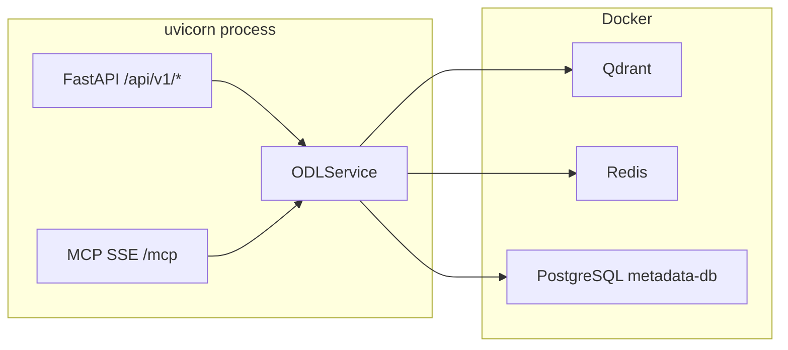

# Official Data Layer for AI Agents

Слой официальных данных для AI-агентов — предоставляет доступ к нормативно-правовым актам и официальным данным с полной трассируемостью источников. Работает через MCP (для AI-агентов) и REST API (для разработчиков).

[](https://github.com/igorvolk1961/gov_data_layer/actions/workflows/ci.yml)

**Версия:** v0.2.0 (develop) · [CHANGELOG](docs/changelog/v0.2.0.md)

---

## Быстрый старт

### 1. Инфраструктура (Docker)

Запустите зависимые сервисы:

```bash
docker compose up -d qdrant redis metadata-db
```

| Сервис | Порт | Назначение |
|--------|------|-----------|
| **Qdrant** | 6333 | Векторное хранение чанков документов |
| **Redis** | 6379 | Кэширование ответов (cache-aside) |
| **PostgreSQL** | 5432 | Метаданные документов и рубрикатор |

Опционально (для трейсинга):

```bash
docker compose up -d langfuse langfuse-db
```

### 2. Конфигурация

Скопируйте примеры и отредактируйте:

```bash
cp config.example.yaml config.yaml
cp .env.example .env
```

Минимальная [`config.yaml`](config.example.yaml) — достаточно указать `database.url` для PostgreSQL.

### 3. Установка зависимостей

```bash
uv sync
```


### 5. Запуск сервера

```bash
uv run python -m core.main
```

Сервер будет доступен:

| Интерфейс | URL |
|-----------|-----|
| REST API | `http://localhost:8000/api/v1/search` |
| Swagger UI | `http://localhost:8000/docs` |
| MCP SSE | `http://localhost:8000/mcp` |
| Healthcheck | `http://localhost:8000/health` |

---

## Docker image

> 🚧 **Не протестировано.** Dockerfile присутствует, но сборка образа не проверена.
> Планируется к тестированию в v0.3.0.

```bash
docker build -t gov-data-layer .
docker compose up
```

---

## Демонстрация работы

Все скрипты запускаются через `uv run python scripts/<script>.py`.
Перед запуском должен быть запущен сервер (`uv run python -m core.main`).

### Шаг 1: Загрузка данных

```bash
uv run python scripts/fixtures_ingest_pipeline.py
```

Скрипт:
- Очищает БД и Qdrant
- Загружает рубрики, организации, типы документов из `fixtures/`
- Индексирует 6 документов через PravoAdapter (stub)

### Шаг 2: Поиск документов

Поиск по запросу «государственные пособия гражданам имеющим детей»:

```bash
# Ожидается результат (found)
uv run python scripts/search_pipeline.py --format human

# Заведомо отсутствующая тема
uv run python scripts/search_pipeline.py --not-found --format human

# Вывод в формате для агента (JSON)
uv run python scripts/search_pipeline.py --format agent
```

**Ожидаемый результат:** список документов с заголовком, сниппетом, URL и score.
**Для not-found:** пустой результат (честный «не нашёл»).

Параметры:
- `--format human` — читаемый вывод
- `--format agent` — JSON для агента (по умолчанию)
- `--input` — показать пример HTTP-запроса (без выполнения)

### Шаг 3: Деталь документа

Получение полной карточки документа с цитатами:

```bash
uv run python scripts/document_detail_pipeline.py --format human
```

**Ожидаемый результат:** заголовок, метаданные, цитаты с путём к разделу.

Параметры:
- `--document-id` — ID документа (по умолчанию: `pravo-0001202012230060`)
- `--query` — фильтрация цитат по запросу
- `--max-citation-length` — макс. длина цитат (по умолчанию: 2000)

### Шаг 4: MCP-инструменты

Проверка MCP-сервера:

```bash
# Список инструментов
uv run python scripts/mcp_list_tools.py

# Верификация MCP
uv run python scripts/mcp_verify.py
```

**Ожидаемый результат:** список из 2 инструментов: `search_documents`, `get_document_detail`.

---

## Архитектура



Ключевые принципы:

- **Metadata Routing** — поиск через Qdrant с payload-фильтрацией (`region_id`, `topic_ids`, `legal_status`). Адаптеры источников используются **только** на этапе инжеста, не в query path.
- **Разложенные сигналы уверенности** — `retrieval_relevance`, `topic_relevance`, `last_verified_at`. Свёртку в единую меру делает агент (механизм/политика).
- **Cache-aside** — Redis для кэширования с разными TTL (5 мин для поиска, 1 час для деталей).
- **Graceful degradation** — при недоступности БД/кэша система продолжает работу best-effort.

Подробнее: [диаграмма классов](docs/architecture/class-diagram.md), [схема БД](docs/architecture/db-schema.md), [sequence diagrams](docs/architecture/sequence-diagrams.md).

---

## API

### REST API

| Метод | Endpoint | Описание |
|-------|----------|----------|
| GET | `/health` | Статус Redis, PostgreSQL, Qdrant, LangFuse |
| POST | `/api/v1/search` | Поиск документов |
| GET | `/api/v1/documents/{source_id}` | Полная карточка документа |
| GET | `/api/v1/admin/reference-counts` | Счётчики справочников |
| GET | `/api/v1/admin/qdrant/collections` | Статус коллекций Qdrant |

### MCP Tools

| Tool | Описание |
|------|----------|
| `search_documents` | Поиск документов по текстовому запросу с фильтрацией |
| `get_document_detail` | Полная карточка документа с цитатами |

---

## Тестирование

```bash
# Все unit-тесты
uv run pytest tests/unit -v

# Интеграционные тесты (требуют Docker)
uv run pytest tests/integration -v

# Contract-тесты адаптеров
uv run pytest tests/contracts -v
```

Тесты проходят: ~460 unit-тестов + интеграционные (требуют Docker: Qdrant + PostgreSQL).

---

## Документация

- [`docs/specification.md`](docs/specification.md) — полная спецификация (v0.2.0)
- [`docs/changelog/v0.2.0.md`](docs/changelog/v0.2.0.md) — изменения от v0.1.0 к v0.2.0
- [`docs/adr.md`](docs/adr.md) — Architecture Decision Records
- [`docs/architecture/c4-context.md`](docs/architecture/c4-context.md) — C4 Context diagram
- [`docs/architecture/c4-container.md`](docs/architecture/c4-container.md) — C4 Container diagram
- [`docs/architecture/class-diagram.md`](docs/architecture/class-diagram.md) — Class diagram (v0.2.0)
- [`docs/architecture/db-schema.md`](docs/architecture/db-schema.md) — Database schema (PostgreSQL + Qdrant)
- [`docs/architecture/sequence-diagrams.md`](docs/architecture/sequence-diagrams.md) — Pipeline sequence diagrams
- [`docs/reference/original_task.md`](docs/reference/original_task.md) — Исходная постановка задачи
- [`docs/reference/expected_result.md`](docs/reference/expected_result.md) — Ожидаемые результаты

---

## Структура проекта

```
adapters/              # Адаптеры источников данных (только для инжеста)
  base/                #   Базовые классы: RSSAdapter, SourceAdapter, IngestPipeline
  ocr/                 #   OCR-провайдеры: StubOCR, TesseractOCR, YandexVisionOCR
  pravo/               #   Адаптер pravo.gov.ru (stub + production)
  stub/                #   Stub-адаптер для тестов

core/                  # Ядро слоя
  api/                 #   REST (FastAPI) и MCP серверы
  cache/               #   Redis-клиент с graceful degradation
  errors/              #   Типизированные ошибки
  index/               #   QdrantStore — векторное хранение
  ingest/              #   Chunker (DocStructSplitter) + Embedder
  models/              #   Pydantic-модели (каноническая модель данных)
  observability/       #   Трейсинг (LangFuse / file fallback)
  persistence/         #   DatabaseClient (asyncpg) + Repository
  reranker/            #   TopicAwareReranker + PassThroughReranker

docs/                  # Документация
  specification.md     #   Спецификация
  adr.md               #   Architecture Decision Records
  changelog/           #   История изменений
  architecture/        #   Диаграммы (C4, class, DB, sequence)

scripts/               # CLI-скрипты для демо и отладки
```

---

## Известные ограничения v0.2.0

1. **OCR-зависимость** — все документы требуют OCR. Для production нужен конвейер без обязательного фонового OCR (запланирован в версии v0.3.0).
2. **Stub-режим** — PravoAdapter работает в режиме заглушки (6 документов).
3. **Docker image не собран** — не протестирован.
4. **`_check_missing_region` — заглушка** — `missing_context` не заполняется.
5. **Нет SLO-замеров** — latency/token budget не измерены.
6. **Проблемы smart_chunker** — требуется доработка собственного чанкера для реализации обработки нескольких документов в одном файле .

Полный список — в [`TODO.md`](TODO.md) и [`docs/specification.md`](docs/specification.md#7-известные-проблемы-v020).
