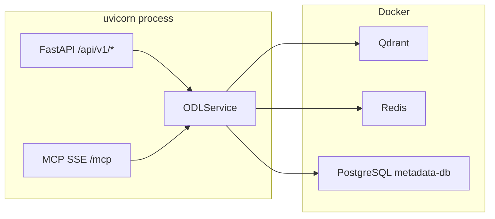

# Official Data Layer for AI Agents

Слой официальных данных для AI-агентов — предоставляет доступ к нормативно-правовым актам и официальным данным с полной трассируемостью источников. Работает через MCP (для AI-агентов) и REST API (для разработчиков).

[](https://github.com/igorvolk1961/gov_data_layer/actions/workflows/ci.yml)

---

## Быстрый старт

### 1. Инфраструктура

Запустите зависимые сервисы через Docker Compose:

```bash
docker compose up -d qdrant redis metadata-db
```

Сервисы:
- **Qdrant** (порт 6333) — векторное хранение чанков документов
- **Redis** (порт 6379) — кэширование ответов (cache-aside)
- **PostgreSQL** (порт 5432) — метаданные документов и рубрикатор

Опционально (для трейсинга):
```bash
docker compose up -d langfuse langfuse-db
```

### 2. Конфигурация

Скопируйте примеры и отредактируйте:

```bash
cp config.example.yaml config.yaml
cp .env.example .env
```

Минимальная [`config.yaml`](config.example.yaml) — достаточно указать `database.url` для PostgreSQL.

### 3. Инициализация и запуск

```bash
# 1. Установка зависимостей
uv sync

# 2. Загрузить справочные данные и проиндексировать документы
uv run python scripts/fixtures_ingest_pipeline.py

# 3. Запустить сервер
uv run python -m core.main
```

Сервер будет доступен:
- **REST API:** http://localhost:8000/api/v1/search
- **Swagger UI:** http://localhost:8000/docs
- **MCP SSE:** http://localhost:8000/mcp
- **Healthcheck:** http://localhost:8000/health

---

## Архитектура



Ключевые принципы:
- **Metadata Routing** — поиск через Qdrant с payload-фильтрацией, без участия адаптеров
- **Адаптеры источников** — используются только на этапе инжеста (загрузка данных)
- **Cache-aside** — Redis для кэширования с разными TTL
- **Graceful degradation** — при недоступности БД/кэша система продолжает работу

---

## API

### REST API

| Метод | Endpoint | Описание |
|-------|----------|----------|
| GET | `/health` | Статус Redis, PostgreSQL, Qdrant, LangFuse |
| POST | `/api/v1/search` | Поиск документов |
| GET | `/api/v1/documents/{source_id}` | Полная карточка документа |
| GET | `/api/v1/topics` | Рубрикатор |
| GET | `/api/v1/documents/{document_id}/toc` | Оглавление |
| GET | `/api/v1/admin/reference-counts` | Счётчики справочников |
| GET | `/api/v1/admin/qdrant/collections` | Статус коллекций Qdrant |
| GET | `/api/v1/admin/documents/{publish_id}/status` | Статус документа |

### MCP Tools

| Tool | Описание |
|------|----------|
| `search_documents` | Поиск документов по текстовому запросу с фильтрацией |
| `get_document_detail` | Полная карточка документа с цитатами |
| `list_topics` | Просмотр иерархического рубрикатора |
| `get_toc` | Оглавление документа |

Пример MCP-запроса через SSE:
```bash
curl -N http://localhost:8000/mcp
```

---

## Проект

### Структура

```
adapters/              # Адаптеры источников данных (только для инжеста)
  base/                #   Базовые классы: RSSAdapter, SourceAdapter, IngestPipeline
  ocr/                 #   OCR-провайдеры: StubOCR, TesseractOCR, YandexVisionOCR
  pravo/               #   Адаптер pravo.gov.ru (stub + production)
  stub/                #   Stub-адаптер для тестов

core/                  # Ядро слоя
  api/                 #   REST (FastAPI) и MCP серверы
  cache/               #   Redis-клиент с graceful degradation
  errors/              #   Типизированные ошибки
  index/               #   QdrantStore — векторное хранение
  ingest/              #   Chunker (DocStructSplitter) + Embedder
  models/              #   Pydantic-модели (каноническая модель данных)
  observability/       #   Трейсинг (LangFuse / file fallback)
  persistence/         #   DatabaseClient (asyncpg) + Repository

docs/                  # Документация
  specification.md     #   Спецификация
  adr.md               #   Architecture Decision Records

scripts/               # CLI-скрипты для демо и отладки
```

---

## Скрипты (порядок применения)

Все скрипты запускаются через `uv run python scripts/<script>.py`.

### Шаг 1. Загрузка данных

| Скрипт | Назначение | Статус |
|--------|-----------|--------|
| [`fixtures_ingest_pipeline.py`](scripts/fixtures_ingest_pipeline.py) | **Основной:** чистит БД и Qdrant, загружает справочники из `fixtures/`, индексирует документы Минтруда через PravoAdapter stub | ✅ Работает |

Что делает:
1. Очищает таблицы PostgreSQL и коллекции Qdrant
2. Загружает рубрики из `fixtures/rubrics.json`
3. Загружает организации, типы документов, регионы
4. Для каждого документа (список `PUBLISH_IDS`): получает метаданные → OCR → сохраняет в БД → чанкинг → эмбеддинг → Qdrant

### Шаг 2. Поиск и просмотр

| Скрипт | Назначение | Статус |
|--------|-----------|--------|
| [`search_pipeline_found.py`](scripts/search_pipeline_found.py) | Поиск по запросу "государственные пособия гражданам имеющим детей" — ожидается результат | ✅ Работает |
| [`search_pipeline_notfound.py`](scripts/search_pipeline_notfound.py) | Поиск по заведомо отсутствующей теме — ожидается пустой результат | ✅ Работает |
| [`document_detail_pipeline.py`](scripts/document_detail_pipeline.py) | Получение полной карточки документа по ID с цитатами | ✅ Работает |

Форматы вывода (общие для всех трёх):
- `--format agent` — JSON для агента (по умолчанию)
- `--format human` — читаемый вывод
- `--input` — показать пример HTTP-запроса (без выполнения)

### Шаг 3. Отладка

| Скрипт | Назначение | Статус |
|--------|-----------|--------|
| [`mcp_list_tools.py`](scripts/mcp_list_tools.py) | Подключается к MCP SSE на `http://localhost:8000/mcp` и выводит список доступных инструментов | ⚠️ Требуется работающий сервер + может не работать (см. [TODO.md](TODO.md#4)) |

---

## Тестирование

```bash
# Все unit-тесты
uv run pytest tests/unit -v

# Интеграционные тесты (требуют Docker)
uv run pytest tests/integration -v

# Contract-тесты адаптеров
uv run pytest tests/contracts -v
```

Тесты проходят: ~460 unit-тестов + интеграционные (требуют Docker: Qdrant + PostgreSQL).

---

## Документация

- [`docs/specification.md`](docs/specification.md) — полная спецификация
- [`docs/adr.md`](docs/adr.md) — Architecture Decision Records
- [`docs/architecture/c4-context.md`](docs/architecture/c4-context.md) — C4 Context diagram
- [`docs/architecture/c4-container.md`](docs/architecture/c4-container.md) — C4 Container diagram
- [`docs/reference/original_task.md`](docs/reference/original_task.md) — Исходная постановка задачи
- [`docs/reference/expected_result.md`](docs/reference/expected_result.md) — Ожидаемые результаты
- [`plans/tech_debt_analysis.md`](plans/tech_debt_analysis.md) — Анализ технического долга

---

## Известные ограничения

1. **MCP `search_documents`** — параметр `official_only` вызывает ошибку (см. [TODO.md](TODO.md#4))
2. **Tracing middleware** — падает на запросах с query-параметрами
3. **Redis health** — всегда показывает "unavailable" при первом запросе
4. **Пагинация** — `total_count` возвращает количество на странице, а не общее
5. **Stub-режим** — только 1 документ Минтруда (`0001202012230060`)

Полный список — в [`TODO.md`](TODO.md) и [`plans/tech_debt_analysis.md`](plans/tech_debt_analysis.md).
