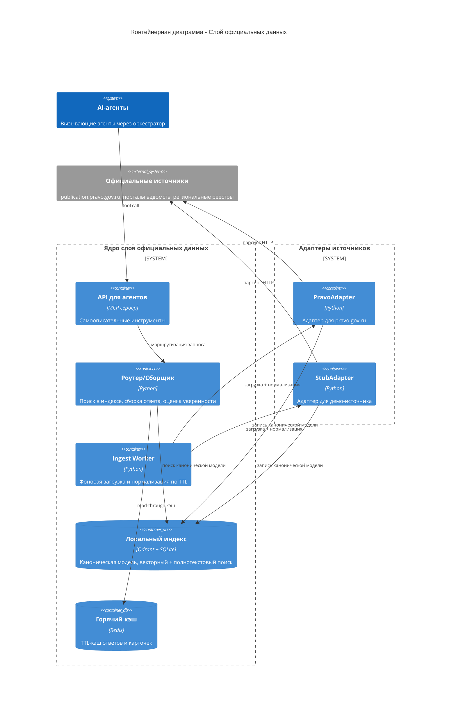

# Container Diagram

```mermaid
C4Container
    title Контейнерная диаграмма - Слой официальных данных

    System(agents, "AI-агенты", "Вызывающие агенты через оркестратор")

    System_Boundary(core, "Ядро слоя официальных данных") {
        Container(api, "API для агентов", "MCP сервер", "Самоописательные инструменты")
        Container(router, "Роутер/Сборщик", "Python", "Поиск в индексе, сборка ответа, оценка уверенности")
        Container(ingest, "Ingest Worker", "Python", "Фоновая загрузка и нормализация по TTL")
        ContainerDb(index, "Локальный индекс", "Qdrant + SQLite", "Каноническая модель, векторный + полнотекстовый поиск")
        ContainerDb(cache, "Горячий кэш", "Redis", "TTL-кэш ответов и карточек")
    }

    System_Boundary(adapters, "Адаптеры источников") {
        Container(pravo_adapter, "PravoAdapter", "Python", "Адаптер для pravo.gov.ru")
        Container(stub_adapter, "StubAdapter", "Python", "Адаптер для демо-источника")
    }

    System_Ext(sources, "Официальные источники", "publication.pravo.gov.ru, порталы ведомств, региональные реестры")

    Rel(agents, api, "tool call")
    Rel(api, router, "маршрутизация запроса")
    Rel(router, index, "поиск канонической модели")
    Rel(router, cache, "read-through кэш")
    Rel(ingest, pravo_adapter, "загрузка + нормализация")
    Rel(ingest, stub_adapter, "загрузка + нормализация")
    Rel(pravo_adapter, sources, "парсинг HTTP")
    Rel(stub_adapter, sources, "парсинг HTTP")
    Rel(pravo_adapter, index, "запись канонической модели")
    Rel(stub_adapter, index, "запись канонической модели")

    UpdateLayoutConfig($c4ShapeInRow="3")
```
