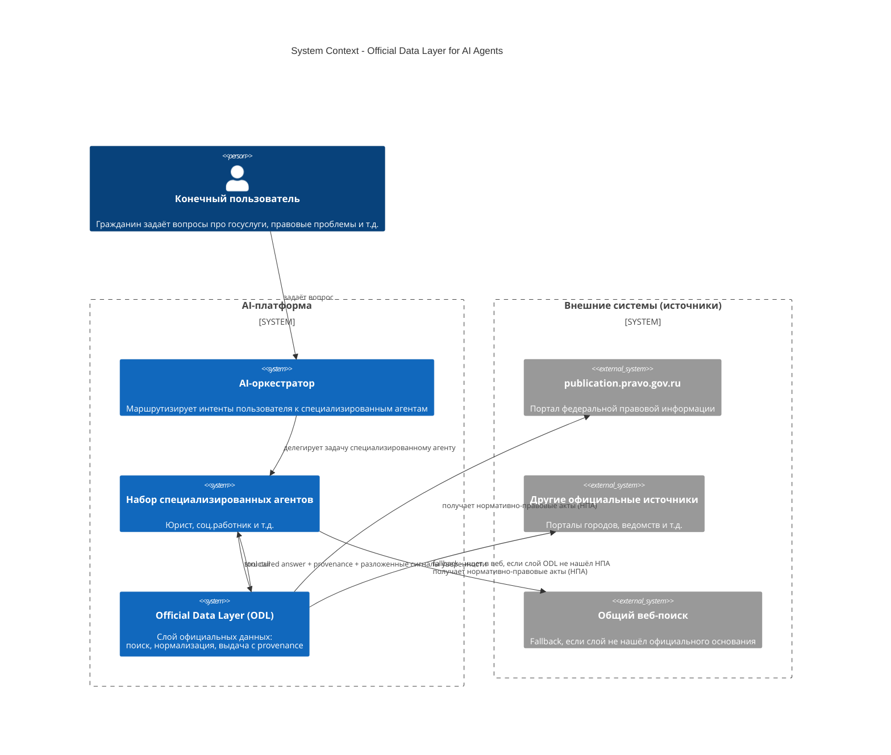

# Context Diagram

```mermaid
C4Context
    title System Context - Official Data Layer for AI Agents

    Person(user, "Конечный пользователь", "Гражданин задаёт вопросы про госуслуги, правовые проблемы и т.д.")

    System_Boundary(ai_platform, "AI-платформа") {
      System(orch, "AI-оркестратор", "Маршрутизирует интенты пользователя к специализированным агентам")
      System(agents, "Набор специализированных агентов", "Юрист, соц.работник и т.д.")
      System(odl, "Official Data Layer (ODL)", "Слой официальных данных:<br>поиск, нормализация, выдача с provenance")
    }


    System_Boundary(ext, "Внешние системы (источники)") {
      System_Ext(pravo, "publication.pravo.gov.ru", "Портал федеральной правовой информации")
      System_Ext(stub, "Другие официальные источники", "Порталы городов, ведомств и т.д.")
      System_Ext(web, "Общий веб-поиск", "Fallback, если слой не нашёл официального основания")
    }
    
    Rel(user, orch, "задаёт вопрос")
    Rel(orch, agents, "делегирует задачу специализированному агенту")
    Rel(agents, odl, "tool call")
    Rel(odl, agents, "structured answer + provenance + разложенные сигналы уверенности")
    Rel(odl, pravo, "получает нормативно-правовые акты (НПА)")
    Rel(odl, stub, "получает нормативно-правовые акты (НПА)")
    Rel(agents, web, "fallback - ищет в веб, если слой ODL не нашёл НПА")
    
    UpdateLayoutConfig($c4ShapeInRow="2")
```
