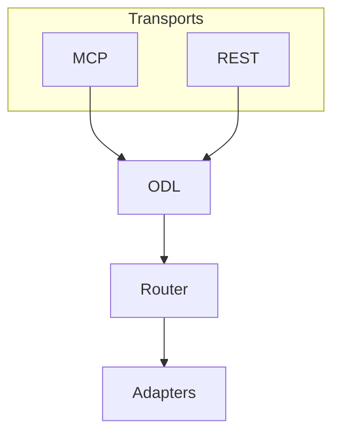
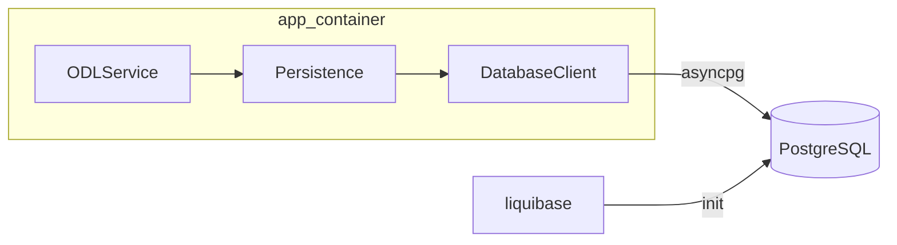

# ADR: Architecture Decision Records

**Статус:** набор принятых решений
**Дата:** 2026-07-10
**Контекст:** проектирование Official Data Layer for AI Agents

---

## 1. SearchContext: query — это интент

**Дата:** 2026-07-10

### Проблема

В `SearchContext` предлагалось добавить поле `intent` для указания намерения пользователя. Однако `query` (свободный текст вопроса) уже передаётся отдельным параметром в инструменты MCP. Выделять `intent` как отдельное поле — избыточно и вредно: агент будет путаться, куда писать намерение пользователя.

### Решение

`query` — это и есть интент. Не дублировать. `SearchContext` содержит только структурированные параметры для фильтрации и роутинга.

### Последствия

- Единая точка входа для семантического поиска
- Меньше путаницы у агента
- Меньше полей в контракте

---

## 2. SearchContext: удаление jurisdiction

**Дата:** 2026-07-10

### Проблема

Поля `region` (география), `jurisdiction` (уровень власти) и `organization` (орган) семантически пересекаются. Пример: «законы законодательного собрания Московской области»:

- `region` = «Московская область»
- `organization` = «Законодательное собрание Московской области»
- `jurisdiction` = «региональная»

Агент не является экспертом-правоведом. Чем больше семантически пересекающихся полей, тем выше вероятность ошибок заполнения и лишних токенов на размышления.

### Решение

Убрать `jurisdiction` из `SearchContext`. Юрисдикция — производная характеристика, которую слой вычисляет сам из `region` и `organization`. Это прямое применение принципа механизм/политика.

### Последствия

- Model-friendly API: 7 простых полей без семантических пересечений
- Слой вычисляет jurisdiction на этапе роутинга (Phase 5)
- В канонической модели `OfficialDocument` поле `jurisdiction: str | None` остаётся

---

## 3. SearchContext: добавление official_only, max_age_days, offset

**Дата:** 2026-07-10

### Проблема

В тестовом задании явно перечислены параметры, которых нет в `SearchContext`:

- `official_only` — «только официальное»
- `max_age_days` — окно актуальности
- `page` — пагинация (токен-осознанность)

### Решение

Добавить все три поля. В ходе обсуждения `page` заменён на `offset` (см. решение 4).

### Рассмотренные альтернативы

- **`filters: dict[str, str]`** — отклонено как анти-паттерн: потеря строгой валидации Pydantic, неопределённая семантика для агента.

### Последствия

- Полное покрытие требований задания
- Строгая валидация Pydantic (типы, границы: `ge`, `le`)
- Мягкая деградация: все поля опциональны

---

## 4. Пагинация: offset + max_results + total_count

**Дата:** 2026-07-10

### Проблема

Для `search_documents` (поиск, не полный текст) нужна пагинация, которая:
- Даёт агенту контроль над токен-бюджетом
- Однозначна и не ломается при смене размера страницы
- Не обрезает результат на середине

### Решение

Пагинация в **результатах** (документах), а не в токенах или страницах.

**Параметры запроса:**
- `max_results` — сколько результатов вернуть (лимит страницы, 1–50)
- `offset` — сколько результатов пропустить (смещение)

**Параметры ответа (`SearchResponse`):**
- `results: list[SearchResult]` — результаты текущей страницы
- `total_count: int` — общее количество результатов
- `offset: int` — смещение текущей страницы (зеркалит запрос)

Агент определяет наличие следующей страницы по формуле:
`offset + len(results) < total_count` → есть ещё страница, запросить с `offset += max_results`.

### Почему не токены

- Токены — единица потребления LLM, а не единица поисковой выдачи
- Размер одного `SearchResult` стабилен (~200-500 токенов)
- `max_results` уже даёт контроль над токен-бюджетом: 10 × ~300 = ~3000 токенов
- Пагинация по токенам потребовала бы accumulative token count и могла бы обрезать результат на середине

### Почему не page

- `page` + `max_results` — то же, что `offset` + `max_results`, но ломается при смене `max_results` между запросами
- `offset` однозначен и не зависит от размера страницы

### Почему не чанки/фрагменты

- Чанки актуальны для `get_document_detail` (полный текст), но не для поиска, где каждый результат — компактный сниппет

### Последствия

- Токен-осознанность: агент контролирует бюджет через `max_results`
- Однозначная пагинация: `offset` не зависит от размера страницы
- Response envelope `SearchResponse` с `total_count` для проверки наличия следующей страницы

---

## 5. Нормализация jurisdiction в PostgreSQL

**Дата:** 2026-07-10

### Проблема

Поле `jurisdiction` в канонической модели `OfficialDocument` объявлено как `str | None`. Если хранить его в PostgreSQL как `VARCHAR`, это приведёт к дублированию строк («federal», «regional», «municipal» и т.д.) — нарушение нормализации в реляционной БД.

### Контекст

Метаданные документов хранятся в PostgreSQL (не в Qdrant), так как нужны:
- Иерархический рубрикатор (темы, регионы, ведомства с parent-child)
- Рекурсивные CTE для обхода иерархии
- Сложные фильтры с JOIN и ссылочная целостность через FK

Qdrant используется только для векторного поиска с денормализованными payload.

PostgreSQL уже развёрнут в docker-compose для LangFuse (`langfuse-db`). Для данных слоя используется отдельный сервис `metadata-db`, чтобы не смешивать с метаданными LangFuse.

### Решение

**Pydantic:** `jurisdiction: str | None` — без изменений. Pydantic не валидирует список допустимых значений, что даёт гибкость при появлении новых юрисдикций без миграций кода.

**PostgreSQL:** нормализованное хранение через lookup-таблицу:

```sql
CREATE TABLE jurisdiction (
    id SERIAL PRIMARY KEY,
    name VARCHAR(100) UNIQUE NOT NULL,
    parent_id INTEGER REFERENCES jurisdiction(id)  -- для иерархии
);

CREATE TABLE official_document (
    id VARCHAR PRIMARY KEY,
    jurisdiction_id INTEGER REFERENCES jurisdiction(id),
    -- остальные поля
);
```

Слой нормализует при записи:

```python
async def _ensure_jurisdiction(self, name: str) -> int:
    row = await self.db.fetchrow(
        "INSERT INTO jurisdiction (name) VALUES ($1) "
        "ON CONFLICT (name) DO NOTHING "
        "RETURNING id",
        name,
    )
    if row:
        return row["id"]
    row = await self.db.fetchrow(
        "SELECT id FROM jurisdiction WHERE name = $1", name
    )
    return row["id"]
```

### Рассмотренные альтернативы

- **`jurisdiction: Enum` в Pydantic** — отклонено: жёсткий список, требующий миграции кода при появлении новых юрисдикций (например, `interstate` для актов СНГ)
- **`jurisdiction: str` без нормализации** — отклонено: дублирование строк, невозможность ссылочной целостности

### Последствия

- Гибкость Pydantic: не требует enum-миграций
- Нормализация в PostgreSQL: без дублирования строк, с FK
- Возможность построить иерархию юрисдикций через `parent_id`

---

## 8. RSSAdapter: ABC vs Protocol

**Дата:** 2026-07-13

### Проблема

Для `RSSAdapter` (базовый класс источников с RSS/Atom лентами) нужно выбрать механизм наследования: `Protocol` (как `SourceAdapter` и `OCRProvider`) или `ABC` (abstract base class).

### Контекст

В проекте уже сложилась дихотомия:

- **`SourceAdapter`** — `Protocol`. Определяет **контракт** (что должен уметь делать любой адаптер источника). Не предоставляет реализации — только сигнатуры методов. Любой класс, реализующий эти методы, является `SourceAdapter` без наследования.
- **`OCRProvider`** — `Protocol`. Аналогично: определяет контракт для OCR-провайдеров.

`RSSAdapter` отличается: он предоставляет **общую реализацию** (HTTP-запросы с retry, парсинг RSS 2.0 и Atom, извлечение дат из различных форматов), а не только контракт.

### Решение

Использовать `ABC` (abstract base class) с `@abstractmethod`.

**Состав RSSAdapter:**
- **Конкретные методы** (общая реализация, переиспользуемая наследниками):
  - `fetch_feed()` — HTTP-запрос к ленте с retry (3 попытки, progressive backoff)
  - `parse_feed()` — парсинг RSS 2.0 и Atom в список сырых записей
  - `fetch_new_entries()` — получение новых записей с опциональной фильтром по дате
  - `_parse_rss()`, `_parse_atom()` — внутренние методы парсинга
  - `_extract_date()`, `_parse_date_string()` — извлечение даты из различных форматов (RFC 2822, ISO 8601, YYYY-MM-DD)
  - `close()`, `__aenter__`, `__aexit__` — управление HTTP-клиентом
- **Абстрактные методы** (наследник обязан реализовать):
  - `parse_entry()` — преобразование RSS-записи в сырые данные для `normalize()`
  - `source_id` (property) — уникальный идентификатор источника

**HTTP-клиент** инжектится через параметр `client: httpx.AsyncClient | None` для тестируемости (как в `YandexVisionOCR`).

### Рассмотренные альтернативы

1. **`Protocol`** — отклонено. Protocol не предназначен для наследования реализации. Если бы RSSAdapter был Protocol, каждый наследник (PravoAdapter) дублировал бы ~200 строк HTTP-логики, XML-парсинга и date-parsing. Это нарушает DRY и увеличивает поверхность для багов.

2. **Композиция** (вынести HTTP-клиент и парсер в отдельные классы) — отклонено. RSSAdapter — это **is-a** отношение: PravoAdapter **является** RSS-адаптером. Композиция (has-a) добавила бы лишний уровень косвенности без выигрыша в тестируемости, так как HTTP-клиент уже инжектится через параметр.

3. **Mixin** — отклонено. Mixin-классы без `ABC` не дают гарантии, что наследник реализовал `parse_entry()` и `source_id`. Ошибка проявится только в runtime, а не при создании экземпляра.

### Последствия

- Наследники переиспользуют ~200 строк общей логики (HTTP, XML, date parsing)
- `@abstractmethod` гарантирует, что наследник реализует `parse_entry()` и `source_id` — проверка на этапе создания экземпляра
- HTTP-клиент инжектится для тестируемости (как в `YandexVisionOCR`)
- PravoAdapter наследует от RSSAdapter и реализует `SourceAdapter` Protocol (множественное наследование не требуется, так как RSSAdapter не является SourceAdapter — это вспомогательный базовый класс)
- Дополнительный lookup-запрос при записи (некритично для фонового ингеста)
- Отдельный сервис `metadata-db` в docker-compose (не смешивается с LangFuse)

---

## 9. Progressive Backoff для всех retry-циклов

**Дата:** 2026-07-13

### Проблема

При HTTP-запросах к внешним источникам (RSS-ленты, API) возможны временные сбои: таймауты, 500-е ошибки, сетевые глитчи. Простой retry с фиксированной задержкой неэффективен:

- Если источник перегружен, повторный запрос через ту же задержку снова упадёт.
- Если проблема временная (1–2 секунды), ждать фиксированные 3 секунды на первой же попытке — избыточно.

### Решение

Использовать **multiplicative backoff** (возрастающий с множителем): задержка между попытками растёт экспоненциально с номером попытки.

**Формула:** `delay = base_delay * multiplier ^ (attempt - 1)`

**Параметры по умолчанию:**
- `max_retries = 3` — максимум 3 попытки (1-я + 2 ретрая)
- `base_delay = 1.0` секунда
- `multiplier = 2` (factor 2x)
- Задержки: после 1-й попытки → 1с, после 2-й → 2с, после 3-й → 4с

**Non-retryable статусы** (прерывают цикл без ожидания):
- `400 Bad Request`
- `401 Unauthorized`
- `403 Forbidden`
- `404 Not Found`
- `405 Method Not Allowed`

Эти статусы указывают на ошибку конфигурации или отсутствие ресурса — повторный запрос не имеет смысла.

### Реализация

В [`RSSAdapter.fetch_feed()`](adapters/base/rss_adapter.py:171):

```python
if attempt < self._max_retries:
    # Multiplicative backoff: 1s, 2s, 4s, 8s...
    await asyncio.sleep(1.0 * 2 ** (attempt - 1))
```

### Рассмотренные альтернативы

1. **Linear backoff** (`base * attempt`) — отклонено. Линейный рост (1с, 2с, 3с) недостаточно агрессивен при длительных сбоях. Мультипликативный backoff (1с, 2с, 4с) даёт более широкий диапазон задержек при том же количестве попыток.

2. **Fixed delay** — отклонено. Фиксированная задержка не адаптируется к длительности сбоя: при коротком сбое ждём слишком долго, при длительном — повторяем слишком рано.

3. **Jitter** (случайная вариация задержки) — отклонено. В проекте нет тысяч конкурентных запросов к одному источнику, поэтому риск «thundering herd» отсутствует. Jitter добавил бы недетерминизм в тесты.

### Последствия

- При временных сбоях (таймаут, 500) система ждёт 1с, затем 2с, затем 4с — достаточно для восстановления большинства источников
- При неисправимых ошибках (400, 401, 403, 404) retry не тратит время
- Единый паттерн для всех будущих retry-циклов в проекте
- Мультипликативный backoff даёт хороший баланс между скоростью восстановления и нагрузкой на источник

---

## 6. Citation.section — путь к разделу документа

**Дата:** 2026-07-10

### Проблема

Для больших документов (НПА на 100+ страниц) цитата без указания раздела бесполезна — агент не понимает, из какой главы, статьи или пункта она взята. Существующие поля `span_start`/`span_end` (позиция в символах) не дают контекста для навигации.

### Решение

Добавить в `Citation` поле `section: list[str] | None` — путь к разделу от корня документа:

```python
class Citation(BaseModel):
    text: str
    source_id: str
    url: str
    section: list[str] | None = Field(
        default=None,
        description="Путь к разделу от корня документа. "
        "Пример: ['Раздел I', 'Глава 2', 'Статья 10']",
    )
    span_start: int | None = None
    span_end: int | None = None
```

### Примеры

| Документ | section |
|----------|---------|
| Конституция РФ, ст. 15 | `["Раздел I", "Глава 2", "Статья 15"]` |
| Налоговый кодекс, гл. 2, ст. 10 | `["Часть I", "Глава 2", "Статья 10"]` |
| Постановление № 123, п. 3.1 | `["Пункт 3.1"]` |
| Длинный отчёт, раздел 4.2 | `["4.2 Анализ показателей"]` |

### Рассмотренные альтернативы

- **`section: str`** — отклонено: по строке сложнее программная навигация, нужен парсинг
- **`section_id: str`** (ссылка на `TocNode.id`) — отклонено: агент не видит контекст без дополнительного запроса `get_toc`
- **`section: list[str]`** — выбрано: агент сразу видит путь от корня, может склеить в строку для пользователя, использовать последний элемент для `get_toc`

### Последствия

- Агент сразу понимает контекст цитаты без дополнительного запроса
- Можно склеить в строку: `" / ".join(section)` для ответа пользователю
- Последний элемент можно использовать как ключ для `get_toc(document_id, parent_section_id)`
- Адаптер должен собирать путь при парсинге документа (используя `TocNode`)
- Поле опционально — обратная совместимость с существующими Citation

---

## 7. ConfidenceSignals: удаление extraction_confidence и legal_status

**Дата:** 2026-07-10

### Проблема

`ConfidenceSignals` содержал 5 полей, два из которых были проблемными:

1. **`legal_status`** — дублировался с `SearchResult.legal_status` и `OfficialDocument.legal_status`. Это метаданные документа, а не сигнал уверенности. Дублирование вводило агента в заблуждение (какой `legal_status` использовать?).

2. **`extraction_confidence`** — «надёжность извлечения полей (если используется LLM)». В текущей реализации все адаптеры используют детерминированный парсинг (HTML → поля), без LLM. Сигнал всегда равен 1.0 и не несёт информации. Кроме того, один скаляр на все поля — грубое усреднение: LLM может уверенно извлечь `title`, но сомневаться в `organization`.

### Решение

Убрать оба поля из `ConfidenceSignals`. Оставить 3 сигнала:

| Сигнал | Тип | Семантика |
|--------|-----|-----------|
| `retrieval_relevance` | float [0,1] | Насколько результат релевантен запросу |
| `data_freshness` | datetime | Когда данные загружены в индекс |
| `source_availability` | enum | Доступность источника на момент запроса |

`legal_status` остаётся только в `SearchResult` и `OfficialDocument`.

### План на будущее: детализация extraction_confidence

При появлении адаптера с LLM-извлечением полей сигнал может быть добавлен как:

```python
field_confidence: dict[str, float] | None = None
# Пример: {"title": 0.99, "organization": 0.75, "summary": 0.88}
```

Это даёт агенту прозрачность: какие поля извлечены надёжно, а какие — с сомнением. Агент может решить, критична ли неточность в конкретном поле для его сценария.

### Рассмотренные альтернативы

- **Оставить `extraction_confidence` как min-агрегацию** — отклонено: сигнал всегда 1.0 в текущей реализации, не несёт информации
- **Оставить `legal_status`** — отклонено: дублирование, нарушение DRY, путаница у агента
- **`field_confidence: dict[str, float]` сейчас** — отклонено: преждевременная сложность, нет потребителя

### Последствия

- `ConfidenceSignals` — 3 поля, только сигналы, без метаданных
- Нет дублирования: `legal_status` только в `SearchResult`/`OfficialDocument`
- При появлении LLM-извлечения — добавить `field_confidence` по ADR
- Обратная совместимость: старые тесты нужно обновить (убрать `extraction_confidence` и `legal_status` из конструктора)

---

## 9. Переименование MCP-инструментов: get_source → get_document_detail, search_official_sources → search_documents

**Дата:** 2026-07-10

### Проблема

Исходные названия MCP-инструментов конфликтуют с доменной моделью:

1. **`get_source`** — ошибочно ассоциируется с классом `Source` (источник данных: pravo.gov.ru, nalog.ru и т.д.). На самом деле инструмент возвращает полную карточку/текст конкретного документа, а не информацию об источнике. Агент, видя `get_source`, может ожидать метаданные адаптера, а не содержание документа.

2. **`search_official_sources`** — избыточно и неточно:
   - `official` — избыточно, так как слой по определению работает только с официальными источниками
   - `sources` — вводит в заблуждение: инструмент ищет документы/акты, а не источники данных
   - Длинное имя (24 символа) увеличивает потребление токенов в промптах агента

### Решение

| Было | Стало | Обоснование |
|------|-------|-------------|
| `get_source(source_id)` | `get_document_detail(source_id)` | Возвращает `DocumentDetail` — полную карточку документа. Название отражает возвращаемый тип. |
| `search_official_sources(query, context)` | `search_documents(query, context)` | Ищет документы. `search_documents` короче (15 vs 24 символа), точнее отражает семантику, не конфликтует с `Source`. |

### Рассмотренные альтернативы

- **`get_document(source_id)`** — отклонено: слишком обще, не отражает, что возвращается именно полная карточка (а не сниппет)
- **`search(query, context)`** — отклонено: слишком обще, неясно что ищется
- **Оставить как есть** — отклонено: путаница у агента между `Source` (класс) и `get_source` (метод)

### Последствия

- Устранена ложная ассоциация с классом `Source`
- Единообразие: `get_document_detail` возвращает `DocumentDetail`, `search_documents` возвращает `SearchResponse` с `SearchResult`
- Сокращение длины имени инструмента на 9 символов (экономия токенов)
- Обратная несовместимость: все клиенты и документация должны быть обновлены

---

## 8. OfficialDocument.region: str | None (не список)

**Дата:** 2026-07-10

### Проблема

Поле `region` отсутствовало в `OfficialDocument`. Документ может быть:

- **Федеральным** — без региона (`region=None`)
- **Региональным** — относится к конкретному субъекту РФ (например, «Московская область»)

Вопрос: должна ли модель документа поддерживать **несколько** регионов (например, межрегиональное соглашение)?

### Решение

`region: str | None` — одно строковое значение, не список.

**Аргументация:**

1. **Документ с несколькими регионами — экзотика.** Межрегиональные соглашения существуют, но:
   - Они редки по сравнению с федеральными и региональными документами
   - Даже в межрегиональном соглашении можно указать основной регион или оставить `None`
   - При появлении реального потребителя список можно добавить без ломающих изменений (сделать `list[str]` с default-фабрикой)

2. **Единообразие с SearchContext.region.** В `SearchContext` поле `region` уже объявлено как `str | None` (решение 2). Агент указывает один регион для поиска. Если документ может иметь несколько регионов, а контекст — только один, возникает асимметрия, усложняющая матчинг.

3. **Принцип минимальной сложности.** Список добавляет сложность:
   - Валидация: пустой список vs `None`?
   - Нормализация в PostgreSQL: нужна связующая таблица `document_region`
   - Поиск: OR-семантика для списка регионов в документе

### Рассмотренные альтернативы

- **`region: list[str]`** — отклонено: преждевременная сложность, экзотический кейс, асимметрия с `SearchContext.region`
- **`region: str` (обязательное)** — отклонено: федеральные документы не имеют региона
- **Нет поля region** — отклонено: без поля невозможно отличить федеральный документ от регионального

### Последствия

- `OfficialDocument.region: str | None = None` — федеральные документы по умолчанию
- Региональные документы указывают конкретный субъект РФ
- При появлении реальной потребности в multi-region — перейти на `list[str]` с default-фабрикой
- В PostgreSQL: `region VARCHAR` (nullable), при необходимости — нормализация через lookup-таблицу (аналогично jurisdiction, решение 5)

---

## 9. Dual API: MCP + OpenAPI

**Дата:** 2026-07-10

### Проблема

Изначально слой проектировался только с MCP-интерфейсом для AI-агентов. Однако:

1. Разработчикам нужен HTTP API для интеграций, тестирования и отладки без MCP-клиента
2. OpenAPI-документация Swagger UI упрощает онбординг новых разработчиков
3. curl-запросы удобнее для smoke-тестов и CI/CD

### Решение

Предоставлять два транспорта — MCP и OpenAPI — поверх единого core-класса `ODLService` `core/service.py`.

**Архитектура:**



- `ODLService` — единственный класс со всей бизнес-логикой, transport-agnostic
- `MCPServer` `core/api/mcp_server.py` — тонкий адаптер: MCP Protocol → ODLService
- `RESTServer` `core/api/rest_server.py` — тонкий адаптер: FastAPI → ODLService
- Оба сервера запускаются параллельно через `asyncio.gather` в одном процессе

### Рассмотренные альтернативы

- **Только MCP** — отклонено: нет HTTP API для разработчиков, сложнее тестировать
- **Только OpenAPI** — отклонено: MCP — нативный протокол для AI-агентов с самоописательными инструментами
- **Два независимых сервиса** — отклонено: дублирование бизнес-логики, расхождение поведения
- **Gateway-паттерн** (один HTTP-сервер, который проксирует в MCP) — отклонено: избыточная сложность, MCP не предназначен для внутреннего проксирования

### Последствия

- Единый core-класс гарантирует одинаковое поведение независимо от транспорта
- FastAPI даёт автоматическую OpenAPI-документацию Swagger UI на `/docs`
- Два сервера в одном контейнере через `asyncio.gather`
- Небольшое дублирование в адаптерах парсинг запроса/ответа
- MCP SDK может ограничивать гибкость
- Добавить зависимость: `fastapi>=0.109.0`, `uvicorn>=0.27.0`

---

## 10. OCRProvider: абстракция для сменяемого OCR

**Дата:** 2026-07-12

### Проблема

PDF на pravo.gov.ru — скан-копии, текстового слоя нет. Нужен OCR для извлечения текста. При этом:
- Внешние OCR-сервисы (Yandex Cloud Vision) могут быть недоступны, дороги или требовать ключей
- Локальный OCR (Tesseract) медленнее и менее точен, но работает без внешних зависимостей
- Для тестов нужна заглушка, не требующая ни внешних сервисов, ни установки Tesseract
- В будущем может потребоваться другой провайдер (Google Vision, AWS Textract, EasyOCR)

### Решение

Ввести `OCRProvider` Protocol с тремя реализациями:

```python
class OCRProvider(Protocol):
    async def extract_text(self, pdf_bytes: bytes, document_id: str) -> str: ...
```

1. **YandexVisionOCR** — HTTP-клиент к Yandex Cloud Vision API (основной провайдер)
2. **TesseractOCR** — локальный OCR через pytesseract (CPU fallback)
3. **StubOCR** — возвращает предопределённый текст для тестовых document_id

Переключение через config: `OCR_PROVIDER=yandex_vision|tesseract|stub`.

### Рассмотренные альтернативы

- **Жёсткая привязка к Yandex Vision** — отклонено: нарушает принцип модель-агностичности из ТЗ, невозможно тестировать без реальных ключей
- **Единый класс с if-else** — отклонено: нарушает Open-Closed Principle, сложно добавлять новых провайдеров
- **Tesseract как единственный провайдер** — отклонено: низкое качество на сложных макетах официальных документов

### Последствия

- Провайдер OCR сменяемый через config (модель-агностичность)
- StubOCR для тестов без внешних зависимостей
- TesseractOCR как fallback при недоступности Yandex
- Новые типизированные ошибки: `OCRUnavailableError`, `OCRQualityError`

---

## 11. RSSAdapter: общее решение для RSS-источников

**Дата:** 2026-07-12

### Проблема

PravoAdapter должен отслеживать новые документы. API pravo.gov.ru предоставляет:
- Периодический опрос `/api/Documents` с параметром `PeriodType=weekly`
- RSS-ленту (не документирована в API, но присутствует на портале)

Часть функционала можно реализовать специфическими средствами API pravo.gov.ru. Но для других источников (nalog.ru, rosmintrud.ru) RSS может быть единственным способом получения обновлений.

### Решение

Создать `RSSAdapter` — базовый класс для источников, поддерживающих RSS:

```python
class RSSAdapter:
    """Base class for RSS-feed based sources."""

    async def fetch_new_entries(self, feed_url: str) -> list[dict[str, Any]]: ...
    async def parse_entry(self, entry: dict[str, Any]) -> dict[str, Any]: ...
```

`PravoAdapter` наследует от `RSSAdapter` и переопределяет `parse_entry()` для специфики pravo.gov.ru.

### Рассмотренные альтернативы

- **Только API pravo.gov.ru** — отклонено: привязка к одному источнику, не переносимо
- **Только RSS** — отклонено: API pravo.gov.ru даёт больше метаданных (pdfFileLength, jdRegNumber и т.д.)
- **Гибрид: RSS для обнаружения + API для деталей** — выбрано: RSS даёт список новых документов, API — полные метаданные

### Последствия

- Единый механизм для всех RSS-источников
- PravoAdapter использует API для деталей, RSS — для обнаружения новых документов
- При добавлении нового RSS-источника достаточно унаследоваться от RSSAdapter

---

## 12. OfficialDocument.meta: source-специфичные атрибуты

**Дата:** 2026-07-12

### Проблема

Каноническая модель `OfficialDocument` должна быть общей для всех источников. Но разные источники имеют специфичные атрибуты, которые не маппятся в канонические поля:

- pravo.gov.ru: `pdfFileLength`, `pagesCount`, `jdRegNumber`, `jdRegDate`, `zipFileLength`, `hasSvg`
- Другие источники могут иметь свои специфичные поля

Добавление каждого такого поля в `OfficialDocument` приводит к «разбуханию» канонической модели и создаёт ложное ожидание, что эти поля заполнены для всех источников.

### Решение

Добавить поле `meta: dict[str, Any]` в `OfficialDocument`:

```python
class OfficialDocument(BaseModel):
    # ... канонические поля ...
    meta: dict[str, Any] = Field(
        default_factory=dict,
        description="Source-специфичные атрибуты документа, "
        "не маппящиеся в канонические поля. "
        "Позволяет расширять модель без изменения схемы.",
    )
```

В PostgreSQL — `meta JSONB NOT NULL DEFAULT '{}'`.

### Рассмотренные альтернативы

- **Плоская модель со всеми полями** — отклонено: разбухание модели, ложные ожидания, миграции при добавлении нового источника
- **Наследование: PravoDocument(OfficialDocument)** — отклонено: нарушает единообразие обработки в ODLService, требует instanceof-проверок
- **Только канонические поля, остальное теряется** — отклонено: потеря данных, которые могут быть полезны агенту

### Последствия

- Каноническая модель остаётся компактной
- Source-специфичные данные доступны через `meta` (агент может их использовать)
- При появлении нового источника не нужно менять схему БД
- JSONB в PostgreSQL позволяет индексировать отдельные ключи при необходимости

---

## 13. DocStructSplitter: чанкинг по структуре документа

**Дата:** 2026-07-12

### Проблема

Официальные документы (НПА, приказы, постановления) имеют чёткую структуру: разделы, главы, статьи, пункты. Наивный чанкинг (по фиксированному числу токенов) разрывает эту структуру, что приводит к:
- Потере контекста при поиске
- Невозможности указать `section` в `Citation`
- Смешиванию семантически разных фрагментов в одном чанке

### Решение

Использовать `DocStructSplitter` из библиотеки `smart_chunker` (https://github.com/igorvolk1961/smart_chunker) — специализированный splitter для текстов с нумерованными разделами.

```python
class DocStructSplitter:
    def split_text(self, text: str, document_id: str) -> list[Chunk]:
        """Split by document structure (sections, articles, clauses)."""
        ...
```

Каждый чанк содержит:
- `section: list[str]` — путь к разделу (для `Citation.section`)
- `chunk_index` — порядковый номер
- `text` — текст чанка

### Рассмотренные альтернативы

- **RecursiveCharacterTextSplitter (LangChain)** — отклонено: не учитывает структуру документа, разрывает разделы
- **TokenTextSplitter** — отклонено: разрывает предложения и разделы
- **Наивный splitter по заголовкам** — отклонено: не все документы имеют единообразные заголовки

### Последствия

- Чанки сохраняют структуру документа
- `Citation.section` заполняется из пути чанка
- Релевантность поиска выше за счёт семантической целостности чанков
- Зависимость от внешней библиотеки `smart_chunker`

---

## 14. paraphrase-multilingual-MiniLM: выбор модели эмбеддингов

**Дата:** 2026-07-12

### Проблема

Для векторного поиска нужна модель эмбеддингов, работающая на CPU (нет GPU) и поддерживающая русский язык.

### Решение

Использовать `paraphrase-multilingual-MiniLM` через `sentence-transformers`.

**Обоснование:**
- **Высокая скорость** — одна из самых быстрых open-source моделей для русского языка - удобно для отладки
- **Малый размер** — 470Mb
- **Работает на CPU** — не требует GPU

**Минусы:**
- Сравнительно низкое качество для русского языка, но для PoC приемлемое

**Митигация:**
- Для повышения качества можно перейти на `multilingual-e5` или `intfloat/multilingual-e5-small`
- При наличии GPU для повышения качеста — bge-m3
- Если качество критично  - GigaEmbedder

### Рассмотренные альтернативы

| Модель                         | Качество | Скорость | Размер | Вердикт |
|--------------------------------|----------|----------|--------|---------|
| bge-m3                         | Высокое | Низкая | 2.2 GB | Выбрана |
| multilingual-e5-base           | Среднее | Средняя | 1.1 GB | Альтернатива |
| paraphrase-multilingual-MiniLM | Низкое | Высокая | 470 MB | Для высоких нагрузок |
| GigaEmbedder                   | Высокое | Высокая | API | Внешняя зависимость |

---

## 15. Stub/Production режимы PravoAdapter

**Дата:** 2026-07-12

### Проблема

Полный пайплайн с реальным OCR (Yandex Cloud Vision) — это риск:
- Внешний сервис может быть недоступен
- Есть стоимость за вызовы API
- Высокая латентность при скачивании PDF и OCR
- Для демонстрации нужны гарантированно известные документы

### Решение

Ввести два режима работы `PravoAdapter`, переключаемых через config (`INGEST_MODE=stub|production`):

**Stub режим:**
- `initial_ingest()` загружает 3 фиксированных документа Минтруда (PDF → OCR → индекс)
- `ingest_new()` возвращает 2 фиксированных URL новых документов
- Позволяет показать работающую вертикаль end-to-end без внешних зависимостей

**Production режим:**
- Реальный мониторинг RSS/API pravo.gov.ru
- OCR всех новых документов через Yandex Vision
- Полный пайплайн с обработкой ошибок

### Рассмотренные альтернативы

- **Только production** — отклонено: высокий риск при демонстрации, зависимость от внешних сервисов
- **Только stub** — отклонено: не показывает реальную интеграцию с источником
- **Mock на уровне HTTP** — отклонено: сложнее поддерживать, не даёт гарантии известного содержимого

### Последствия

- Демонстрация работает даже при недоступности Yandex Vision
- Фиксированные документы позволяют проверить корректность ответов
- Production-режим реализуется как надстройка над stub
- Переключение через config без изменения кода

---

## 10. ORM не нужен — raw SQL + Repository достаточно

**Дата:** 2026-07-14

### Проблема

В проекте возник вопрос о необходимости внедрения ORM (SQLAlchemy, Tortoise, SQLModel) для persistence-слоя. Текущая реализация использует raw SQL через [`DatabaseClient`](core/persistence/db_client.py) (asyncpg) и паттерн Repository.

### Решение

ORM **не нужен**. Текущая архитектура (DatabaseClient + Repository + Pydantic) — правильный выбор по следующим причинам:

1. **Уже есть адекватная абстракция** — паттерн Repository + DatabaseClient. Добавление ORM под Repository создаст лишний слой без изменения потребительского API.

2. **Сложные запросы преобладают** — upsert с `ON CONFLICT ... DO UPDATE SET ... COALESCE` ([`document_repo.py:83-134`](core/persistence/repository/document_repo.py:83)), get-or-create с whitelist-валидацией ([`reference_repo.py:191-261`](core/persistence/repository/reference_repo.py:191)), self-referencing FK для иерархии разделов ([`section_repo.py:45-72`](core/persistence/repository/section_repo.py:45)). ORM не упростит эти запросы, а в некоторых случаях (dynamic SQL) — усложнит.

3. **Мало сущностей** — 10 таблиц. Overhead настройки ORM (декларация mapped-классов, relationship mapping, настройка async-движка) не окупается.

4. **Двойные миграции** — проект уже использует Liquibase. Добавление Alembic (или другого ORM-мигратора) создаст два источника истины для схемы.

5. **Двойные модели** — Pydantic-модели уже определены в [`core/models/models.py`](core/models/models.py). ORM потребует либо SQLModel (если переходить на него целиком), либо отдельные mapped-классы, что нарушит DRY.

6. **Производительность** — raw asyncpg даёт предсказуемую производительность без сюрпризов. ORM добавит ~5-10% overhead на генерацию SQL и маппинг.

7. **asyncpg уже используется** — проект уже зависит от asyncpg. Добавление SQLAlchemy async (через `greenlet` или `asyncio`) — это ещё одна тяжёлая зависимость.

### Что улучшаем без ORM

Вместо внедрения ORM добавляем хелперы в [`DatabaseClient`](core/persistence/db_client.py):

| Хелпер | Назначение | Потребители |
|---|---|---|
| `upsert(table, data, conflict_columns)` | Generic `INSERT ... ON CONFLICT ... DO UPDATE` | Все репозитории |
| `transaction()` | Context manager для атомарных групп запросов | `document_repo.py`, `odl_service.py` |
| `paginated_fetch(query, limit, offset)` | Автоматическое `LIMIT/OFFSET` | `document_repo.py` |
| `serialize_jsonb()` / `deserialize_jsonb()` | Статические методы для JSONB | `document_repo.py` |

А также создаём [`ModelMapper`](core/persistence/mapper.py) — generic утилиту для Pydantic ↔ SQL маппинга, заменяющую ручной boilerplate в `section_repo.py` и `change_tracking_repo.py`.

Детальный план реализации — в [`plans/persistence_helpers_plan.md`](plans/persistence_helpers_plan.md).

### Рассмотренные альтернативы

- **SQLAlchemy 2.0 async** — отклонено: тяжеловесный, сложный async setup (greenlet), конфликт миграций (Alembic vs Liquibase), двойные модели
- **SQLModel** — отклонено: молодой, ограниченная поддержка сложных запросов, нет async в ранних версиях
- **Tortoise ORM** — отклонено: нет поддержки `ON CONFLICT`, меньше комьюнити
- **GINO / Piccolo** — отклонено: GINO архивирован, Piccolo — малый adoption

### Последствия

- Экономия на зависимостях: не добавляем SQLAlchemy (~5MB) или Tortoise
- Единый источник истины для схемы: Liquibase, не Alembic
- Единый источник истины для моделей: Pydantic, не ORM-классы
- Предсказуемая производительность: raw asyncpg без overhead ORM
- ~500 строк хелперов вместо ~5000 строк ORM-конфигурации
- При росте проекта до 30+ таблиц вопрос ORM может быть пересмотрен

---

## 16. Persistence-слой: in-process библиотека, а не отдельный контейнер

**Дата:** 2026-07-14

### Проблема

Persistence-слой (DatabaseClient + 4 репозитория + Liquibase миграции) встроен в `app` контейнер как Python-пакет `core.persistence`. Возможна альтернатива — выделить его в отдельный микросервис с REST/gRPC API.

### Контекст

- PostgreSQL (`metadata-db`) уже работает как отдельный контейнер в [`docker-compose.yml`](docker-compose.yml:77)
- Liquibase для миграций — отдельный init-контейнер
- Persistence используется **только** `ODLService` — других потребителей нет
- Репозитории: ~1200 строк кода, 10 таблиц
- Graceful degradation уже реализован: [`ODLService`](core/odl_service.py:130-131) работает без БД

### Решение

Persistence-слой остаётся **in-process библиотекой** в составе `app` контейнера.

**Архитектура:**



### Рассмотренные альтернативы

1. **Отдельный persistence-сервис (REST/gRPC)** — отклонено:
   - Нет потребителей вне ODLService — сетевой API не даёт выигрыша
   - Два сетевых hop вместо одного (app → persistence → PostgreSQL) — ухудшение latency
   - Новые точки отказа: сеть, DNS, HTTP/gRPC таймауты
   - Overhead отдельного сервиса (API-контракт, аутентификация, CI/CD) превышает размер самого persistence-слоя (~1200 строк)
   - Транзакционная целостность сложнее (нужен distributed transaction или saga)

2. **Отдельный Python package (`gov-persistence`)** — отложено:
   - Имеет смысл, когда появится второй потребитель (например, отдельный ingest-worker)
   - На текущем этапе — преждевременная декомпозиция

### Последствия

- Persistence остаётся частью `app` контейнера (см. [`plans/container.md`](plans/container.md))
- При появлении второго потребителя — выделить `core.persistence` в отдельный Python package
- Container diagram не требует изменений

---

## 17. Обработка отказа БД: fail-fast на старте, graceful degradation в API, Circuit Breaker в инжесте

**Дата:** 2026-07-14

### Проблема

Методы `_persist_document` в [`ODLService`](core/odl_service.py:136) и [`PravoAdapterBase`](adapters/pravo/adapter/base.py:425) содержали паттерн `if self._db is None: return` — silent skip без логирования. Это приводило к трём проблемам:

1. **Misconfiguration не диагностируется.** Если БД ожидалась, но не передана в конструктор — ни ошибки, ни предупреждения.
2. **Противоречие с docstring.** Методы декларировали «persistence is mandatory — errors propagate to the caller», но на практике silently возвращали `None`.
3. **Отсутствие различения контекстов.** Поведение при недоступности БД должно различаться: при старте — fail fast, при запросе агента — graceful degradation, при инжесте — Circuit Breaker.

### Контекст

- Система поддерживает опциональный `DatabaseClient` в конструкторе `ODLService` и `PravoAdapterBase`
- `get_document_detail` вызывает `_persist_document` как side-effect — ошибка БД не должна ломать ответ агенту
- Ingest-путь (`PravoAdapterBase._persist_document`) вызывается из фоновых процессов, где retry с backoff более уместен, чем graceful degradation
- `CircuitBreaker` уже реализован в [`adapters/base/circuit_breaker.py`](adapters/base/circuit_breaker.py) для внешних API, но не использовался для БД

### Решение

Ввести трёхуровневую стратегию обработки недоступности БД:

#### 1. Startup healthcheck (fail-fast)

В [`core/main.py`](core/main.py) — `_run_server()`:

```
if db is not None:
    await db.connect()  # fail-fast на старте
```

Если `database_url` указан в конфиге, но PostgreSQL недоступен — сервер не стартует. `logger.critical` + `sys.exit(1)`.

#### 2. Graceful degradation в API (get_document_detail)

В [`core/odl_service.py`](core/odl_service.py) — `get_document_detail()`:

```python
try:
    await self._persist_document(doc, source_id, toc)
except Exception:
    logger.exception(...)
    with self.tracer.trace("persistence.failed") as span:
        span.set_input(...)
        span.set_error()
```

Ошибка БД логируется + пишется в tracer, но **не прерывает** ответ агента. Агент получает `DocumentDetail` с полными данными, но без гарантии персистентности.

#### 3. Circuit Breaker в инжесте

В [`adapters/pravo/adapter/base.py`](adapters/pravo/adapter/base.py) — `PravoAdapterBase._persist_document()`:

```python
if not self._persistence_cb.can_request():
    raise PersistenceUnavailableError(...)

try:
    # ... persistence logic ...
    self._persistence_cb.record_success()
except Exception:
    self._persistence_cb.record_failure()
    raise
```

Параметры: `failure_threshold=3`, `recovery_timeout=30s`. После 3 последовательных failures — OPEN, быстрый отказ (raise) без запроса к БД.

#### Замена `if self._db is None: return`

В обоих `_persist_document` silent return заменён на:

```python
if self._db is None:
    logger.warning("Database not configured — skipping persistence for document %s", doc.id)
    return
```

Это defensive coding — при корректной конфигурации этот путь не выполняется (healthcheck не пропустит).

#### Новая ошибка

Добавлена [`PersistenceUnavailableError`](core/errors/errors.py) (code: `PERSISTENCE_UNAVAILABLE`) — для Circuit Breaker и потенциального использования в API-слое.

#### Health endpoint

`/health` теперь возвращает статус БД: [`"database": "connected" | "unavailable"`](core/api/rest_server.py:117).

### Рассмотренные альтернативы

1. **Всегда fail-fast (raise)** — отклонено. `get_document_detail` — синхронный запрос агента, ошибка БД не должна ломать ответ. Агент уже получил данные от адаптера, persistence — side-effect.

2. **Всегда silent skip** — отклонено (это текущее поведение). Без логирования misconfiguration не диагностируется.

3. **Queue для retry** — отложено. Имеет смысл при появлении фонового воркера для bulk-записи справочников (Task 9.5). На текущем этапе Circuit Breaker достаточен.

4. **Отдельный persistence-сервис** — уже отклонено в ADR 16. Graceful degradation — ещё один аргумент против: при недоступности отдельного сервиса теряется и document retrieval, и persistence. При in-process библиотеке — теряется только persistence.

### Последствия

- **Старт**: fail-fast — сервер не стартует без PostgreSQL, если он настроен
- **API (get_document_detail)**: graceful degradation — ответ возвращается, ошибка в tracer
- **Инжест**: Circuit Breaker (3 failures → OPEN, retry через 30s)
- **Healthcheck**: статус БД в `/health`
- **Docstring**: убраны упоминания «опциональности» персистентности — persistence mandatory when configured
- **Тесты**: 460 unit-тестов проходят без изменений (StubAdapter не использует БД)
