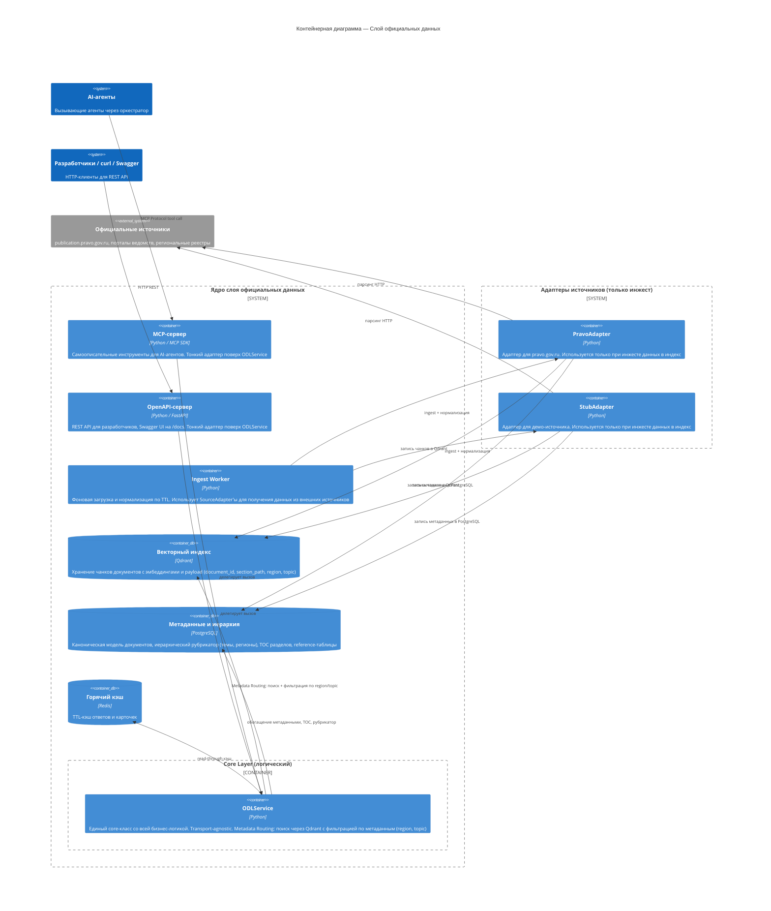

# Container Diagram

```mermaid
C4Container
    title Контейнерная диаграмма — Слой официальных данных

    System(agents, "AI-агенты", "Вызывающие агенты через оркестратор")
    System(dev, "Разработчики / curl / Swagger", "HTTP-клиенты для REST API")

    System_Boundary(core, "Ядро слоя официальных данных") {
        Container(mcp_api, "MCP-сервер", "Python / MCP SDK", "Самоописательные инструменты для AI-агентов. Тонкий адаптер поверх ODLService")
        Container(rest_api, "OpenAPI-сервер", "Python / FastAPI", "REST API для разработчиков, Swagger UI на /docs. Тонкий адаптер поверх ODLService")

        Container_Boundary(service_boundary, "Core Layer (логический)") {
            Container(service, "ODLService", "Python", "Единый core-класс со всей бизнес-логикой. Transport-agnostic. Metadata Routing: поиск через Qdrant с фильтрацией по метаданным (region, topic)")
        }

        Container(ingest, "Ingest Worker", "Python", "Фоновая загрузка и нормализация по TTL. Использует SourceAdapter'ы для получения данных из внешних источников")
        ContainerDb(index, "Векторный индекс", "Qdrant", "Хранение чанков документов с эмбеддингами и payload (document_id, section_path, region, topic)")
        ContainerDb(metadata_db, "Метаданные и иерархия", "PostgreSQL", "Каноническая модель документов, иерархический рубрикатор (темы, регионы), TOC разделов, reference-таблицы")
        ContainerDb(cache, "Горячий кэш", "Redis", "TTL-кэш ответов и карточек")
    }

    System_Boundary(adapters, "Адаптеры источников (только инжест)") {
        Container(pravo_adapter, "PravoAdapter", "Python", "Адаптер для pravo.gov.ru. Используется только при инжесте данных в индекс")
        Container(stub_adapter, "StubAdapter", "Python", "Адаптер для демо-источника. Используется только при инжесте данных в индекс")
    }

    System_Ext(sources, "Официальные источники", "publication.pravo.gov.ru, порталы ведомств, региональные реестры")

    Rel(agents, mcp_api, "MCP Protocol tool call")
    Rel(dev, rest_api, "HTTP REST")
    Rel(mcp_api, service, "делегирует вызов")
    Rel(rest_api, service, "делегирует вызов")
    Rel(service, index, "Metadata Routing: поиск + фильтрация по region/topic")
    Rel(service, metadata_db, "обогащение метаданными, TOC, рубрикатор")
    Rel(service, cache, "read-through кэш")
    Rel(ingest, pravo_adapter, "ingest + нормализация")
    Rel(ingest, stub_adapter, "ingest + нормализация")
    Rel(pravo_adapter, sources, "парсинг HTTP")
    Rel(stub_adapter, sources, "парсинг HTTP")
    Rel(pravo_adapter, index, "запись чанков в Qdrant")
    Rel(pravo_adapter, metadata_db, "запись метаданных в PostgreSQL")
    Rel(stub_adapter, index, "запись чанков в Qdrant")
    Rel(stub_adapter, metadata_db, "запись метаданных в PostgreSQL")

    UpdateLayoutConfig($c4ShapeInRow="4")
```
