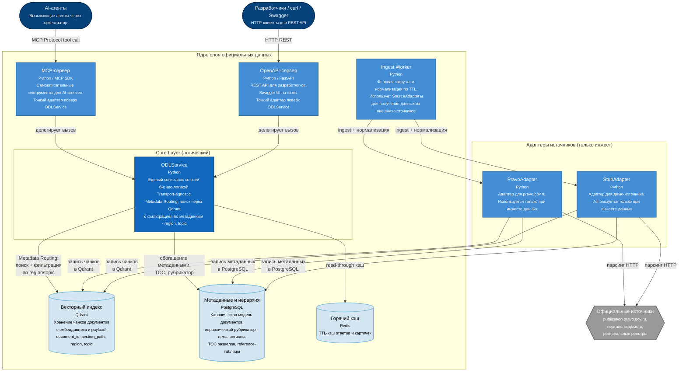

# Container Diagram

```mermaid
flowchart TB
    %% ─── Стили ──────────────────────────────────────────────
    classDef system fill:#1168bd,color:#ffffff,stroke:#0b4884,stroke-width:2px
    classDef container fill:#438dd5,color:#ffffff,stroke:#2b6ba8,stroke-width:2px
    classDef db fill:#d4e6f1,color:#000000,stroke:#7ab8d4,stroke-width:2px
    classDef person fill:#08427b,color:#ffffff,stroke:#052e56,stroke-width:2px
    classDef external fill:#999999,color:#ffffff,stroke:#666666,stroke-width:2px

    %% ─── Внешние системы / люди ──────────────────────────────
    agents(["AI-агенты<br/><small>Вызывающие агенты через оркестратор</small>"])
    dev(["Разработчики / curl / Swagger<br/><small>HTTP-клиенты для REST API</small>"])
    sources{{"Официальные источники<br/><small>publication.pravo.gov.ru,<br/>порталы ведомств,<br/>региональные реестры</small>"}}

    class agents person
    class dev person
    class sources external

    %% ─── Ядро слоя официальных данных ────────────────────────
    subgraph core_b [Ядро слоя официальных данных]
        direction TB

        mcp_api[MCP-сервер<br/><small>Python / MCP SDK</small><br/><small>Самоописательные инструменты для AI-агентов.<br/>Тонкий адаптер поверх ODLService</small>]
        rest_api[OpenAPI-сервер<br/><small>Python / FastAPI</small><br/><small>REST API для разработчиков,<br/>Swagger UI на /docs.<br/>Тонкий адаптер поверх ODLService</small>]

        class mcp_api container
        class rest_api container

        subgraph core_inner["Core Layer (логический)"]
            direction TB
            service[ODLService<br/><small>Python</small><br/><small>Единый core-класс со всей бизнес-логикой.<br/>Transport-agnostic.<br/>Metadata Routing: поиск через Qdrant<br/>с фильтрацией по метаданным - region, topic</small>]
        end

        class service system

        ingest[Ingest Worker<br/><small>Python</small><br/><small>Фоновая загрузка и нормализация по TTL.<br/>Использует SourceAdapter'ы<br/>для получения данных из внешних источников</small>]

        class ingest container

        index[(Векторный индекс<br/><small>Qdrant</small><br/><small>Хранение чанков документов<br/>с эмбеддингами и payload:<br/>document_id, section_path, region, topic</small>)]
        metadata_db[(Метаданные и иерархия<br/><small>PostgreSQL</small><br/><small>Каноническая модель документов,<br/>иерархический рубрикатор - темы, регионы,<br/>TOC разделов, reference-таблицы</small>)]
        cache[(Горячий кэш<br/><small>Redis</small><br/><small>TTL-кэш ответов и карточек</small>)]

        class index db
        class metadata_db db
        class cache db
    end

    %% ─── Адаптеры источников ─────────────────────────────────
    subgraph adapters_b["Адаптеры источников (только инжест)"]
        direction TB
        pravo[PravoAdapter<br/><small>Python</small><br/><small>Адаптер для pravo.gov.ru.<br/>Используется только при инжесте данных</small>]
        stub[StubAdapter<br/><small>Python</small><br/><small>Адаптер для демо-источника.<br/>Используется только при инжесте данных</small>]

        class pravo container
        class stub container
    end

    %% ─── Связи ───────────────────────────────────────────────
    agents  -->|"MCP Protocol tool call"| mcp_api
    dev     -->|"HTTP REST"| rest_api

    mcp_api -->|"делегирует вызов"| service
    rest_api -->|"делегирует вызов"| service

    service -->|"Metadata Routing:<br/>поиск + фильтрация<br/>по region/topic"| index
    service -->|"обогащение метаданными,<br/>TOC, рубрикатор"| metadata_db
    service -->|"read-through кэш"| cache

    ingest  -->|"ingest + нормализация"| pravo
    ingest  -->|"ingest + нормализация"| stub

    pravo   -->|"парсинг HTTP"| sources
    stub    -->|"парсинг HTTP"| sources

    pravo   -->|"запись чанков<br/>в Qdrant"| index
    pravo   -->|"запись метаданных<br/>в PostgreSQL"| metadata_db
    stub    -->|"запись чанков<br/>в Qdrant"| index
    stub    -->|"запись метаданных<br/>в PostgreSQL"| metadata_db
```
