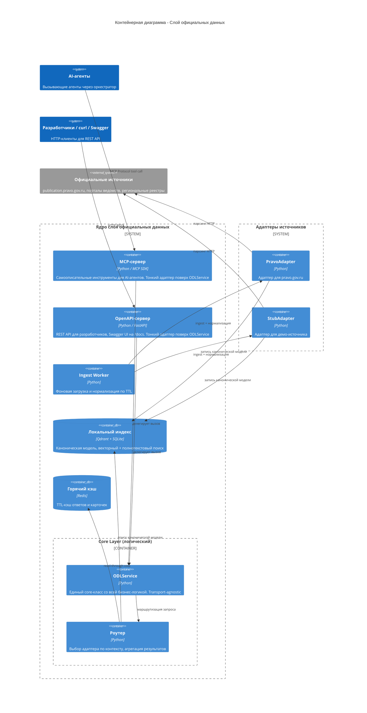

# Container Diagram

```mermaid
C4Container
    title Контейнерная диаграмма - Слой официальных данных

    System(agents, "AI-агенты", "Вызывающие агенты через оркестратор")
    System(dev, "Разработчики / curl / Swagger", "HTTP-клиенты для REST API")

    System_Boundary(core, "Ядро слоя официальных данных") {
        Container(mcp_api, "MCP-сервер", "Python / MCP SDK", "Самоописательные инструменты для AI-агентов. Тонкий адаптер поверх ODLService")
        Container(rest_api, "OpenAPI-сервер", "Python / FastAPI", "REST API для разработчиков, Swagger UI на /docs. Тонкий адаптер поверх ODLService")

        Container_Boundary(service_boundary, "Core Layer (логический)") {
            Container(service, "ODLService", "Python", "Единый core-класс со всей бизнес-логикой. Transport-agnostic")
            Container(router, "Роутер", "Python", "Выбор адаптера по контексту, агрегация результатов")
        }

        Container(ingest, "Ingest Worker", "Python", "Фоновая загрузка и нормализация по TTL")
        ContainerDb(index, "Локальный индекс", "Qdrant + SQLite", "Каноническая модель, векторный + полнотекстовый поиск")
        ContainerDb(cache, "Горячий кэш", "Redis", "TTL-кэш ответов и карточек")
    }

    System_Boundary(adapters, "Адаптеры источников") {
        Container(pravo_adapter, "PravoAdapter", "Python", "Адаптер для pravo.gov.ru")
        Container(stub_adapter, "StubAdapter", "Python", "Адаптер для демо-источника")
    }

    System_Ext(sources, "Официальные источники", "publication.pravo.gov.ru, порталы ведомств, региональные реестры")

    Rel(agents, mcp_api, "MCP Protocol tool call")
    Rel(dev, rest_api, "HTTP REST")
    Rel(mcp_api, service, "делегирует вызов")
    Rel(rest_api, service, "делегирует вызов")
    Rel(service, router, "маршрутизация запроса")
    Rel(router, index, "поиск канонической модели")
    Rel(router, cache, "read-through кэш")
    Rel(ingest, pravo_adapter, "ingest + нормализация")
    Rel(ingest, stub_adapter, "ingest + нормализация")
    Rel(pravo_adapter, sources, "парсинг HTTP")
    Rel(stub_adapter, sources, "парсинг HTTP")
    Rel(pravo_adapter, index, "запись канонической модели")
    Rel(stub_adapter, index, "запись канонической модели")

    UpdateLayoutConfig($c4ShapeInRow="3")
```
