# Class Diagram — Official Data Layer v0.2.0

> Диаграмма классов ядра слоя официальных данных.
> Группировка: модели данных → core-сервис → API → persistence → адаптеры → вспомогательные.

```mermaid
classDiagram
    class LegalStatus {
        <<enumeration>>
        ACTIVE
        NOT_ACTIVE
    }

    class SourceAvailability {
        <<enumeration>>
        AVAILABLE
        DEGRADED
        UNAVAILABLE
    }

    class Source {
        +str id
        +str name
        +str url
        +str | None jurisdiction
    }

    class OfficialDocument {
        +str id
        +str title
        +Source source
        +str url
        +str | None summary
        +str | None jurisdiction
        +str | None region
        +str | None region_id
        +list~str~ topic
        +str | None organization
        +str | None organization_id
        +str | None document_type
        +str | None document_type_id
        +datetime created_at
        +datetime | None valid_from
        +datetime | None valid_to
        +LegalStatus legal_status
        +str | None document_number
        +str | None publish_id
        +datetime | None publish_date
        +dict meta
    }

    class SearchContext {
        +str | None region
        +str | None region_id
        +float | None region_confidence
        +list~str~ | None organization
        +int | None max_age_days
        +int max_results
        +int offset
        +float | None score_threshold
    }

    class SearchResult {
        +str id
        +str title
        +str snippet
        +str url
        +str source_name
        +str | None jurisdiction
        +str | None region
        +list~str~ topic
        +str | None organization
        +datetime created_at
        +LegalStatus legal_status
        +ConfidenceSignals confidence
        +str | None document_number
        +str | None document_type
    }

    class SearchResponse {
        +list~SearchResult~ results
        +int total_count
        +int offset
        +str | None missing_context
        +str | None suggested_clarification_prompt
    }

    class DocumentDetail {
        +str id
        +str title
        +str url
        +str source_name
        +str | None jurisdiction
        +str | None region
        +list~str~ topic
        +str | None organization
        +datetime created_at
        +datetime | None valid_from
        +datetime | None valid_to
        +LegalStatus legal_status
        +str | None document_number
        +str | None document_type
        +list~Citation~ citations
    }

    class Citation {
        +str text
        +str source_id
        +str url
        +list~str~ | None section
        +int | None span_start
        +int | None span_end
    }

    class TopicMatch {
        +str topic_id
        +float score
    }

    class ConfidenceSignals {
        +float retrieval_relevance
        +list~TopicMatch~ | None topic_relevance
        +datetime | None last_verified_at
    }

    class DocumentChunk {
        +str id
        +str document_id
        +str doc_uuid
        +str text
        +list~float~ | None embedding
        +list~str~ section_path
        +list~str~ section_external_ids
        +list~str~ section_uuids
        +int chunk_index
        +int section_chunk_index
        +datetime | None data_freshness
        +date | None not_actual_since
        +str | None region
        +str | None region_id
        +list~str~ topic_ids
        +dict~str, float~ topic_scores
    }

    class TopicNode {
        +str id
        +str name
        +str parent_id
        +str | None description
        +int child_count
        +int document_count
    }

    class TocNode {
        +str id
        +str document_id
        +str title
        +str parent_id
        +int level
        +int child_count
    }

    class TopicPoint {
        +str id
        +str topic_id
        +str name
        +list~float~ | None embedding
    }

    class RegionNode {
        +str id
        +str name
        +str parent_id
        +str | None description
        +int child_count
        +int document_count
    }

    %% ─── Core Service ──────────────────────────────────────────────
    class ODLServiceProtocol {
        <<interface>>
        +search_documents(query, context) SearchResponse
        +get_document_detail(source_id) DocumentDetail
        +list_topics(parent_id, query) list~TopicNode~
        +get_toc(document_id) list~TocNode~
    }

    class ODLService {
        -Tracer | None _tracer
        -CacheClient | None _cache
        -DatabaseClient | None _db
        -QdrantStore | None _qdrant
        -Embedder | None _embedder
        -Reranker | None _reranker
        -DocumentRepository _doc_repo_lazy
        -SectionRepository _section_repo_lazy
        -ReferenceRepository _ref_repo_lazy
        -ChangeTrackingRepository _change_repo_lazy
        -RegionResolver _region_resolver
        +search_documents(query, context) SearchResponse
        +get_document_detail(source_id) DocumentDetail
        +list_topics(parent_id, query) list~TopicNode~
        +get_toc(document_id) list~TocNode~
        +get_reference_counts() ReferenceCounts
        +get_admin_qdrant_status() AdminQdrantStatus
        +get_document_status(publish_id) DocumentStatus
    }

    ODLService ..|> ODLServiceProtocol : implements

    %% ─── API Layer ─────────────────────────────────────────────────
    class MCPServer {
        +search_documents(query, context)
        +get_document_detail(source_id)
        +list_topics(parent_id, query)
        +get_toc(document_id, parent_section_id, query)
    }

    class RESTServer {
        +GET /health
        +POST /api/v1/search
        +GET /api/v1/documents/id
        +GET /api/v1/topics
        +GET /api/v1/documents/id/toc
        +GET /api/v1/admin/reference-counts
        +GET /api/v1/admin/qdrant/collections
        +GET /api/v1/admin/documents/id/status
    }

    MCPServer --> ODLService : delegates to
    RESTServer --> ODLService : delegates to

    %% ─── Persistence Layer ─────────────────────────────────────────
    class DatabaseClient {
        -str dsn
        -Pool _pool
        +connect()
        +close()
        +fetch(query) list~Record~
        +fetchrow(query) Record | None
        +execute(query) str
        +executemany(query, args)
        +upsert(table, data) UUID
        +paginated_fetch(query, limit, offset) list~Record~
        +transaction() TransactionProxy
    }

    class DocumentRepository {
        +get_document_by_publish_id(publish_id) OfficialDocument | None
        +get_document_uuid(publish_id) str | None
        +save_document(doc) str
        +get_legal_status(doc_uuid) LegalStatus
        +update_document_jurisdiction_region(doc_uuid, jurisdiction_id, region_id)
    }

    class SectionRepository {
        +save_section_hierarchy(doc_uuid, sections)
        +get_toc(doc_uuid) list~TocNode~
        +get_section_uuids(doc_uuid) list~str~
    }

    class ReferenceRepository {
        +get_or_create_data_source(source_id, name, url) str
        +get_or_create_topic(source_id, external_id, name) tuple~str, bool~
        +get_or_create_document_type(source_id, external_id, name) str
        +get_or_create_organization(source_id, external_id, name) str
        +get_or_create_region(source_id, code, name) str
        +get_or_create_jurisdiction(source_id, code, name) str
        +get_organization_data(external_id, source_id) dict
    }

    class ChangeTrackingRepository {
        +get_last_ingest_time(source_id) datetime | None
        +log_ingest(source_id, status, details)
    }

    class QdrantStore {
        -str host
        -int port
        -int vector_size
        +ensure_collection(name)
        +upsert(collection, points)
        +search(collection, query_vector, filters, limit, offset) list~tuple~DocumentChunk, float~~
        +delete_all_collections()
        +build_filter(field, values)
        +deactivate_sections(doc_uuid, section_uuids, effective_date)
    }

    DatabaseClient --> DocumentRepository : provides connection
    DatabaseClient --> SectionRepository : provides connection
    DatabaseClient --> ReferenceRepository : provides connection
    DatabaseClient --> ChangeTrackingRepository : provides connection

    %% ─── Ingest Layer ──────────────────────────────────────────────
    class SourceAdapter {
        <<protocol>>
        +get(document_id) OfficialDocument
        +get_content(document_id) str
        +search(query, context) list~OfficialDocument~
        +list_topics() list~TopicNode~
    }

    class PravoAdapter {
        +get(document_id) OfficialDocument
        +get_content(document_id) str
        +search(query, context) list~OfficialDocument~
        +list_topics() list~TopicNode~
    }

    class StubAdapter {
        +get(document_id) OfficialDocument
        +get_content(document_id) str
        +search(query, context) list~OfficialDocument~
        +list_topics() list~TopicNode~
    }

    class IngestPipeline {
        +process_document_text(text, document_id, doc_uuid, chunker, embedder, qdrant, section_repo) tuple~list~DocumentChunk~~, list~TocNode~~
        +link_chunks_to_topics(chunks, embedder, qdrant)
    }

    class DocStructSplitter {
        +parse_hierarchy(text) list~Section~
        +generate_chunks(sections) tuple~list~DocumentChunk~~, list~TocNode~~
    }

    class Embedder {
        -str model_name
        -int vector_size
        +embed(text) list~float~
        +embed_batch(texts) list~list~float~~
    }

    PravoAdapter ..|> SourceAdapter : implements
    StubAdapter ..|> SourceAdapter : implements

    IngestPipeline --> DocStructSplitter : uses
    IngestPipeline --> Embedder : uses
    IngestPipeline --> QdrantStore : writes to

    %% ─── Cache ─────────────────────────────────────────────────────
    class CacheClient {
        -Redis | None _client
        -bool _available
        +get(key) str | None
        +set(key, value, ttl)
        +ping() bool
        +close()
    }

    %% ─── Region Resolver ───────────────────────────────────────────
    class RegionResolver {
        -DatabaseClient _db
        -CacheClient _cache
        +resolve(region_name) tuple~str | None, float | None~
    }

    %% ─── Reranker ──────────────────────────────────────────────────
    class Reranker {
        <<abstract>>
        +rerank(query_embedding, chunks, topic_matches) list~tuple~DocumentChunk, float~~
    }

    class TopicAwareReranker {
        -float retrieval_weight
        -float topic_weight
        +rerank(query_embedding, chunks, topic_matches) list~tuple~DocumentChunk, float~~
    }

    class PassThroughReranker {
        +rerank(query_embedding, chunks, topic_matches) list~tuple~DocumentChunk, float~~
    }

    TopicAwareReranker --|> Reranker : extends
    PassThroughReranker --|> Reranker : extends

    %% ─── Observability ─────────────────────────────────────────────
    class Tracer {
        <<abstract>>
        +trace(name) Span
        +check_health() bool
    }

    class LangFuseTracer {
        -LangfuseClient _client
        +trace(name) Span
        +check_health() bool
    }

    class FileFallbackTracer {
        -str log_dir
        +trace(name) Span
        +check_health() bool
    }

    LangFuseTracer --|> Tracer : extends
    FileFallbackTracer --|> Tracer : extends

    %% ─── Circuit Breaker ───────────────────────────────────────────
    class CircuitBreaker {
        -int failure_threshold
        -float recovery_timeout
        -int _failures
        -datetime | None _last_failure
        +call(callable) Any
        +reset()
    }

    %% ─── Relationships ─────────────────────────────────────────────
    %% Data model relationships
    SearchResponse "1" *-- "many" SearchResult : contains
    SearchResult "1" *-- "1" ConfidenceSignals : has
    ConfidenceSignals "1" *-- "many" TopicMatch : contains

    DocumentDetail "1" *-- "many" Citation : contains

    %% Core service dependencies
    ODLService "1" *-- "1" CacheClient : uses
    ODLService "1" *-- "1" RegionResolver : uses
    ODLService "1" *-- "1" Reranker : uses
    ODLService "1" *-- "1" QdrantStore : queries
    ODLService "1" *-- "1" DatabaseClient : queries
    ODLService "1" *-- "1" Embedder : uses

    %% Ingest relationships
    IngestPipeline --> DocumentChunk : produces
    IngestPipeline --> TopicNode : produces (TOC)
    DocStructSplitter --> DocumentChunk : creates
    Embedder --> DocumentChunk : fills .embedding
```

---

## Описание групп классов

### 1. Модели данных (Pydantic v2)

Ядро канонической модели. Все модели наследуют `BaseModel` от Pydantic v2, обеспечивая строгие схемы входа/выхода.

| Класс | Назначение | Файл |
|-------|-----------|------|
| `OfficialDocument` | Каноническая модель документа (entity) | [`core/models/models.py:102`](core/models/models.py:102) |
| `DocumentChunk` | Чанк для хранения в Qdrant с payload | [`core/models/models.py:431`](core/models/models.py:431) |
| `SearchContext` | Входной контракт для фильтрации и роутинга | [`core/models/models.py:198`](core/models/models.py:198) |
| `SearchResult` | Результат поиска (компактный) | [`core/models/models.py:261`](core/models/models.py:261) |
| `SearchResponse` | Ответ на поисковый запрос с пагинацией | [`core/models/models.py:310`](core/models/models.py:310) |
| `DocumentDetail` | Полная карточка документа (ответ get_document_detail) | [`core/models/models.py:342`](core/models/models.py:342) |
| `ConfidenceSignals` | Разложенные сигналы уверенности | [`core/models/models.py:63`](core/models/models.py:63) |
| `Citation` | Цитата с привязкой к разделу | [`core/models/models.py:46`](core/models/models.py:46) |
| `TopicNode` / `TocNode` | Узлы рубрикатора и оглавления | [`core/models/models.py:401`](core/models/models.py:401) |
| `TopicMatch` | Пара (topic_id, score) для разложенного сигнала | [`core/models/models.py:509`](core/models/models.py:509) |

### 2. Core-сервис

| Класс | Назначение | Файл |
|-------|-----------|------|
| `ODLServiceProtocol` | Интерфейс core-класса (transport-agnostic) | [`core/odl_service_protocol.py`](core/odl_service_protocol.py) |
| `ODLService` | Единая реализация всей бизнес-логики | [`core/odl_service.py:58`](core/odl_service.py:58) |

`ODLService` — центральный класс, реализующий Metadata Routing. Не зависит от адаптеров источников.

### 3. API-слой

| Компонент | Интерфейс | Файл |
|-----------|-----------|------|
| MCP-сервер | 4 инструмента (search, detail, topics, toc) | [`core/api/mcp_server.py`](core/api/mcp_server.py) |
| REST-сервер | 9 endpoints (FastAPI + OpenAPI) | [`core/api/rest_server.py`](core/api/rest_server.py) |

Оба — тонкие адаптеры, делегирующие вызовы `ODLService`.

### 4. Persistence

| Класс | Назначение | Файл |
|-------|-----------|------|
| `DatabaseClient` | asyncpg pool + upsert/transaction | [`core/persistence/db_client.py:49`](core/persistence/db_client.py:49) |
| `QdrantStore` | Векторное хранение + payload-фильтрация | [`core/index/qdrant_store.py`](core/index/qdrant_store.py) |
| `DocumentRepository` | CRUD документов в PostgreSQL | [`core/persistence/repository/document_repo.py`](core/persistence/repository/document_repo.py) |
| `SectionRepository` | Иерархия разделов (TOC) | [`core/persistence/repository/section_repo.py`](core/persistence/repository/section_repo.py) |
| `ReferenceRepository` | Справочники (topic, org, region, ...) | [`core/persistence/repository/reference_repo.py`](core/persistence/repository/reference_repo.py) |
| `ChangeTrackingRepository` | Логирование инжеста | [`core/persistence/repository/change_tracking_repo.py`](core/persistence/repository/change_tracking_repo.py) |

### 5. Адаптеры источников

| Класс | Назначение | Файл |
|-------|-----------|------|
| `SourceAdapter` (Protocol) | Интерфейс адаптера (7 методов) | [`adapters/base/source_adapter.py`](adapters/base/source_adapter.py) |
| `PravoAdapter` | Адаптер pravo.gov.ru (stub + production) | [`adapters/pravo/`](adapters/pravo/) |
| `StubAdapter` | Демо-источник | [`adapters/stub/stub_adapter.py`](adapters/stub/stub_adapter.py) |
| `IngestPipeline` | Сквозной пайплайн инжеста | [`adapters/base/ingest_pipeline.py`](adapters/base/ingest_pipeline.py) |

Адаптеры используются **только на этапе инжеста**. Query path идёт напрямую через `ODLService` → Qdrant.

### 6. Вспомогательные

| Класс | Назначение | Файл |
|-------|-----------|------|
| `CacheClient` | Redis cache-aside с graceful degradation | [`core/cache/__init__.py`](core/cache/__init__.py) |
| `RegionResolver` | Триграммный поиск региона | [`core/regions.py:21`](core/regions.py:21) |
| `TopicAwareReranker` | Ранжирование с учётом близости рубрик | [`core/reranker/topic_aware_reranker.py`](core/reranker/topic_aware_reranker.py) |
| `CircuitBreaker` | Защита от каскадных отказов (3 failures → 30s recovery) | [`adapters/base/circuit_breaker.py`](adapters/base/circuit_breaker.py) |
| `Tracer` (abstract) | Интерфейс трейсинга | [`core/observability/tracer.py`](core/observability/tracer.py) |
| `LangFuseTracer` | LangFuse + файловый fallback | [`core/observability/tracer.py:298`](core/observability/tracer.py:298) |
