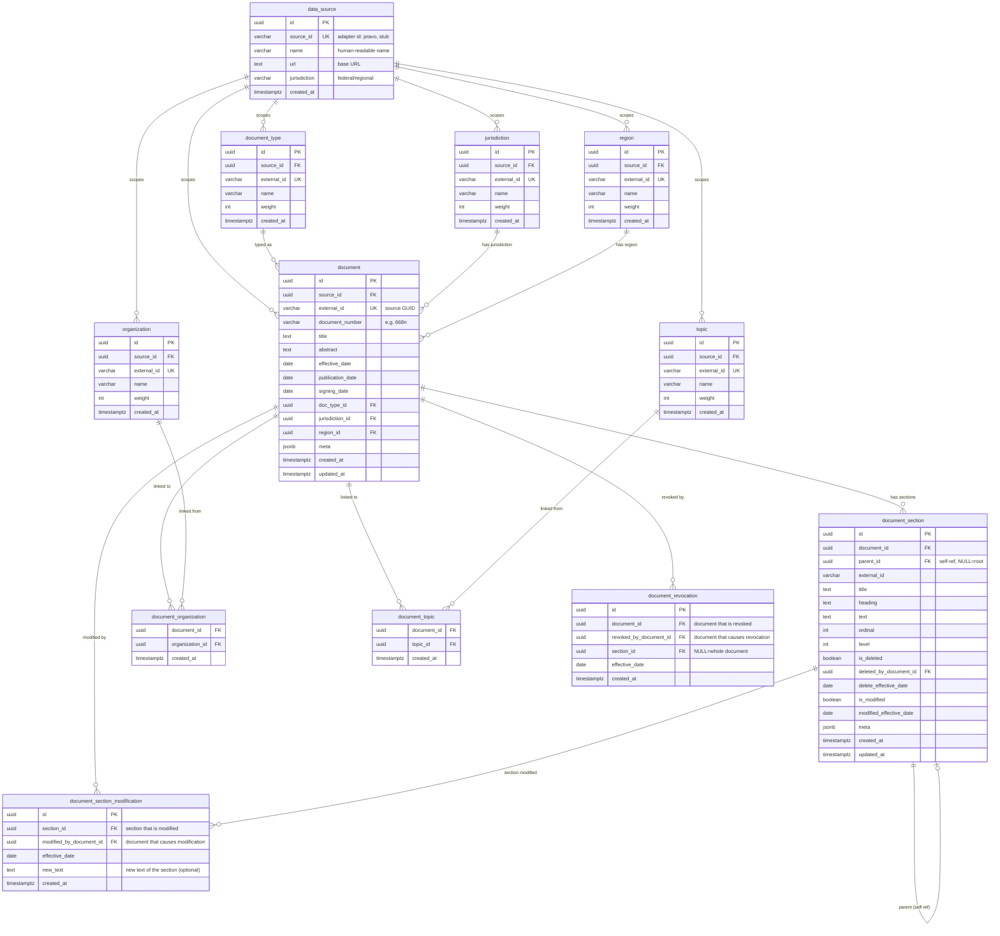

# Database Schema — PostgreSQL

> ER-диаграмма и описание всех таблиц PostgreSQL.
> Версия миграций: v001 (Liquibase).

---

## ER-диаграмма

---

## Описание таблиц

### 1. Reference tables (справочники)

Все reference-таблицы скоупированы на `data_source` через внешний ключ `source_id`. Это позволяет каждому источнику иметь свой набор справочников (например, pravo.gov.ru → свои GUID организаций).

#### `data_source`
Корневая таблица — регистрирует каждый адаптер источника.

| Колонка | Тип | Описание |
|---------|-----|----------|
| `id` | `UUID PK` | Внутренний идентификатор |
| `source_id` | `VARCHAR(50) UNIQUE` | Идентификатор адаптера (`pravo`, `stub`) |
| `name` | `VARCHAR(255)` | Человекочитаемое имя |
| `url` | `TEXT` | Базовый URL источника |
| `jurisdiction` | `VARCHAR(50)` | Юрисдикция (федеральная и т.д.) |

Скрипт: [`000_create_data_source.sql`](core/persistence/migrations/v001/000_create_data_source.sql)

#### `document_type`
Виды документов (Федеральный закон, Приказ, Постановление...).

#### `organization`
Органы, принявшие документ (Минтруд России, ФНС...).

#### `jurisdiction`
Юрисдикции (федеральная, региональная, ведомственная).

#### `region`
Регионы (город Москва, Московская область...).

#### `topic`
Тематические рубрики (иерархические, с parent_id в `rubric`).

Скрипт: [`001_create_reference_tables.sql`](core/persistence/migrations/v001/001_create_reference_tables.sql)

### 2. Document tables (документы)

#### `document`
Каноническая модель документа. Центральная таблица.

| Колонка | Тип | Описание |
|---------|-----|----------|
| `id` | `UUID PK` | Внутренний UUID |
| `source_id` | `UUID FK → data_source` | Адаптер источника |
| `external_id` | `VARCHAR(36)` | GUID из источника (например, `3fa85f64-...`) |
| `title` | `TEXT` | Заголовок документа |
| `abstract` | `TEXT` | Аннотация |
| `effective_date` | `DATE` | Дата вступления в силу |
| `publication_date` | `DATE` | Дата публикации |
| `signing_date` | `DATE` | Дата подписания |
| `doc_type_id` | `UUID FK → document_type` | Вид документа |
| `jurisdiction_id` | `UUID FK → jurisdiction` | Юрисдикция |
| `region_id` | `UUID FK → region` | Регион |
| `meta` | `JSONB` | Source-специфичные атрибуты |

Уникальность: `UNIQUE(source_id, external_id)`.

Скрипт: [`002_create_document_tables.sql`](core/persistence/migrations/v001/002_create_document_tables.sql)

#### `document_section`
Иерархические разделы документа (self-referencing через `parent_id`).

Ключевые колонки:
- `parent_id` — `NULL` для корневого раздела
- `ordinal` — порядок внутри родителя (0-based)
- `level` — глубина иерархии (0 = корень)
- `is_deleted` / `is_modified` — флаги для change tracking

Скрипт: [`002_create_document_tables.sql`](core/persistence/migrations/v001/002_create_document_tables.sql)

### 3. Junction tables (связи M:N)

#### `document_organization`
Many-to-many: документ → организации. Документ может быть принят несколькими органами.

#### `document_topic`
Many-to-many: документ → рубрики. Документ может относиться к нескольким рубрикам.

Скрипт: [`003_create_document_relations.sql`](core/persistence/migrations/v001/003_create_document_relations.sql)

### 4. Change tracking (история изменений)

#### `document_revocation`
Фиксирует факт отмены документа или его раздела другим документом.

| Колонка | Описание |
|---------|----------|
| `document_id` | Документ, который отменён |
| `revoked_by_document_id` | Документ, который отменяет |
| `section_id` | Конкретный раздел (NULL = весь документ) |
| `effective_date` | Дата отмены |

#### `document_section_modification`
Фиксирует факт изменения раздела другим документом.

Скрипт: [`004_create_change_tracking.sql`](core/persistence/migrations/v001/004_create_change_tracking.sql)

---

## Миграции

Все миграции выполняются через Liquibase:

| Миграция | Описание |
|----------|----------|
| `v001/000` | `data_source` |
| `v001/001` | Reference tables (document_type, organization, jurisdiction, region, topic) |
| `v001/002` | `document`, `document_section` |
| `v001/003` | Junction tables (document_organization, document_topic) |
| `v001/004` | Change tracking (document_revocation, document_section_modification) |
| `v001/005` | `rubric` table |
| `v001/006` | `document_rubric` |
| `v001/007` | Rename `external_id` → `publish_id` |
| `v001/008` | Rename document columns |
| `v001/009` | Region hierarchical |
| `v001/010` | `section_topic` |

Скрипты: [`core/persistence/migrations/v001/`](core/persistence/migrations/v001/)

---

## Векторное хранение (Qdrant)

Qdrant не является частью PostgreSQL, но хранит **DocumentChunk** с payload-полями:

| Qdrant payload field | Source | Назначение |
|----------------------|--------|------------|
| `document_id` | `source_id-publish_id` | Идентификация документа |
| `doc_uuid` | PostgreSQL `document.id` | Связь с реляционной моделью |
| `section_path` | DocStructSplitter | Путь к разделу |
| `section_uuids` | PostgreSQL `document_section.id` | Связь с разделами |
| `region_id` | `OfficialDocument.region_id` | Фильтрация по региону |
| `topic_ids` | `link_chunks_to_topics()` | Фильтрация по рубрикам |
| `topic_scores` | `link_chunks_to_topics()` | Score близости к рубрикам |
| `legal_status` | `OfficialDocument.legal_status` | Фильтрация по статусу |
| `not_actual_since` | Change tracking | Фильтрация устаревших |
| `data_freshness` | Ingest pipeline | Дата свежести чанка |
