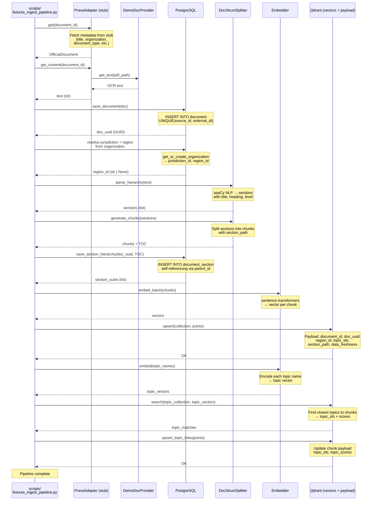
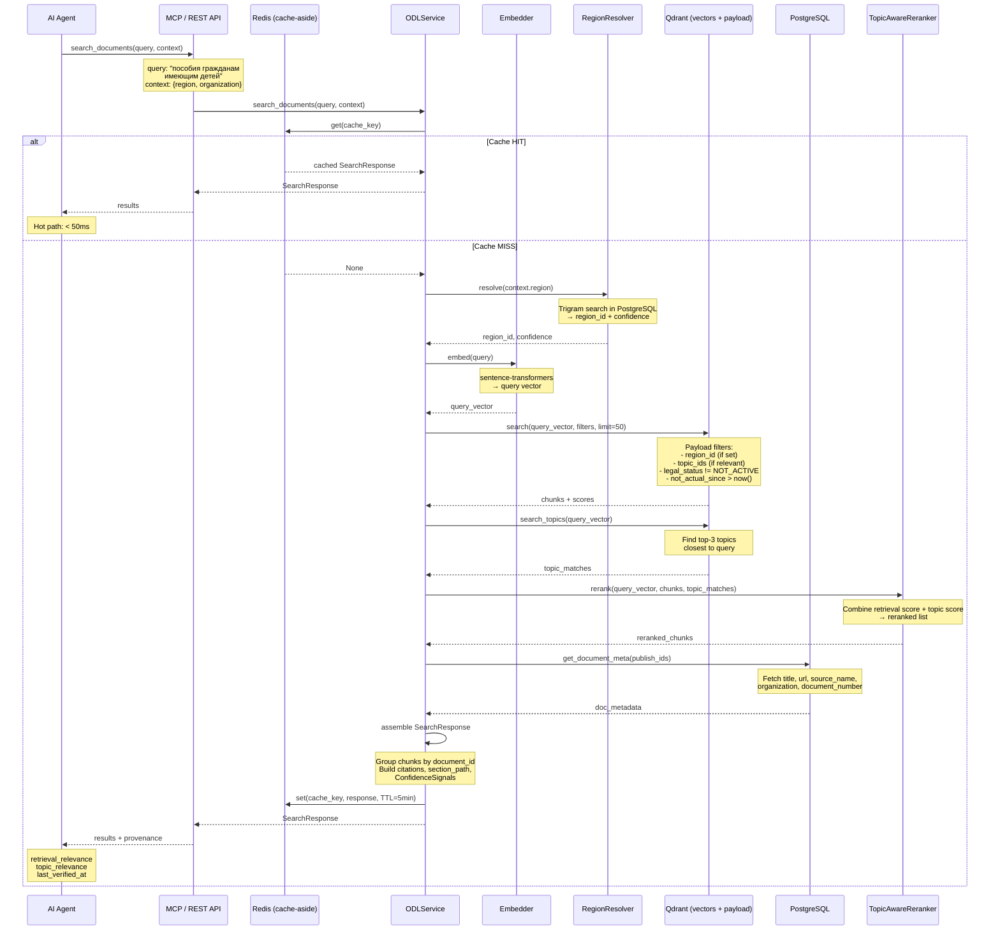
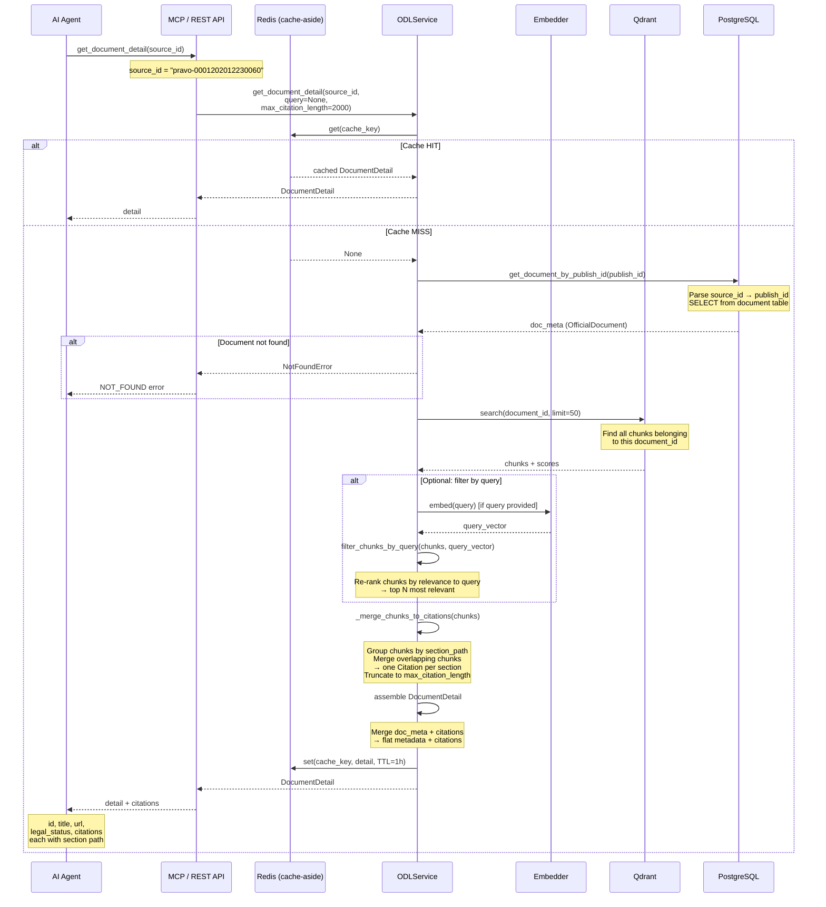

# Pipeline Sequence Diagrams

> Три диаграммы последовательностей для ключевых пайплайнов:
> 1. **Ingest Pipeline** — загрузка данных из источника в индекс
> 2. **Search Pipeline (Metadata Routing)** — поиск документов с фильтрацией
> 3. **Document Detail Pipeline** — получение полной карточки документа

---

## 1. Ingest Pipeline

Загрузка документа из источника → OCR → чанкинг → эмбеддинг → сохранение в Qdrant + PostgreSQL.



### Ключевые моменты инжеста

| Шаг | Что происходит | Заполняется в payload Qdrant |
|-----|---------------|------------------------------|
| Fetch metadata | Получение title, organization, document_type | `document_id`, `doc_uuid` |
| Resolve region | Определение `region_id` из организации | `region_id` |
| Generate chunks | Структурный чанкинг с section_path | `section_path`, `section_uuids` |
| Embed chunks | Векторизация текста чанков | `embedding` |
| Link topics | Косинусная близость чанк↔рубрика | `topic_ids`, `topic_scores` |
| Set legal_status | `ACTIVE` (stub) / из JSON API (production) | `legal_status` |

---

## 2. Search Pipeline (Metadata Routing)

Поиск документов по текстовому запросу с фильтрацией по метаданным. Ключевая особенность: **адаптеры источников не участвуют** — поиск идёт напрямую через Qdrant.



### Flow поиска

```
Query → Embedder → Qdrant (vector search + payload filter)
                                       ↓
                              TopicAwareReranker
                                       ↓
                              PostgreSQL enrichment
                                       ↓
                              Cache → Response
```

### Payload-фильтры в Qdrant

| Поле | Фильтр | Назначение |
|------|--------|------------|
| `region_id` | Равенство (если указан в контексте) | Поиск только по нужному региону |
| `topic_ids` | Пересечение (если рубрики релевантны) | Поиск в тематической области |
| `legal_status` | `!= NOT_ACTIVE` | Исключить отменённые документы |
| `not_actual_since` | `IS NULL OR > now()` | Исключить устаревшие разделы |

---

## 3. Document Detail Pipeline

Получение полной карточки документа с цитатами по `source_id`.



### Сборка цитат

Процесс в `_merge_chunks_to_citations()`:

1. Чанки группируются по `section_path`
2. Внутри каждой группы — сортировка по `section_chunk_index`
3. Перекрывающиеся чанки объединяются
4. Одна `Citation` на раздел с `section` (путь от корня)
5. Общая длина цитат ≤ `max_citation_length`

---

## Сводка TTL кэширования

| Метод | TTL | Ключ |
|-------|-----|------|
| `search_documents` | 5 минут | `odl:search:{sha256(query+ctx)}` |
| `get_document_detail` | 1 час | `odl:detail:{source_id}` |
| `list_topics` | 1 час | `odl:topics:{parent_id}:{query}` |
| `get_toc` | 1 час | `odl:toc:{doc_id}:{parent_id}:{query}` |
| Region resolution | 24 часа | `region:{region_name}` |
