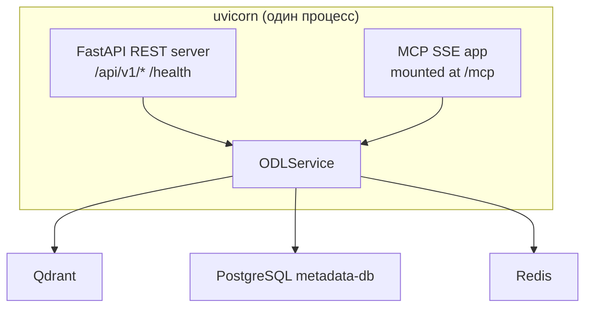

# Спецификация: Official Data Layer for AI Agents

**Версия:** 0.2.0
**Статус:** Актуальная (соответствует реализации)

---

## 1. Цель

Создать переносимый слой официальных данных (ODL — Official Data Layer), к которому AI-агент обращается вместо веб-поиска, когда вопрос касается государственной и социальной тематики. Слой опирается на официальные источники, отдаёт ответ с provenance (источник, дата, юридический статус), а если официального основания нет — честно сообщает.

---

## 2. Границы

### Что делает слой (in scope)

- Поиск и ретрив нормативно-правовых актов (НПА) и официальных данных
- Нормализация данных из разных источников в единую каноническую модель
- Выдача с provenance: цитата + ссылка на источник + дата актуальности + юридический статус
- Оценка уверенности разложенными сигналами (не одним скаляром)
- Фоновая актуализация данных по TTL
- Плавная деградация при недоступности источника
- Metadata Routing: фильтрация результатов поиска по метаданным (region, topic, organization) без явного указания источника
- Адаптеры источников используются только на этапе инжеста (загрузка и нормализация данных)
- Двойной интерфейс: MCP (для AI-агентов) + REST OpenAPI (для разработчиков)

### Что НЕ делает слой (out of scope)

- Не ведёт диалог с пользователем
- Не генерирует свободный текст для пользователя (финальную формулировку делает вызывающий агент)
- Не принимает решений о пороге доверия (это политика агента)
- Не работает с персональными данными (ФРИ и т.п.)
- Не является рассуждающим агентом — нет открытой агентной петли

---

## 3. Ключевые решения

### 3.1 Разделение механизм/политика

Сквозной принцип архитектуры:

| Аспект | Механизм (внутри слоя) | Политика (на стороне агента) |
|--------|----------------------|---------------------------|
| Выбор источника | Слой выбирает по реестру охвата и контексту | Агент может сузить декларативными ограничениями (регион, тема) |
| Расчёт уверенности | Слой отдаёт разложенные сигналы | Агент задаёт порог доверия под свой сценарий |
| Сборка ответа | Слой отдаёт факты с цитатами и датами | Агент формулирует финальный ответ пользователю |
| Свежесть | Слой отслеживает TTL и юридический статус | Агент решает, какая свежесть приемлема |
| Отказ | Слой честно сообщает «не нашёл» | Агент решает, отказаться или искать в веб |
| Порог релевантности | Слой возвращает все результаты с score | Агент задаёт `score_threshold` |

### 3.2 Контракт ответа с разложенными сигналами уверенности

Вместо одного скаляра уверенности слой отдаёт разложенные сигналы.
Свёртку в единую меру (answerability) делает вызывающий агент
(принцип механизм/политика).

| Сигнал | Тип | Семантика |
|--------|-----|-----------|
| `retrieval_relevance` | float [0,1] | similarity score ретрива (косинусная близость) |
| `data_freshness` | datetime \| None | Дата свежести чанка (valid_from документа/раздела, к которому принадлежит чанк) |
| `source_availability` | enum | `available` / `degraded` / `unavailable` |

**Почему именно эти три сигнала:**

- **`retrieval_relevance`** — основной сигнал: насколько результат релевантен запросу. Единственный обязательный, всегда доступен после поиска.
- **`data_freshness`** — свежесть копии в индексе. В текущей реализации используется `valid_from` документа (дата вступления в силу), не дата инжеста. **Техдолг:** должен храниться отдельный `ingested_at` timestamp.
- **`source_availability`** — доступность источника на момент запроса. Может различаться между результатами при агрегации из нескольких источников.

**Что НЕ включено и почему:**

- **`legal_status`** — метаданные документа, а не сигнал уверенности. Доступен в `SearchResult.legal_status` и `OfficialDocument.legal_status`.
- **`extraction_confidence`** — в текущей реализации все адаптеры используют детерминированный парсинг (без LLM), поэтому сигнал всегда равен 1.0. При появлении LLM-извлечения полей сигнал может быть добавлен как `dict[str, float]`.

### 3.3 Две оси времени

| Ось | Что означает | Пример |
|-----|-------------|--------|
| `created_at` / TTL | Когда данные загружены в индекс, свежесть копии | 2026-06-15 (обновляется раз в 24ч) |
| `valid_from` / `valid_to` | Юридический статус редакции | действует с 01.01.2025 по 31.12.2026 |

Свежая копия отменённого акта не должна уходить как «актуально». Для этого используется поле `not_actual_since` в [`DocumentChunk`](core/models/models.py:475) — чанки с `not_actual_since <= now()` фильтруются при поиске.

### 3.4 Выбор стека

| Компонент | Выбор | Обоснование |
|-----------|-------|-------------|
| Язык | Python 3.10+ | Требование задания |
| Интерфейс | MCP + OpenAPI (Dual API) | MCP — для AI-агентов самоописательные инструменты; OpenAPI FastAPI — для разработчиков, Swagger UI, curl |
| Векторный поиск | Qdrant | Высокопроизводительная векторная БД, payload filtering, sparse vectors |
| Метаданные и иерархия | PostgreSQL | Иерархический рубрикатор (темы, регионы, ведомства), рекурсивные CTE, ссылочная целостность через FK |
| Кэш | Redis | TTL-кэш ответов и карточек (cache-aside) |
| Observability | LangFuse (опционально) + файловый fallback | Трейсинг LLM-вызовов, метрики, отладка |
| Валидация | Pydantic v2 | Строгие схемы входа/выхода, типизированные ошибки |
| Эмбеддинги | sentence-transformers (локально) | Без внешних зависимостей, сменяемая модель |
| Database driver | asyncpg | Асинхронный PostgreSQL-драйвер |
| Чанкинг | smart_chunker (DocStructSplitter) | Структурный чанкинг для НПА с сохранением иерархии разделов |
| Миграции БД | Liquibase | XML-формат, не зависит от языка |
| Персистентность | In-process библиотека (не микросервис) | Нет второго потребителя, минимизация latency |
| ORM | Не используется | Raw SQL + Repository + Pydantic — достаточно для 10 таблиц |

### 3.5 Dual API: MCP + OpenAPI

Слой предоставляет два интерфейса поверх единого core-класса [`ODLService`](core/odl_service.py:60):

#### MCP-сервер (для AI-агентов)

Самоописательные инструменты через MCP Protocol, определённые в [`mcp_server.py`](core/api/mcp_server.py):

1. `search_documents(query, context)` — компактные процитированные попадания
2. `get_document_detail(source_id)` — полная карточка/текст акта
3. `list_topics(parent_id, query)` — просмотр иерархического рубрикатора
4. `get_toc(document_id, parent_section_id, query)` — навигация по оглавлению документа

#### OpenAPI-сервер (для разработчиков)

FastAPI-приложение с автоматической OpenAPI-документацией Swagger UI, определённое в [`rest_server.py`](core/api/rest_server.py):

| Метод | Endpoint | Описание |
|-------|----------|----------|
| GET | `/health` | Healthcheck (Redis, PostgreSQL, Qdrant, LangFuse) |
| POST | `/api/v1/search` | Поиск документов |
| GET | `/api/v1/documents/{source_id}` | Полная карточка документа |
| GET | `/api/v1/topics` | Рубрикатор |
| GET | `/api/v1/documents/{document_id}/toc` | Оглавление |
| GET | `/api/v1/admin/reference-counts` | Счётчики справочников |
| GET | `/api/v1/admin/qdrant/collections` | Статус коллекций Qdrant |
| GET | `/api/v1/admin/documents/{publish_id}/status` | Статус документа |

#### Transport-agnostic core

Оба сервера — тонкие адаптеры, делегирующие вызовы [`ODLService`](core/odl_service.py:60):

```python
class ODLService(ODLServiceProtocol):
    async def search_documents(self, query, context=None, parent_span=None) -> SearchResponse: ...
    async def get_document_detail(self, source_id, query=None, context=None, max_citation_length=2000) -> DocumentDetail: ...
    async def list_topics(self, parent_id=None, query="") -> list[TopicNode]: ...
    async def get_toc(self, document_id, parent_section_id=None, query="") -> list[TocNode]: ...
```

#### Архитектура запуска



Оба сервера запускаются в едином uvicorn-процессе через `app.mount("/mcp", mcp_sse_app)` в [`main.py`](core/main.py:183-184).

#### Свойства контракта (общие для обоих интерфейсов)
- **Самоописательность** — инструменты и параметры описаны Pydantic-схемами
- **Строгие детерминированные схемы** — strict structured outputs
- **Модель-дружественный вывод** — компактный, токен-эффективный
- **Provenance по умолчанию** — источник, дата, уверенность в каждом ответе
- **Токен-осознанность** — пагинация, выбор полей
- **Честные границы** — типизированные ошибки, «не найдено» вместо пустоты

### 3.6 Входной контракт: SearchContext

`SearchContext` — структурированный контракт для фильтрации и Metadata Routing запроса.

#### Структура

| Поле | Тип | По умолчанию | Описание |
|------|-----|-------------|----------|
| `query` | `str` | (обязательный параметр) | Свободный текст вопроса/интент пользователя. Передаётся отдельным параметром, не входит в SearchContext. |
| `region` | `str \| None` | `None` | Географический регион (город, область, край). Пример: «Московская область», «г. Москва» |
| `region_id` | `str \| None` | `None` | Resolved UUID региона (устанавливается внутренне через RegionResolver) |
| `region_confidence` | `float \| None` | `None` | Trigram similarity score разрешённого региона |
| `topic` | `list[str] \| None` | `None` | Тематические рубрики для фильтрации (OR-семантика). `None` = не фильтровать |
| `organization` | `list[str] \| None` | `None` | Органы для фильтрации (OR-семантика). `None` = не фильтровать |
| `max_age_days` | `int \| None` | `None` | Максимальный возраст документа в днях |
| `max_results` | `int` | `10` | Максимум результатов на страницу (1–50) |
| `offset` | `int` | `0` | Смещение для пагинации |
| `score_threshold` | `float \| None` | `None` | Минимальный порог релевантности (cosine similarity). Политика агента |

**Важные изменения от предыдущих версий:**
- `official_only` **удалён** — слой по определению работает только с официальными источниками
- `jurisdiction` **удалён** из SearchContext — вычисляется слоем из region и organization
- `region_id` и `region_confidence` добавлены — устанавливаются внутренне через [`RegionResolver`](core/regions.py:21)
- `score_threshold` добавлен — для фильтрации по релевантности (политика агента)

#### Принципы проектирования

1. **query — это интент.** Свободный текст вопроса пользователя передаётся отдельным параметром `query`, а не дублируется в `SearchContext`.

2. **Поля не пересекаются семантически.** `region` (география), `topic` (тематика) и `organization` (орган) ортогональны.

3. **Производные характеристики вычисляются слоем.** `jurisdiction` отсутствует в SearchContext, хотя присутствует в канонической модели `OfficialDocument`. Слой выводит юрисдикцию из контекста через `RegionResolver`.

4. **Model-friendly.** Названия полей интуитивно понятны даже не-эксперту.

5. **Мягкая деградация.** Все поля опциональны.

6. **`None` vs `[]`:** В SearchContext `None` означает "фильтр не указан" (пропустить фильтрацию). В `OfficialDocument`/`SearchResult` пустой список `[]` означает "нет данных".

#### Metadata Routing (замена Router)

Поиск работает напрямую через Qdrant с payload-фильтрацией, без участия адаптеров источников. Адаптеры используются **только** на этапе инжеста.

Поля `region_id`, `topic`, `organization` из SearchContext транслируются в Qdrant payload filter:

```python
filters = {
    "region_id": context.region_id,   # если определён
    "topic": context.topic,            # если указан
    "organization": context.organization,  # если указана
}
chunks = await qdrant.search(query_vector, filters=filters, ...)
```

Это прямое применение принципа **механизм/политика**: Metadata Routing — механизм внутри слоя.

#### Нормализация jurisdiction в PostgreSQL

Поле `jurisdiction` в канонической модели `OfficialDocument` объявлено как `str | None` — Pydantic не валидирует список допустимых значений, что даёт гибкость без миграций кода.

Однако при записи в PostgreSQL (через asyncpg) строка нормализуется через lookup-таблицу:

```sql
CREATE TABLE jurisdiction (
    id UUID PRIMARY KEY DEFAULT gen_random_uuid(),
    source_id UUID NOT NULL REFERENCES data_source(id),
    external_id VARCHAR(36) NOT NULL,
    name VARCHAR(255) NOT NULL,
    UNIQUE (source_id, external_id)
);

CREATE TABLE document (
    id UUID PRIMARY KEY DEFAULT gen_random_uuid(),
    jurisdiction_id UUID REFERENCES jurisdiction(id),
    ...
);
```

Слой нормализует при записи через [`ReferenceRepository.get_or_create_jurisdiction()`](core/persistence/repository/reference_repo.py).

**Зачем:** иерархический рубрикатор (темы, регионы, ведомства) требует рекурсивных SQL-запросов и ссылочной целостности — это невыполнимо в Qdrant с его денормализованными payload. PostgreSQL используется именно для этой задачи.

#### Пагинация: offset + max_results + total_count

Для `search_documents` (поиск, не полный текст) пагинация ведётся в **результатах** (документах), а не в токенах или страницах.

Параметры:
- `max_results` — сколько результатов вернуть (лимит страницы)
- `offset` — сколько результатов пропустить (смещение)

Ответ содержит `total_count` — общее количество результатов, удовлетворяющих запросу. Агент сравнивает `offset + len(results)` с `total_count`: если меньше — запрашивает следующую страницу с `offset += max_results`.

**Известная проблема:** в текущей реализации [`ODLService.search_documents()`](core/odl_service.py:405) `total_count` устанавливается как `len(results)` (количество уникальных документов на текущей странице), а не как общее количество. Это делает пагинацию нерабочей. Требуется исправление: Qdrant должен возвращать общее количество hits.

### 3.7 Citation.section — путь к разделу документа

`Citation` содержит цитату из документа с привязкой к источнику. Для больших документов (НПА на 100+ страниц) добавлено поле `section: list[str] | None` — путь к разделу от корня документа.

**Структура:**
```python
class Citation(BaseModel):
    text: str
    source_id: str
    url: str
    section: list[str] | None = None  # ['Раздел I', 'Глава 2', 'Статья 10']
    span_start: int | None = None
    span_end: int | None = None
```

**Как собирается:** чанки из Qdrant группируются по `section_path`, объединяются через `_merge_overlapping_chunks()` и превращаются в одну `Citation` на раздел. См. [`_merge_chunks_to_citations()`](core/odl_service.py:642).

### 3.8 Идентификатор документа: составной формат

Документы идентифицируются составным ID в формате `{source_id}-{publish_id}`:
- `source_id` — идентификатор источника (например, `pravo`)
- `publish_id` — номер электронного опубликования из источника

Пример: `pravo-0001202012230060`

Формат используется во всех API-контрактах (search возвращает, get_document_detail принимает). Разбор происходит в [`ODLService.get_document_detail()`](core/odl_service.py:471).

### 3.9 Архитектура чанкинга: DocStructSplitter

Для чанкинга используется [`DocStructSplitter`](core/ingest/chunker.py:28) из библиотеки [`smart_chunker`](https://github.com/igorvolk1961/smart_chunker). Особенности:

- За один проход (`parse_hierarchy` + `generate_chunks`) возвращает и секции (TOC), и чанки
- Чанки сохраняют структуру документа через `section_path`
- spaCy (CPU-bound) запускается в thread pool executor
- Чанки нумеруются в пределах каждого раздела (`section_chunk_index`) для правильной сборки цитат

**Процесс инжеста:**
1. PDF → OCR → текст
2. DocStructSplitter → (chunks, toc)
3. TOC → PostgreSQL (через SectionRepository)
4. Chunks → Embedder → Qdrant
5. Metadata → PostgreSQL (через DocumentRepository)

### 3.10 Graceful degradation chain

Система имеет многоуровневую плавную деградацию:

| Компонент | Недоступен | Поведение |
|-----------|-----------|-----------|
| PostgreSQL | На старте | Fail-fast: сервер не стартует |
| PostgreSQL | В рантайме | API работает с Qdrant-only; persistence skip с логированием |
| Redis | Любой момент | Пропуск кэширования, прямой запрос в Qdrant/PG |
| Qdrant | Поиск | Пустой результат |
| Qdrant | Деталь документа | Fallback: цитата из заголовка |
| Embedder | Загрузка | Zero vectors (поиск не имеет смысла) |
| LangFuse | Любой момент | FileFallbackTracer (JSON-логи) |

### 3.11 Circuit Breaker для персистентности

Для инжеста используется [`CircuitBreaker`](adapters/base/circuit_breaker.py) при записи в БД:
- `failure_threshold=3`, `recovery_timeout=30s`
- После 3 последовательных ошибок — OPEN (быстрый отказ без запроса)
- Используется в [`PravoAdapterBase._persist_document()`](adapters/pravo/adapter/base.py)

Для API-запросов (`get_document_detail`) — graceful degradation: ошибка БД логируется, но **не прерывает** ответ агента.

### 3.12 Кэширование (Cache-aside)

Все методы ODLService используют cache-aside pattern:

| Метод | TTL кэша | Ключ |
|-------|----------|------|
| `search_documents` | 5 минут | `odl:search:{sha256(query+ctx)}` |
| `get_document_detail` | 1 час | `odl:detail:{source_id}` |
| `list_topics` | 1 час | `odl:topics:{parent_id}:{query}` |
| `get_toc` | 1 час | `odl:toc:{doc_id}:{parent_section_id}:{query}` |
| Region resolution | 24 часа | `region:{region_name}` |

Кэш реализован через [`CacheClient`](core/cache/__init__.py) с lazy-подключением и graceful degradation на no-op.

### 3.13 Обработка отката/изменения документов

Система поддерживает юридический статус документов через две механики:

1. **`LegalStatus`** (enum: `ACTIVE`, `REVOKED`, `MODIFIED`, `UNKNOWN`) — определяется через таблицы `document_revocation` и `document_section_modification` в PostgreSQL. См. [`DocumentRepository.get_legal_status()`](core/persistence/repository/document_repo.py:343).

2. **`not_actual_since`** в [`DocumentChunk`](core/models/models.py:475) — дата, после которой чанк перестаёт быть актуальным. Устанавливается при обработке документа, отменяющего/изменяющего раздел. Фильтр при поиске: `not_actual_since IS NULL OR not_actual_since > now()`.

---

## 4. SLO-ориентиры

| Путь | p95 | Примечание |
|------|-----|-----------|
| Быстрый ретривальный (из индекса/кэша) | < 500ms | Hot path: поиск → индекс/кэш → ответ |
| Путь с LLM (извлечение полей) | < 2s | Если внутри используется LLM |
| Фоновый холодный (ингест) | Вне запроса | По TTL, не влияет на latency запроса |

### Токен-бюджет ответа

- `search_documents`: до 10 результатов, каждый до 500 токенов
- `get_document_detail`: до 4000 токенов (ограничивается через `max_citation_length`)
- `list_topics`: до 50 узлов, каждый до 200 токенов
- `get_toc`: до 50 узлов, каждый до 200 токенов

### Свежесть данных (TTL)

| Тип данных | TTL | Обоснование |
|-----------|-----|-------------|
| НПА (федеральные) | 24ч | Низкая частота изменений |
| НПА (региональные) | 48ч | Меньший приоритет |
| Справочная информация | 7 дней | Редко меняется |

---

## 5. Типизированные ошибки

| Ошибка | HTTP код | MCP code | Когда возникает |
|--------|----------|----------|----------------|
| `InvalidInputError` | 400 | `INVALID_INPUT` | Невалидные параметры запроса |
| `NotFoundError` | 404 | `NOT_FOUND` | Документ не найден в индексе |
| `SourceUnavailableError` | 503 | `SOURCE_UNAVAILABLE` | Источник недоступен |
| `InternalError` | 500 | `INTERNAL_ERROR` | Внутренняя ошибка слоя |
| `OCRUnavailableError` | 503 | `OCR_UNAVAILABLE` | OCR-сервис недоступен |
| `OCRQualityError` | 500 | `OCR_QUALITY` | Качество OCR ниже порога |
| `PersistenceUnavailableError` | 503 | `PERSISTENCE_UNAVAILABLE` | БД недоступна (Circuit Breaker) |

---

## 6. Компромиссы

| Решение | Компромисс |
|---------|-----------|
| PostgreSQL для метаданных | Добавляет ещё один сервис в docker-compose, но даёт рекурсивные CTE, FK и ссылочную целостность |
| Локальные эмбеддинги (sentence-transformers) | Медленнее OpenAI API, но без внешних зависимостей |
| LangFuse как отдельный сервис | Overkill для тестового, но показывает культуру observability |
| Dual API MCP + OpenAPI | Два сервера в одном контейнере через `app.mount()`; MCP SDK может ограничивать гибкость |
| Raw SQL + Repository вместо ORM | Больше boilerplate, но полный контроль над запросами без overhead ORM |
| In-process persistence (не микросервис) | Нет изоляции persistence-слоя, но меньше latency и точек отказа |
| Lazy init всех компонентов | Маскирует ошибки конфигурации до первого использования |
| Cache-aside с Redis | Redis — дополнительная зависимость, но значительное ускорение при повторных запросах |
| Структурный чанкинг (smart_chunker) | Зависимость от внешней библиотеки + spaCy, но качественно лучшие чанки для НПА |

---

## 7. Известные проблемы и технический долг

### Блокирующие баги (требуют немедленного исправления)

1. **[CRITICAL] MCP search_documents передаёт `official_only` в SearchContext**
   - [`mcp_server.py:67`](core/api/mcp_server.py:67) — параметр `official_only` объявлен, но [`SearchContext`](core/models/models.py:198) не содержит этого поля
   - Вызов через MCP с `official_only` упадёт с Pydantic ValidationError
   - **Fix:** удалить параметр из MCP-инструмента

2. **[HIGH] Tracing middleware падает на запросах с query-параметрами**
   - [`rest_server.py:85`](core/api/rest_server.py:85): `dict(scope.get("query_string", b"").decode())` — `dict()` не принимает сырую строку
   - Любой HTTP-запрос с параметрами (например, `?parent_id=t1`) вызывает crash
   - **Fix:** заменить на `dict(parse_qsl(...))` из `urllib.parse`

3. **[HIGH] Health endpoint показывает Redis как "unavailable"**
   - [`rest_server.py:158`](core/api/rest_server.py:158): пассивная проверка `cache.available`, которая инициализирована как `False`
   - **Fix:** активный ping при проверке health

### Проблемы качества кода

4. **[MEDIUM] `total_count` в SearchResponse неверен**
   - [`odl_service.py:405`](core/odl_service.py:405): `total_count = len(results)` — это количество на текущей странице, а не общее
   - Пагинация не работает

5. **[MEDIUM] Qdrant offset-пагинация неэффективна**
   - [`odl_service.py:296-298`](core/odl_service.py:296-298): Qdrant вызывается с `limit=max_results + offset` без параметра `offset`
   - Для глубокой пагинации (offset=1000) фетчится 1010 точек, из которых 1000 отбрасываются

6. **[MEDIUM] `_check_missing_region` — заглушка**
   - [`odl_service.py:825-855`](core/odl_service.py:825-855): всегда возвращает `(None, None)`
   - Поля `missing_context` и `suggested_clarification_prompt` никогда не заполняются

7. **[LOW] Дублирование импорта SearchContext**
   - [`mcp_server.py:147`](core/api/mcp_server.py:147): повторный импорт внутри `get_document_detail`

8. **[LOW] Default database_url = SQLite при PostgreSQL-коде**
   - [`app_config.py:128`](core/api/app_config.py:128): `"sqlite:///data/official_data.db"` — asyncpg не сможет подключиться

9. **[LOW] pyproject.toml mypy: python_version = "3.14"**
   - [`pyproject.toml:70`](pyproject.toml:70): слишком ранняя версия, следует исправить на 3.10 или 3.12

### Несоответствия модели данных

10. **[LOW] OfficialDocument.organization: str vs SearchResult.organization: list[str]**
    - Каноническая модель хранит одну строку, API возвращает список
    - При появлении документа с несколькими организациями — потеря данных

11. **[LOW] `data_freshness` семантически неверен**
    - Spec: "дата последнего инжеста данных в индекс"
    - Code (`odl_service.py:358`): `valid_from or created_at` — дата вступления в силу документа
    - Нужен отдельный `ingested_at` timestamp

### Технический долг архитектуры

12. Два источника истины для схемы БД: Liquibase XML + Python код (get-or-create pattern)
13. `cache/__init__.py` содержит полную реализацию вместо импортов
14. MCP SSE endpoint — неясен путь монтирования (TODO #4)
15. Нет healthcheck для MCP-сервера
16. Hardcoded document IDs в pipeline-скриптах
17. Stub-режим PravoAdapter использует только 3 документа Минтруда

---

## 8. Следующий шаг

Что не успели в рамках тестового задания:
- Полноценный адаптер для publication.pravo.gov.ru (реализован stub с 3 документами)
- `_check_missing_region` — детекция контекста региона по рубрикам
- Production-ready healthcheck и метрики (Prometheus)
- Сборка `total_count` в Qdrant (пагинация)
- Production-миграции PostgreSQL через Liquibase CLI
- Rate limiting для адаптеров
- Prometheus-метрики для Qdrant/Redis/PG
- Нагрузочное тестирование SLO
