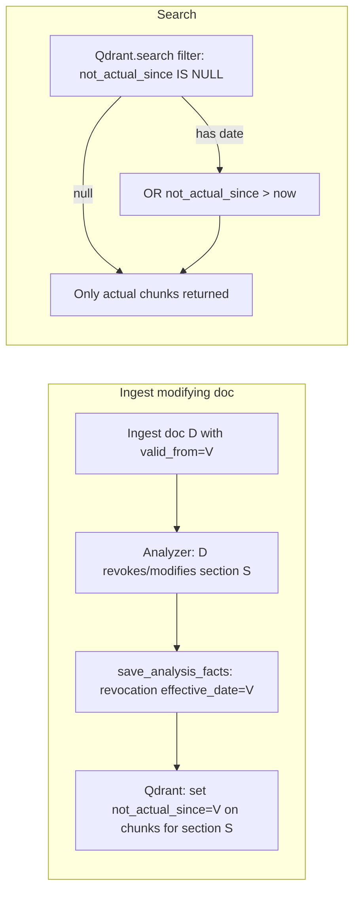
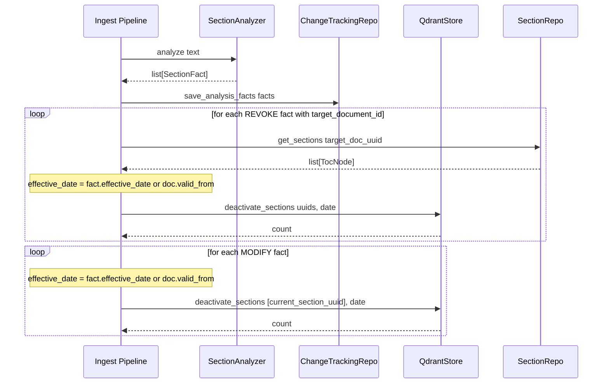

# Plan: Chunk `not_actual_since` Metadata for Fast Search

## Design Decision

Instead of a boolean `actual` flag, use a **`not_actual_since: str | None`** field in Qdrant payload:

- `null` — chunk is still actual (default at ingest)
- `"2026-07-15"` — chunk became non-actual on this date

At search time, filter: `not_actual_since IS NULL OR not_actual_since > now()`

## Rationale

- More expressive: we know WHEN the chunk became non-actual
- Handles future-dated modifications: a law passed today that takes effect next year has `not_actual_since = next_year`, so it's still actual until then
- If effective date is not explicitly specified, it defaults to the modifying document's `valid_from`
- A deactivated chunk **cannot be re-activated** — once `not_actual_since` is set, it stays
- Two documents modifying the same section is considered unrealistic (low document flow)

## Flow



## Steps

### Step A: Add `not_actual_since` to DocumentChunk model

**File:** [`core/models/models.py`](core/models/models.py)

- Add field `not_actual_since: date | None = None` to `DocumentChunk`

### Step B: Add `not_actual_since` to Qdrant payload

**File:** [`core/index/qdrant_store.py`](core/index/qdrant_store.py)

1. In `upsert_chunks()`: add `"not_actual_since": chunk.not_actual_since.isoformat() if chunk.not_actual_since else None` to payload
2. In `search()` and `get_chunks_by_document_id()`: parse `not_actual_since` from payload back to `DocumentChunk`
3. Add new method:

```python
async def deactivate_sections(
    self,
    section_uuids: list[str],
    effective_date: date,
) -> int:
    """Set not_actual_since on all chunks belonging to given sections.

    Args:
        section_uuids: List of section UUIDs to deactivate.
        effective_date: Date from which the chunks are no longer actual.

    Returns:
        Number of updated points.
    """
    # Scroll by filter section_uuids has any of given
    # Then set_payload with not_actual_since
```

4. Create payload index on `not_actual_since` for fast filtering:

```python
client.create_payload_index(
    collection_name=...,
    field_name="not_actual_since",
    field_type=_qdrant_models.PayloadSchemaType.KEYWORD,
)
```

5. In `build_filter()`: add default filter:
```python
filter_conditions = {
    "should": [
        {"is_null": {"key": "not_actual_since"}},
        {"datetime": {"key": "not_actual_since", "gt": datetime.now(timezone.utc).isoformat()}},
    ]
}
```

### Step C: Wire into ingest pipeline

**File:** [`adapters/base/ingest_pipeline.py`](adapters/base/ingest_pipeline.py)

In `process_document_text()`, after `save_analysis_facts()` call:

1. Collect `SectionFact` objects
2. For each `REVOKE` fact with `target_document_id`:
   - Get sections of target doc via `SectionRepository.get_sections()`
   - Effective date = fact's `effective_date` or current doc's `valid_from`
   - Call `QdrantStore.deactivate_sections(section_uuids, effective_date)`
3. For each `MODIFY` fact:
   - The analyzed section itself is the one being modified
   - Its own `section_uuid` is the target
   - Call `QdrantStore.deactivate_sections([section_uuid], effective_date)`

### Step D: Update `search_documents` in ODLService

**File:** [`core/odl_service.py`](core/odl_service.py)

- No changes needed if `build_filter()` already includes the `not_actual_since` filter
- The `QdrantStore.search()` call passes the filter from `build_filter()`

## Sequence Diagram



## Files to Modify

| File | Change |
|------|--------|
| [`core/models/models.py`](core/models/models.py) | Add `not_actual_since: date | None = None` to `DocumentChunk` |
| [`core/index/qdrant_store.py`](core/index/qdrant_store.py) | Add to payload, add `deactivate_sections()`, update `build_filter()` |
| [`adapters/base/ingest_pipeline.py`](adapters/base/ingest_pipeline.py) | After `save_analysis_facts()`, deactivate Qdrant chunks |
| [`tests/unit/test_qdrant_store.py`](tests/unit/test_qdrant_store.py) | Tests for `deactivate_sections()` |

## Key Rules

1. `not_actual_since` is set **once** and never removed
2. If `effective_date` is `None`, use modifying document's `valid_from`
3. At search time: exclude chunks where `not_actual_since <= now()`
4. Pipeline accepts `QdrantStore` as optional param for deactivation
