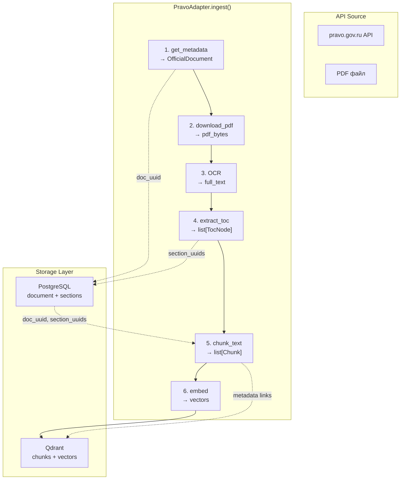
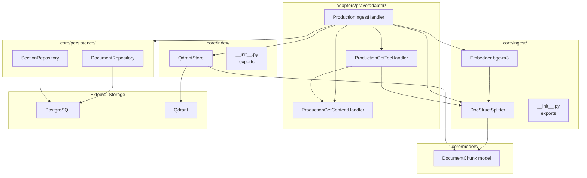

# План завершения пайплайна адаптера PravoAdapter

> **Важно:** Этот план — проект для обсуждения. Все решения могут быть скорректированы.

## 1. Текущее состояние (что уже готово)

### Готово ✅
| Компонент | Статус | Файлы |
|-----------|--------|-------|
| OCRProvider Protocol | ✅ | `adapters/ocr/ocr_provider.py` |
| YandexVisionOCR | ✅ | `adapters/ocr/yandex_vision.py` |
| TesseractOCR | ✅ | `adapters/ocr/tesseract_ocr.py` |
| StubOCR | ✅ | `adapters/ocr/stub_ocr.py` |
| PravoAdapter (+stub/production) | ✅ | `adapters/pravo/adapter/` |
| ПравоClient (HTTP) | ✅ | `adapters/pravo/pravo_client.py` |
| ПравоParser (маппинг) | ✅ | `adapters/pravo/pravo_parser.py` |
| Поиск (search) | ✅ | `search` handler |
| Получение метаданных (get) | ✅ | `get` handler — сохраняет в PostgreSQL |
| Получение контента (get_content) | ✅ | `get_content` handler — PDF→OCR→текст |
| Perсистентность в PostgreSQL | ✅ | `DocumentRepository`, `SectionRepository` |
| ODLService | ✅ | `core/odl_service.py` |

### Не готово ❌
| Компонент | Статус | Причина |
|-----------|--------|---------|
| TOC extraction (get_toc) | ❌ | `get_toc()` returns `[]` в обоих режимах |
| Чанкинг | ❌ | `core/ingest/__init__.py` — заглушка |
| Эмбеддинг | ❌ | `core/index/__init__.py` — заглушка |
| Qdrant storage | ❌ | `core/index/__init__.py` — заглушка |
| Ingest pipeline (OCR→chunk→embed→store) | ❌ | `ingest()` только кэширует метаданные |
| Chunk model с метаданными | ❌ | Нужен Pydantic Chunk |

---

## 2. Архитектура пайплайна



### 2.1. Поток данных (Data Flow при ingest)

```mermaid
flowchart LR
    subgraph PravoAdapter["PravoAdapter"]
        Ingest["ingest()"]
        Get["get() → OfficialDocument"]
        GetContent["get_content() → text"]
        GetTOC["get_toc() → TocNode[]"]
    end

    subgraph IngestLayer["core/ingest/"]
        Chunker["DocStructSplitter<br/>→ Chunk[]"]
        Embedder["Embedder<br/>→ vectors"]
    end

    subgraph IndexLayer["core/index/"]
        QdrantStore["QdrantStore<br/>upsert + search"]
    end

    subgraph Persistence["core/persistence/"]
        DocRepo["DocumentRepository"]
        SectionRepo["SectionRepository"]
    end

    Ingest --> Get
    Ingest --> GetContent
    Ingest --> GetTOC

    Get -->|OfficialDocument| DocRepo
    GetTOC -->|TocNode[]| SectionRepo
    
    GetContent -->|text| Chunker
    DocRepo -->|doc_uuid| Chunker
    SectionRepo -->|section_uuids| Chunker
    
    Chunker -->|Chunk[]| Embedder
    Embedder -->|vectors + payload| QdrantStore
```

---

## 3. Решение по чанкеру: smart_chunker (primary) + inline fallback

**Источник:** `git+https://github.com/igorvolk1961/smart_chunker.git` (установлен, версия 1.0.0)

### API smart_chunker (изучен)

Библиотека предоставляет два ключевых компонента:

**`HierarchyParser`** — парсит плоский текст в иерархию разделов:
```python
from smart_chunker import HierarchyParser, SectionChunker, SectionNode, Chunk

parser = HierarchyParser()
sections: list[SectionNode] = parser.parse_hierarchy(text)
# SectionNode: .number, .title, .level, .content, .parent, .children
```

**`SectionChunker`** — генерирует чанки из иерархии:
```python
chunker = SectionChunker(max_chunk_size=1024, chunk_overlap=200)
chunks: list[Chunk] = chunker.generate_chunks(sections, target_level=3)
# Chunk: .content (str), .metadata (ChunkMetadata), .section (SectionNode)
# ChunkMetadata: .chunk_id, .chunk_number, .section_number, .word_count
```

**Важно:** `DocStructSplitter` из `smart_chunker` — это LangChain `TextSplitter`, предназначенный для файлов на диске. Для нашей задачи (OCR-текст в памяти) правильнее использовать `HierarchyParser` + `SectionChunker` напрямую.

### Архитектура DocStructSplitter

**Стратегия:**
- `smart_chunker` — внешняя зависимость (pip install, версия 1.0.0)
- Наш `core/ingest/chunker.py` — wrapper, наследует `HierarchyParser` для кастомизации под НПА РФ
- Если потребуется полный контроль — файлы `smart_chunker` копируются в `core/ingest/smart_chunker/`

```python
from smart_chunker import HierarchyParser, SectionChunker, SectionNode

class GovHierarchyParser(HierarchyParser):
    """Кастомный парсер для НПА РФ.
    
    Добавляет поддержку заголовков:
    - Раздел I, Раздел 1
    - Глава 1, Глава 1.1
    - Статья 1, Статья 1.1
    - Параграф 1, § 1
    """

    def _init_patterns(self):
        patterns = super()._init_patterns()
        import re
        patterns['npa_header'] = re.compile(
            r'^\s*(?:Раздел|Глава|Статья|Параграф|§)\s+'
            r'([IVXLCDM]+|\d+(?:\.\d+)*)\.?\s+(.*)$'
        )
        return patterns

class DocStructSplitter:
    """Структурный чанкинг для русских НПА."""

    def __init__(self, max_chunk_size: int = 1024, chunk_overlap: int = 200):
        self._parser = GovHierarchyParser()
        self._chunker = SectionChunker(max_chunk_size, chunk_overlap)

    def split_text(
        self,
        text: str,
        document_id: str,
        doc_uuid: str,
        section_uuids: dict[str, str],
    ) -> list[DocumentChunk]:
        sections = self._parser.parse_hierarchy(text)
        chunks = self._chunker.generate_chunks(sections, target_level=3)
        return [self._to_doc_chunk(i, c, document_id, doc_uuid, section_uuids)
                for i, c in enumerate(chunks)]

    def _split_with_smart_chunker(self, text, document_id, doc_uuid, section_uuids):
        from smart_chunker import HierarchyParser, SectionChunker
        
        parser = HierarchyParser()
        sections = parser.parse_hierarchy(text)
        
        chunker = SectionChunker(
            max_chunk_size=self._max_chunk_size,
            chunk_overlap=self._chunk_overlap,
        )
        smart_chunks = chunker.generate_chunks(sections, target_level=3)
        
        # Конвертация smart_chunker.Chunk → DocumentChunk
        result = []
        for i, sc in enumerate(smart_chunks):
            section_path = self._build_section_path(sc.section)
            chunk = DocumentChunk(
                id=sc.metadata.chunk_id,
                document_id=document_id,
                doc_uuid=doc_uuid,
                text=sc.content,
                section_path=section_path,
                section_external_ids=self._extract_section_numbers(sc.section),
                section_uuids=self._map_section_uuids(sc.section, section_uuids),
                chunk_index=i,
            )
            result.append(chunk)
        return result
```

**Inline fallback** парсит заголовки вида:
- `Раздел I. Название`, `Раздел 1. Название`
- `Глава 1. Название`, `Глава 1.1. Название`
- `Статья 1. Название`
- `Пункт 1.`, `Подпункт 1.1.`

**Зависимость:** добавить в `pyproject.toml`:
```
smart_chunker@git+https://github.com/igorvolk1961/smart_chunker.git
```

---

## 4. Детальный план работ

### Задача 1: Chunk model (Pydantic)

**Файл:** `core/models/models.py` или `core/index/models.py`

Нужна каноническая модель чанка с метаданными для Qdrant:

```python
class DocumentChunk(BaseModel):
    """Чанк документа с метаданными для Qdrant."""
    
    id: str                          # Уникальный ID чанка (UUID)
    document_id: str                 # Внешний ID документа (source_id-publish_id)
    doc_uuid: str                    # UUID записи в таблице document (PostgreSQL)
    text: str                        # Текст чанка
    section_path: list[str]          # Путь к разделу от корня
    section_external_ids: list[str]  # External_id каждого раздела в пути
    section_uuids: list[str]         # UUID разделов в document_section (PostgreSQL)
    chunk_index: int                 # Порядковый номер чанка
    embedding: list[float] | None = None  # Вектор (заполняется после эмбеддинга)
```

**Зачем doc_uuid / section_uuids:**
- Позволяет JOIN-ить чанки с записями в PostgreSQL по UUID
- При поиске возвращаем чанк → можно получить полные метаданные документа из PostgreSQL
- section_uuids позволяет найти точный раздел в document_section

### Задача 2: DocStructSplitter (чанкинг)

**Файл:** `core/ingest/chunker.py`

Интеграция с `smart_chunker` (https://github.com/igorvolk1961/smart_chunker) — библиотека для структурного чанкинга русских официальных документов.

```python
class DocStructSplitter:
    """Splitter for structured Russian official documents."""

    def __init__(self, chunk_max_tokens: int = 1024):
        ...

    def split_text(
        self,
        text: str,
        document_id: str,
        doc_uuid: str,
        section_uuids: dict[str, str],  # external_id → UUID mapping
    ) -> list[DocumentChunk]:
        """Split OCR'd text into chunks preserving document structure."""
        ...
```

**Вход:** полный текст документа (из OCR), doc_uuid, маппинг section_uuids
**Выход:** список `DocumentChunk`

**Примечание:** Если `smart_chunker` не установлен, можно начать с простого splitter'а по заголовкам разделов (регулярные выражения для `Раздел`, `Глава`, `Статья`).

### Задача 3: TOC extraction (получение структуры документа)

**Файл:** `adapters/pravo/adapter/production/get_toc.py` (новый)

Сейчас `get_toc()` возвращает пустой список. Нужно извлекать структуру из OCR-текста.

```python
class ProductionGetTocHandler(BaseGetTocHandler):
    """Extract TOC from OCR'd document text."""

    async def get_toc(
        self,
        document_id: str,
        parent_section_id: str | None = None,
        query: str = "",
    ) -> list[TocNode]:
        # 1. Get document text via get_content() (triggers OCR)
        # 2. Parse structure from text (using smart_chunker or regex)
        # 3. Return TocNode list
        ...
```

**Альтернатива:** Использовать `DocStructSplitter.split_text()` для извлечения структуры, затем преобразовать в `TocNode`.

Важно: `get_toc()` должен быть **ленивым** — если структура уже извлечена и сохранена в БД, возвращать из БД.

### Задача 4: Обновление ingest() — полный пайплайн

**Файлы:**
- `adapters/pravo/adapter/production/ingest.py` — ProductionIngestHandler
- `adapters/pravo/adapter/stub/ingest.py` — StubIngestHandler

Текущий `ingest()` только кэширует метаданные. Нужно расширить до полного пайплайна:

```python
class ProductionIngestHandler(BaseIngestHandler):
    async def ingest(self) -> int:
        count = 0
        for raw_doc in self._fetch_documents():
            # 1. Get + persist metadata (already done in get())
            doc = await adapter.get(document_id)
            
            # 2. Get content via OCR
            text = await adapter.get_content(document_id)
            
            # 3. Extract and persist TOC
            toc = await adapter.get_toc(document_id)
            
            # 4. Get doc_uuid from DB (we just persisted it)
            doc_uuid = await adapter._doc_repo_lazy.get_document_by_publish_id(doc.publish_id)
            
            # 5. Get section UUIDs from DB
            section_uuids = await adapter._section_repo_lazy.get_section_uuids(doc_uuid)
            
            # 6. Chunk
            chunks = chunker.split_text(text, doc.id, doc_uuid, section_uuids)
            
            # 7. Embed
            embeddings = await embedder.embed([c.text for c in chunks])
            for chunk, emb in zip(chunks, embeddings):
                chunk.embedding = emb
            
            # 8. Store in Qdrant
            await qdrant_store.upsert_chunks(chunks)
            
            count += 1
        return count
```

### Задача 5: Embedder

**Файл:** `core/ingest/embedder.py`

```python
class Embedder:
    """Text embedder using sentence-transformers with bge-m3 model."""

    def __init__(self, model_name: str = "BAAI/bge-m3"):
        self._model = SentenceTransformer(model_name)

    async def embed(self, texts: list[str]) -> list[list[float]]:
        """Embed a batch of texts.
        
        Args:
            texts: List of text strings to embed.
            
        Returns:
            List of embedding vectors.
        """
        ...

    async def embed_query(self, query: str) -> list[float]:
        """Embed a single query string (for search).
        
        Args:
            query: Search query text.
            
        Returns:
            Single embedding vector.
        """
        ...
```

**Важно:** `SentenceTransformer` блокирующий (CPU). Нужно запускать в thread pool executor:

```python
import asyncio
loop = asyncio.get_event_loop()
embeddings = await loop.run_in_executor(None, self._model.encode, texts)
```

### Задача 6: QdrantStore

**Файл:** `core/index/qdrant_store.py`

```python
class QdrantStore:
    """Vector storage in Qdrant for document chunks."""

    def __init__(
        self,
        host: str = "localhost",
        port: int = 6333,
        collection: str = "documents",
        vector_size: int = 1024,  # bge-m3 default
    ):
        ...

    async def ensure_collection(self) -> None:
        """Create collection if not exists."""
        ...

    async def upsert_chunks(self, chunks: list[DocumentChunk]) -> None:
        """Insert or update chunks with embeddings.
        
        Payload:
        - document_id: str  (source-publish_id)
        - doc_uuid: str     (PostgreSQL UUID)
        - text: str
        - section_path: list[str]
        - section_external_ids: list[str]
        - section_uuids: list[str]
        - chunk_index: int
        """
        ...

    async def search(
        self,
        query_embedding: list[float],
        filters: dict | None = None,
        limit: int = 10,
    ) -> list[tuple[DocumentChunk, float]]:
        """Semantic search with payload filtering.
        
        Args:
            query_embedding: Query vector.
            filters: Optional payload filters (e.g. {"document_id": "pravo-..."}).
            limit: Max results.
            
        Returns:
            List of (chunk, score) tuples.
        """
        ...
```

**Payload схема Qdrant:**

```json
{
    "document_id": "pravo-0001202012230060",
    "doc_uuid": "550e8400-e29b-41d4-a716-446655440000",
    "text": "Текст чанка...",
    "section_path": ["Раздел I", "Глава 2", "Статья 10"],
    "section_external_ids": ["sec-1", "sec-1-2", "sec-1-2-3"],
    "section_uuids": ["uuid-1", "uuid-2", "uuid-3"],
    "chunk_index": 3
}
```

### Задача 7: Обновление get_toc() handler в PravoAdapter

**Файл:** `adapters/pravo/adapter/__init.py` и `adapters/pravo/adapter/base.py`

Текущий `get_toc()` возвращает `[]`. После реализации TOC extraction нужно:

1. Создать `ProductionGetTocHandler` в `adapters/pravo/adapter/production/get_toc.py`
2. Подключить его в `PravoAdapter._build_handlers()` (заменить `StubGetTocHandler` на production)
3. `StubGetTocHandler` может вернуть fake TOC для тестовых документов

### Задача 8: Интеграционный тест пайплайна

**Файл:** `tests/integration/test_pravo_stub_pipeline.py` (дополнить)

```python
@pytest.mark.asyncio
async def test_pipeline_download_ocr_chunk_embed_store():
    """End-to-end test: ingest → OCR → chunk → embed → Qdrant."""
    ...
```

---

## 4. Порядок выполнения задач

| # | Задача | Зависит от | Файлы |
|---|--------|-----------|-------|
| 1 | Chunk model (DocumentChunk) | — | `core/models/models.py` |
| 2 | DocStructSplitter (chunker) | 1 | `core/ingest/chunker.py` |
| 3 | TOC extraction (get_toc) | 2 | `adapters/pravo/adapter/production/get_toc.py` |
| 4 | Обновление ingest() — полный pipeline | 1, 2, 3 | `adapters/pravo/adapter/production/ingest.py`, `stub/ingest.py` |
| 5 | Embedder | — | `core/ingest/embedder.py` |
| 6 | QdrantStore | 1, 5 | `core/index/qdrant_store.py` |
| 7 | Подключение ProductionGetTocHandler | 3 | `adapters/pravo/adapter/__init__.py` |
| 8 | Интеграционные тесты | 1-7 | `tests/integration/` |
| 9 | Зависимости (smart_chunker) | — | `pyproject.toml` |
| 10 | config.yaml (Qdrant, embedder) | 5, 6 | `config.yaml`, `core/api/app_config.py` |

### Зависимость: smart_chunker

Библиотека `smart_chunker` (https://github.com/igorvolk1961/smart_chunker) должна быть либо:
- **Вариант A:** Добавлена в `pyproject.toml` как зависимость (если пакет опубликован на PyPI)
- **Вариант B:** Установлена из git-репозитория (`pip install git+https://github.com/igorvolk1961/smart_chunker.git`)
- **Вариант C:** Реализована inline в `core/ingest/chunker.py` как regex-based splitter для русских НПА (fallback, если библиотека не готова)

---

## 5. Mermaid-диаграмма модулей



---

## 6. Новые/изменяемые файлы

### Создать:
1. `core/ingest/chunker.py` — DocStructSplitter
2. `core/ingest/embedder.py` — Embedder (bge-m3)
3. `core/index/__init__.py` — обновить (убрать заглушку)
4. `core/index/qdrant_store.py` — QdrantStore
5. `adapters/pravo/adapter/production/get_toc.py` — ProductionGetTocHandler

### Изменить:
6. `core/models/models.py` — добавить `DocumentChunk` модель
7. `core/ingest/__init__.py` — экспорты Chunker, Embedder
8. `adapters/pravo/adapter/production/ingest.py` — полный пайплайн
9. `adapters/pravo/adapter/stub/ingest.py` — полный пайплайн (stub)
10. `adapters/pravo/adapter/__init__.py` — подключить ProductionGetTocHandler
11. `adapters/pravo/adapter/base.py` — обновить get_toc() если нужно
12. `pyproject.toml` — добавить `smart_chunker` зависимость
13. `config.yaml` — Qdrant, embedder настройки
14. `core/api/app_config.py` — QdrantConfig, EmbedderConfig
15. `tests/integration/test_pravo_stub_pipeline.py` — интеграционные тесты
