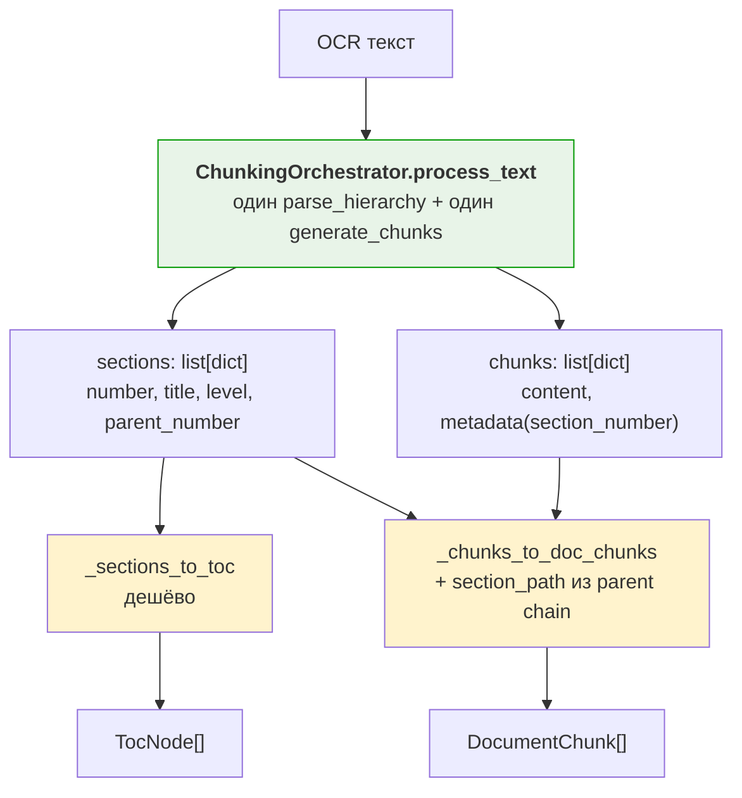

# Анализ smart_chunker и проектирование DocStructSplitter

## 1. Исходный код smart_chunker (изучен)

### ChunkingOrchestrator — готовое решение

```python
class ChunkingOrchestrator:
    def __init__(self, config):
        self.parser = HierarchyParser(config)    # парсер
        self.chunker = SectionChunker(...)       # чанкер

    def process_text(self, text) -> dict:
        # ОДИН парсинг текста
        sections = self.parser.parse_hierarchy(text)
        # ДЕШЁВАЯ генерация чанков из тех же sections
        chunks = self.chunker.generate_chunks(sections)

        return {
            'sections': self._serialize_sections(sections),
            #   каждая секция: number, title, level, parent_number, children, chunks
            'chunks': self._serialize_chunks(chunks),
            #   каждый чанк: content, metadata {chunk_id, chunk_number, section_number...}
            'metadata': {...}
        }
```

### Data structures

```python
@dataclass
class SectionNode:
    number: str                           # "I", "1", "1.1"
    title: str                            # "Общие положения"
    level: int                            # 0, 1, 2
    content: str                          # полный текст раздела
    parent: Optional[SectionNode]         # ссылка на родителя
    children: List[SectionNode]           # дочерние разделы

@dataclass
class Chunk:
    content: str
    metadata: ChunkMetadata               # chunk_id, chunk_number, section_number
    section: SectionNode                  # ссылка на SectionNode (с parent!)
```

## 2. Проблема текущей реализации

**Двойной парсинг текста:**
- `toc_extractor.extract_toc_from_text()` → `DocStructSplitter.split_text()` → `parse_hierarchy()` + `generate_chunks()` (лишний чанкинг для TOC)
- `process_document_text()` → `DocStructSplitter.split_text()` → `parse_hierarchy()` + `generate_chunks()` (ещё один парсинг)

## 3. Решение: ChunkingOrchestrator

Используем `ChunkingOrchestrator.process_text()` — он уже делает один парсинг и возвращает и sections, и chunks.

```python
class DocStructSplitter:
    def __init__(self, max_chunk_size=1024, chunk_overlap=200):
        from smart_chunker import ChunkingOrchestrator
        self._orch = ChunkingOrchestrator(config={
            'max_chunk_size': max_chunk_size,
            'chunk_overlap': chunk_overlap,
            'target_level': 3,
        })

    def split_text(self, text, document_id, doc_uuid) -> tuple[list[DocumentChunk], list[TocNode]]:
        # ОДИН ВЫЗОВ — ОБА РЕЗУЛЬТАТА
        result = self._orch.process_text(text)

        raw_sections = result['sections']  # list[dict]
        raw_chunks = result['chunks']      # list[dict]

        # Sections → TocNode (дешёво)
        toc = self._sections_to_toc(raw_sections, document_id)

        # Chunks → DocumentChunk (дешёво)
        # section_path строим через parent_number в raw_sections
        chunks = self._chunks_to_doc_chunks(raw_chunks, raw_sections, document_id, doc_uuid)

        return (chunks, toc)
```

### sections_to_toc

```python
def _sections_to_toc(self, sections: list[dict], document_id: str) -> list[TocNode]:
    toc = []
    for sec in sections:
        parent_num = str(sec.get('parent_number') or '')
        toc.append(TocNode(
            id=str(sec['number']),
            document_id=document_id,
            title=str(sec['title']),
            parent_id=str(parent_num) if parent_num else '',
            level=int(sec['level']),
            child_count=len(sec.get('children', [])),
        ))
    return toc
```

### chunks_to_doc_chunks с section_path

```python
def _chunks_to_doc_chunks(self, chunks, raw_sections, document_id, doc_uuid):
    # Строим lookup: section_number → section_data
    sec_map = {s['number']: s for s in raw_sections}

    result = []
    for i, ch in enumerate(chunks):
        meta = ch['metadata']
        sec_num = meta['section_number']

        # Строим section_path через parent_number chain
        path = []
        cur = sec_map.get(sec_num)
        while cur:
            path.insert(0, f"{cur['number']}. {cur['title']}")
            parent_num = cur.get('parent_number')
            cur = sec_map.get(parent_num) if parent_num else None

        result.append(DocumentChunk(
            id=meta['chunk_id'],
            document_id=document_id,
            doc_uuid=doc_uuid,
            text=ch['content'],
            section_path=path,
            section_external_ids=[],
            section_uuids=[],
            chunk_index=i,
        ))
    return result
```

## 4. Новый поток данных



## 5. Изменения в файлах

### core/ingest/chunker.py
- `split_text()` → использует `ChunkingOrchestrator.process_text()`
- Возвращает `tuple[list[DocumentChunk], list[TocNode]]`
- Добавить `_sections_to_toc()`, `_chunks_to_doc_chunks()`

### adapters/base/toc_extractor.py
- `extract_toc_from_text()` → вызывает `DocStructSplitter.split_text()`, берёт `[1]` (TOC)
- Один парсинг → и chunks, и TOC

### adapters/base/ingest_pipeline.py
- `process_document_text()` → вызывает `split_text()`, берёт `[0]` (chunks)
- При желании может сохранить TOC в БД

### adapters/base/toc_mixin.py
- `get_toc()` → вызывает `DocStructSplitter.split_text()` → `[1]`
