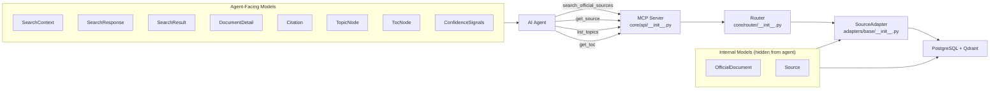
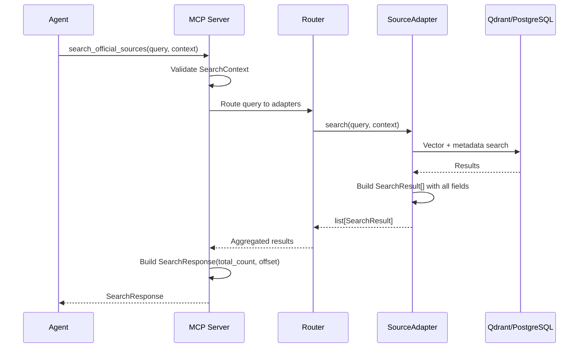
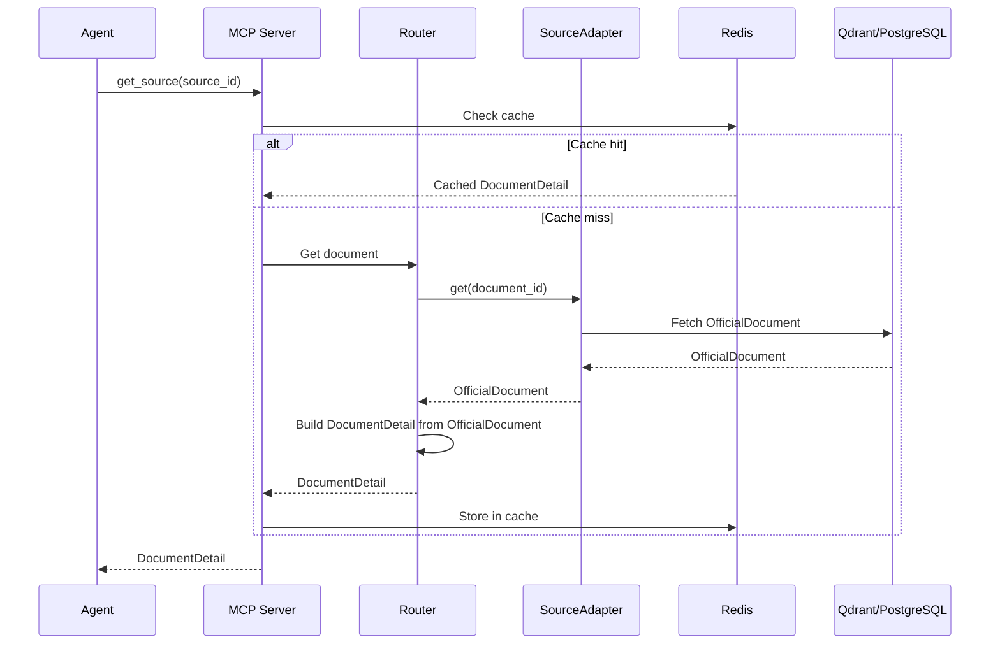
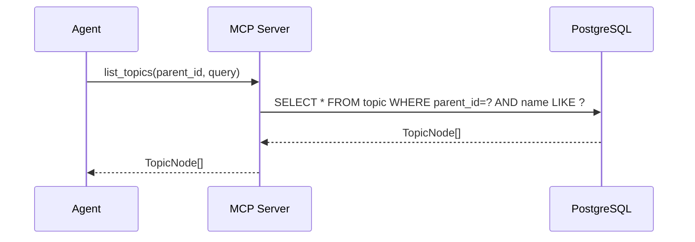
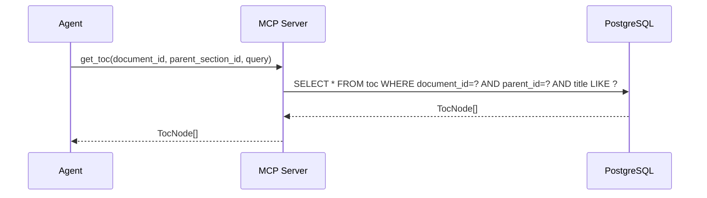

# Data Structures Design — All Layer Requests

## 1. Overview

This document defines all data structures (Pydantic models) needed for every MCP tool request to the Official Data Layer. The design follows the **mechanism/policy** separation principle: agent-facing models are flat and self-contained, while internal models (`OfficialDocument`) are hidden from the agent.

### MCP Tools (from SPEC.md)

| Tool | Input | Output | Status |
|------|-------|--------|--------|
| `search_official_sources(query, context)` | `query: str`, `SearchContext` | `SearchResponse` | ✅ Defined |
| `get_source(source_id)` | `source_id: str` | `DocumentDetail` | ❌ Needs design |
| `list_topics(parent_id, query)` | `parent_id: str`, `query: str` | `TopicNode[]` | ✅ Defined |
| `get_toc(document_id, parent_section_id, query)` | `document_id: str`, `parent_section_id: str`, `query: str` | `TocNode[]` | ✅ Defined |

---

## 2. Architecture: Who Sees What



**Key rule:** Agent never sees `OfficialDocument` or `Source`. All agent-facing models are flat.

---

## 3. Current State Analysis

### 3.1 What's Already Correct

| Model | Status | Notes |
|-------|--------|-------|
| `SearchContext` | ✅ Complete | All fields defined, OR-semantics for `topic`/`organization` |
| `SearchResponse` | ✅ Complete | Pagination metadata with `total_count` + `offset` |
| `SearchResult` | ⚠️ Needs enrichment | Missing `jurisdiction`, `region`, `topic`, `organization` |
| `TopicNode` | ✅ Complete | Hierarchical rubricator node |
| `TocNode` | ✅ Complete | Document table of contents node |
| `ConfidenceSignals` | ✅ Complete | Three decomposed signals |
| `Citation` | ✅ Defined but unused | Will be used in `DocumentDetail.citations` |
| `OfficialDocument` | ✅ Complete | Internal model, hidden from agent |
| `Source` | ✅ Complete | Internal model, part of `OfficialDocument` |

### 3.2 Problem: SearchResult is Missing Filter Fields

Current `SearchResult` has: `id`, `title`, `snippet`, `url`, `source_name`, `ingest_date`, `legal_status`, `confidence`.

Missing: `jurisdiction`, `region`, `topic`, `organization`.

**Consequence:** Agent must call `get_source()` for every result to get these fields — N+1 problem.

**Fix:** Add these fields to `SearchResult`. They are cheap to include (already in `OfficialDocument`).

---

## 4. Complete Model Definitions

### 4.1 Enums (unchanged)

```python
class LegalStatus(str, Enum):
    ACTIVE = "active"
    REVOKED = "revoked"
    MODIFIED = "modified"
    UNKNOWN = "unknown"

class SourceAvailability(str, Enum):
    AVAILABLE = "available"
    DEGRADED = "degraded"
    UNAVAILABLE = "unavailable"
```

### 4.2 Internal Models (hidden from agent, unchanged)

```python
class Source(BaseModel):
    """Information about a data source."""
    id: str = Field(min_length=1)
    name: str
    url: str
    jurisdiction: str | None = None

class OfficialDocument(BaseModel):
    """Canonical document model — internal, agent never sees this."""
    id: str = Field(min_length=1)
    title: str
    source: Source
    url: str
    summary: str | None = None
    jurisdiction: str | None = None
    region: str | None = None
    topic: list[str] = Field(default_factory=list)
    organization: list[str] = Field(default_factory=list)
    ingest_date: datetime
    valid_from: datetime | None = None
    valid_to: datetime | None = None
    legal_status: LegalStatus = LegalStatus.UNKNOWN
```

### 4.3 Agent-Facing Models

#### SearchContext (input for search_official_sources)

```python
class SearchContext(BaseModel):
    """Structured filter parameters for search. query is passed separately."""
    region: str | None = None
    topic: list[str] | None = None       # OR-semantics
    organization: list[str] | None = None # OR-semantics
    official_only: bool = False
    max_age_days: int | None = None      # ge=1
    max_results: int = 10                # 1..50
    offset: int = 0                      # ge=0
```

#### SearchResult (output item for search_official_sources)

```python
class SearchResult(BaseModel):
    """Compact search result with snippet — for quick scanning."""
    id: str = Field(min_length=1)
    title: str
    snippet: str                         # Pre-computed relevant fragment
    url: str
    source_name: str
    jurisdiction: str | None = None      # NEW: avoids N+1
    region: str | None = None            # NEW: avoids N+1
    topic: list[str] = Field(default_factory=list)         # NEW
    organization: list[str] = Field(default_factory=list)  # NEW
    ingest_date: datetime
    legal_status: LegalStatus
    confidence: ConfidenceSignals
```

**Why add these fields:** Agent can filter/rank results without calling `get_source()` for each one. The fields are already available in `OfficialDocument` — no extra cost.

#### SearchResponse (output for search_official_sources)

```python
class SearchResponse(BaseModel):
    """Search results with pagination metadata."""
    results: list[SearchResult]
    total_count: int = Field(ge=0)
    offset: int = Field(ge=0)
```

#### DocumentDetail (output for get_source)

```python
class DocumentDetail(BaseModel):
    """Full document card — response to get_source().

    Agent calls get_source() after selecting a document from search results.
    Contains flat metadata (not nested OfficialDocument), full text content,
    citations with section paths, and table of contents.
    """
    # Flat metadata (agent never sees OfficialDocument)
    id: str = Field(min_length=1)
    title: str
    url: str
    source_name: str
    jurisdiction: str | None = None
    region: str | None = None
    topic: list[str] = Field(default_factory=list)
    organization: list[str] = Field(default_factory=list)
    ingest_date: datetime
    valid_from: datetime | None = None
    valid_to: datetime | None = None
    legal_status: LegalStatus

    # Full content (why agent calls get_source)
    content: str                          # Full text in markdown-like format
    citations: list[Citation] = Field(default_factory=list)
    toc: list[TocNode] = Field(default_factory=list)
```

**Why flat:** Agent never sees `OfficialDocument`. All metadata fields are duplicated flatly in `DocumentDetail`. This is intentional — the agent works with MCP tool outputs, not internal models.

**Why `content` is a single string:** The full text of a document (up to ~4000 tokens per SPEC). For very large documents, chunking/pagination can be added later.

#### Citation (used in DocumentDetail.citations)

```python
class Citation(BaseModel):
    """Structured quote with section path — for precise provenance."""
    text: str
    source_id: str
    url: str
    section: list[str] | None = None      # Path from root: ['Раздел I', 'Глава 2', 'Статья 10']
    span_start: int | None = None
    span_end: int | None = None
```

**Note:** `Citation` is currently defined but never used. It becomes alive in `DocumentDetail.citations` when `get_source()` is implemented.

#### ConfidenceSignals (used in SearchResult)

```python
class ConfidenceSignals(BaseModel):
    """Decomposed confidence signals — agent decides threshold."""
    retrieval_relevance: float = Field(ge=0.0, le=1.0)
    data_freshness: datetime
    source_availability: SourceAvailability
```

#### TopicNode (output for list_topics)

```python
class TopicNode(BaseModel):
    """Hierarchical rubricator node."""
    id: str = Field(min_length=1)
    name: str
    parent_id: str
    description: str | None = None
    child_count: int = 0
    document_count: int = 0
```

#### TocNode (output for get_toc)

```python
class TocNode(BaseModel):
    """Document table of contents node."""
    id: str = Field(min_length=1)
    document_id: str
    title: str
    parent_id: str
    level: int = Field(ge=0)
    child_count: int = 0
```

---

## 5. Request Flow Diagrams

### 5.1 search_official_sources



### 5.2 get_source



### 5.3 list_topics



### 5.4 get_toc



---

## 6. Data Flow: OfficialDocument → Agent-Facing Models

```mermaid
flowchart LR
    subgraph Internal["Internal (hidden)"]
        OD["OfficialDocument<br/>id, title, source, url,<br/>summary, jurisdiction,<br/>region, topic[], org[],<br/>ingest_date, valid_from,<br/>valid_to, legal_status"]
    end

    subgraph AgentFacing["Agent-Facing"]
        SR["SearchResult<br/>id, title, snippet, url,<br/>source_name, jurisdiction,<br/>region, topic[], org[],<br/>ingest_date, legal_status,<br/>confidence"]
        DD["DocumentDetail<br/>id, title, url,<br/>source_name, jurisdiction,<br/>region, topic[], org[],<br/>ingest_date, valid_from,<br/>valid_to, legal_status,<br/>content, citations[], toc[]"]
    end

    OD -->|search() → flatten| SR
    OD -->|get() → flatten + content| DD

    style Internal fill:#f5f5f5,stroke:#999
    style AgentFacing fill:#e8f4e8,stroke:#090
```

**Mapping rules:**

| OfficialDocument field | SearchResult field | DocumentDetail field |
|---|---|---|
| `id` | `id` | `id` |
| `title` | `title` | `title` |
| `source.name` | `source_name` | `source_name` |
| `url` | `url` | `url` |
| `jurisdiction` | `jurisdiction` | `jurisdiction` |
| `region` | `region` | `region` |
| `topic` | `topic` | `topic` |
| `organization` | `organization` | `organization` |
| `ingest_date` | `ingest_date` | `ingest_date` |
| `valid_from` | — | `valid_from` |
| `valid_to` | — | `valid_to` |
| `legal_status` | `legal_status` | `legal_status` |
| `summary` | → `snippet` | — |
| — | `confidence` | — |
| — | — | `content` |
| — | — | `citations` |
| — | — | `toc` |

---

## 7. Changes Required

### 7.1 Add fields to SearchResult

Add `jurisdiction`, `region`, `topic`, `organization` to [`SearchResult`](core/models/models.py:193).

**Impact:**
- [`adapters/stub/__init__.py`](adapters/stub/__init__.py:108) — populate new fields in `search()` method
- [`tests/unit/test_models.py`](tests/unit/test_models.py:327) — update `TestSearchResult` tests
- [`tests/unit/test_stub_adapter.py`](tests/unit/test_stub_adapter.py) — update stub adapter tests

### 7.2 Add DocumentDetail model

Add `DocumentDetail` to [`core/models/models.py`](core/models/models.py).

**Impact:**
- [`core/models/__init__.py`](core/models/__init__.py) — add to exports
- [`tests/unit/test_models.py`](tests/unit/test_models.py) — add `TestDocumentDetail` class
- [`adapters/stub/__init__.py`](adapters/stub/__init__.py) — optionally add stub `get_source_detail()` or extend `get()` to return `DocumentDetail`

### 7.3 Update SPEC.md

Update [`SPEC.md`](SPEC.md:109) — change `topic` and `organization` from `str | None` to `list[str] | None` in the SearchContext table.

### 7.4 Update ADR

Add ADR #9 documenting the `DocumentDetail` design decision and the agent-facing vs internal model separation.

---

## 8. Summary

| Model | Layer | Purpose | Status |
|-------|-------|---------|--------|
| `LegalStatus` | Both | Enum for legal status | ✅ Done |
| `SourceAvailability` | Both | Enum for source availability | ✅ Done |
| `Source` | Internal | Data source metadata | ✅ Done |
| `OfficialDocument` | Internal | Canonical document model | ✅ Done |
| `SearchContext` | Agent | Input filter for search | ✅ Done |
| `SearchResult` | Agent | Compact search result | ⚠️ Needs enrichment |
| `SearchResponse` | Agent | Paginated search output | ✅ Done |
| `DocumentDetail` | Agent | Full document card | ❌ Needs creation |
| `Citation` | Agent | Structured quote with section path | ✅ Defined, needs usage |
| `ConfidenceSignals` | Agent | Decomposed confidence | ✅ Done |
| `TopicNode` | Agent | Rubricator node | ✅ Done |
| `TocNode` | Agent | TOC node | ✅ Done |
