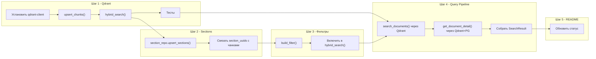

# План на ближайшие часы работы

**Дата:** 2026-07-15
**Контекст:** Формирование работающей end-to-end вертикали

---

## Цель на ближайшие 4-6 часов

Собрать минимально работающую end-to-end вертикаль: **Query → Qdrant поиск → Ответ с provenance**.
Без этого слой — набор несвязанных компонентов.

---

## Порядок работ

### Шаг 1: Подключить QdrantStore к реальному Qdrant (TD-2)
**Ожидаемое время:** 1.5 часа

1. Установить `qdrant-client` — убрать conditional import guard из [`core/index/qdrant_store.py`](core/index/qdrant_store.py)
2. Реализовать `QdrantStore.upsert_chunks(chunks: list[DocumentChunk])`:
   - Создать коллекцию, если не существует (с заданным vector_size)
   - Upsert точек с payload: doc_uuid, section_uuids, text, chunk_index, actual
3. Реализовать `QdrantStore.hybrid_search(query_vector, filter, limit)`:
   - Dense search + payload filter
   - Вернуть (chunk_id, score, payload)
4. Добавить тест: `test_qdrant_store.py` — upsert + search (in-memory Qdrant)

**Приёмка:** `QdrantStore(...).search(...)` возвращает результаты с корректными score и payload.

---

### Шаг 2: Сохранять sections в PostgreSQL (TD-8)
**Ожидаемое время:** 1 час

1. В [`ODLService._persist_document()`](core/odl_service.py:122):
   - После `doc_repo.upsert_document()` — вызвать `section_repo.upsert_sections(doc_uuid, toc)`
   - Получить `section_uuids` — mapping external_id → UUID
2. Передать `section_uuids` в `DocStructSplitter.split_text()` для заполнения `DocumentChunk.section_uuids`

**Приёмка:** После вызова `get_document_detail()` разделы сохраняются в `document_section`.

---

### Шаг 3: Реализовать payload-фильтры Qdrant (TD-12)
**Ожидаемое время:** 1 час

1. Реализовать `QdrantStore.build_filter(context: SearchContext) → Filter`:
   - `actual == true` (всегда)
   - Если `region` указан → `region_id == ...`
   - Если `topic` указан → `topic_ids contains ...`
   - Если `max_age_days` указан → `created_at >= now - max_age_days`
2. Включить в `hybrid_search()`

**Приёмка:** Фильтры корректно применяются к поисковому запросу.

---

### Шаг 4: Собрать Query Pipeline в ODLService (TD-13)
**Ожидаемое время:** 1.5 часа

1. В [`ODLService.search_documents()`](core/odl_service.py:185):
   - Заменить текущую заглушку (опрос всех адаптеров) на:
     1. Построить query vector через `Embedder.embed_query(query)`
     2. Построить фильтр из `context`
     3. Выполнить `QdrantStore.hybrid_search()`
     4. Для каждого результата: найти метаданные в PostgreSQL через `DocumentRepository`
     5. Собрать `SearchResult` с `ConfidenceSignals`
2. В `get_document_detail()`:
   - Найти документ в Qdrant + PostgreSQL
   - Собрать `DocumentDetail` с чанками как citations
   - Персистировать в БД (уже есть)

**Приёмка:** `POST /api/v1/search` возвращает реальные результаты из Qdrant.
`GET /api/v1/documents/{id}` возвращает полную карточку документа.

---

### Шаг 5: Исправить README.md (TD-1)
**Ожидаемое время:** 30 минут

1. Обновить секцию "Статус" — перечислить реально реализованное
2. Добавить roadmap с текущим состоянием
3. Ссылки на [`plans/interim_report.md`](plans/interim_report.md) и [`plans/tech_debt_elimination_plan.md`](plans/tech_debt_elimination_plan.md)

---

### Шаг 6 (если останется время): Исправить интеграционные тесты (TD-4)
**Ожидаемое время:** 1 час

1. Добавить `pytest-timeout` с таймаутом 30с на каждый тест
2. Запустить и диагностировать зависшие тесты

---

## Диаграмма плана

---

## Критерии готовности (Definition of Done)

После выполнения плана:
- [ ] `QdrantStore` работает с реальным Qdrant (не заглушка)
- [ ] `ODLService.search_documents()` возвращает результаты векторного поиска
- [ ] `ODLService.get_document_detail()` возвращает полную карточку с цитатами
- [ ] Фильтры региона и рубрик применяются к поиску
- [ ] Sections сохраняются в PostgreSQL
- [ ] README отражает реальное состояние проекта
- [ ] Все unit-тесты проходят (78%+ coverage)
- [ ] Интеграционные тесты не зависают
