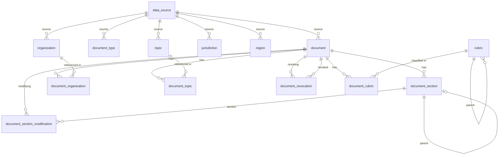

# Анализ необходимости ORM в проекте gov_data_layer

## 1. Текущее состояние persistence-слоя

### 1.1 Архитектура

Проект использует **ручной (raw SQL) подход** через [`DatabaseClient`](core/persistence/db_client.py) — тонкую обёртку над `asyncpg` connection pool, и **репозитории** ([`DocumentRepository`](core/persistence/repository/document_repo.py), [`ReferenceRepository`](core/persistence/repository/reference_repo.py), [`SectionRepository`](core/persistence/repository/section_repo.py), [`ChangeTrackingRepository`](core/persistence/repository/change_tracking_repo.py)), которые вручную пишут SQL-запросы и маппят результаты в Pydantic-модели.

### 1.2 Схема БД (PostgreSQL, 10 таблиц)



### 1.3 Характер SQL-запросов

| Тип запроса | Пример | Сложность |
|---|---|---|
| **Get-or-create** (reference tables) | `INSERT ... ON CONFLICT DO UPDATE RETURNING id` | Средняя (dynamic SQL с whitelist-валидацией) |
| **Upsert** (document) | `INSERT ... ON CONFLICT (external_id) DO UPDATE SET ...` | Высокая (16 параметров, 5 JOIN при чтении) |
| **M:N junction** | `INSERT INTO document_organization ... ON CONFLICT DO NOTHING` | Низкая |
| **Hierarchical** (sections) | Self-referencing FK, parent_id resolution через подзапрос | Высокая |
| **Change tracking** | `INSERT ... ON CONFLICT DO UPDATE` | Средняя |
| **Search** | `ILIKE` + JOIN + ORDER BY + LIMIT/OFFSET | Средняя |

### 1.4 Объём кода в репозиториях

| Файл | Строк | SQL-запросов |
|---|---|---|
| [`document_repo.py`](core/persistence/repository/document_repo.py) | 425 | 8 |
| [`reference_repo.py`](core/persistence/repository/reference_repo.py) | 266 | 10+ |
| [`section_repo.py`](core/persistence/repository/section_repo.py) | 168 | 4 |
| [`change_tracking_repo.py`](core/persistence/repository/change_tracking_repo.py) | 203 | 6 |
| **Итого** | **~1062** | **~28** |

---

## 2. Критерии оценки необходимости ORM

### 2.1 Когда ORM оправдан

- **CRUD-heavy** приложения с типовыми операциями над сущностями
- **Быстрая разработка** — ORM генерирует SQL, миграции, схемы
- **Смена БД** — ORM абстрагирует диалекты SQL
- **Lazy loading / identity map** — удобно для графов объектов
- **Много простых запросов** — ORM экономит время на написании SQL

### 2.2 Когда ORM избыточен

- **Query-heavy** приложения со сложными отчётами и аналитикой
- **High-performance** — raw SQL быстрее и предсказуемее
- **Существующий слой абстракции** уже есть (репозитории)
- **Малое количество сущностей** — overhead ORM не окупается
- **Специфичные фичи БД** (Liquibase, recursive CTE, JSONB, PARTITION BY)

---

## 3. Анализ применимости ORM к проекту

### 3.1 Анализ по критерию "CRUD vs Query"

**Текущие операции:**

| Операция | Тип | ORM подходит? |
|---|---|---|
| `upsert_document()` | Сложный upsert с 16 полями + M:N | ❌ ON CONFLICT с COALESCE — не все ORM поддерживают |
| `get_or_create_*()` | Get-or-create с UNIQUE constraint | ⚠️ Есть generic-реализация, ORM не даст выигрыша |
| `search_documents()` | ILIKE + JOIN + пагинация | ⚠️ Простой, но ORM не упростит |
| `get_sections()` | SELECT с сортировкой | ✅ Простой SELECT |
| `mark_section_deleted()` | UPDATE с WHERE | ✅ Простой UPDATE |
| `add_section_modification()` | INSERT ON CONFLICT | ⚠️ UPSERT — не все ORM умеют |

**Вывод:** ~40% операций — сложные upsert/get-or-create, где ORM не даст преимущества. ~30% — простые CRUD, где ORM мог бы помочь, но overhead не оправдан. ~30% — специфичные запросы (recursive CTE для иерархии разделов, change tracking).

### 3.2 Анализ по критерию "количество сущностей"

Всего **10 таблиц**, из которых:
- 5 reference tables (`document_type`, `organization`, `jurisdiction`, `region`, `topic`) — идентичная структура, уже абстрагированы через `_get_or_create()`
- 3 junction tables (`document_organization`, `document_topic`, `document_rubric`) — тривиальные M:N
- 2 core tables (`document`, `document_section`) — основная сложность
- 2 change tracking tables (`document_section_modification`, `document_revocation`)
- 1 rubric table (`rubric`) — иерархическая

**Вывод:** 10 таблиц — это **мало** для оправдания ORM. Overhead настройки ORM (декларация моделей, relationship mapping, миграции) превысит выгоду.

### 3.3 Анализ по критерию "сложность запросов"

**Ключевые сложные места:**

1. **Upsert документа** ([`document_repo.py:83-134`](core/persistence/repository/document_repo.py:83)):
   ```sql
   INSERT INTO document (...) VALUES (...)
   ON CONFLICT (external_id) DO UPDATE
       SET title = EXCLUDED.title,
           url = EXCLUDED.url,
           summary = COALESCE(EXCLUDED.summary, document.summary),
           ...
   ```
   - ORM (SQLAlchemy) имеет `on_conflict_do_update()` с 1.4+, но синтаксис громоздкий
   - Pydantic → ORM model mapping добавит ещё один слой трансформации

2. **Get-or-create с whitelist** ([`reference_repo.py:191-261`](core/persistence/repository/reference_repo.py:191)):
   - Dynamic SQL с f-string и whitelist-валидацией
   - ORM не поддерживает динамические таблицы без метапрограммирования

3. **Self-referencing parent_id resolution** ([`section_repo.py:45-72`](core/persistence/repository/section_repo.py:45)):
   ```sql
   parent_id = (SELECT id FROM document_section
                WHERE document_id = $1::uuid AND external_id = $4)
   ```
   - ORM relationship mapping для self-referencing FK возможен, но не даст выигрыша

4. **JSONB meta field** ([`document_repo.py:390-408`](core/persistence/repository/document_repo.py:390)):
   - Сериализация/десериализация `dict[str, Any]` в JSONB
   - ORM (SQLAlchemy) поддерживает JSONB через `MutableDict`, но это добавляет сложности

### 3.4 Анализ по критерию "существующая абстракция"

В проекте **уже есть** слой абстракции:
- [`DatabaseClient`](core/persistence/db_client.py) — пул соединений
- [`Repository`](core/persistence/repository/) — паттерн Repository
- [`Pydantic models`](core/models/models.py) — канонические модели данных
- [`Liquibase`](core/persistence/migrations/) — миграции

**Паттерн Repository** — это осознанный архитектурный выбор, зафиксированный в ADR и планах. Добавление ORM **под** Repository создаст лишний уровень косвенности без изменения потребительского API.

### 3.5 Анализ по критерию "производительность"

| Аспект | Raw SQL | ORM |
|---|---|---|
| **Connection pool** | asyncpg native | SQLAlchemy async + asyncpg |
| **Query generation** | Нулевой overhead | ~0.5-2ms на генерацию |
| **N+1 queries** | Контролируется явно | Требует `selectinload`/`joinedload` |
| **JSONB** | Прямая поддержка asyncpg | Через `MutableDict` или кастомный тип |
| **Batch operations** | `executemany()` напрямую | Через `bulk_insert_mappings` |

**Вывод:** Raw SQL даёт предсказуемую производительность без сюрпризов. ORM добавит ~5-10% overhead на каждый запрос, что для фонового ингеста документов некритично, но для API-запросов может быть заметно.

---

## 4. Сравнение ORM-решений для Python async

### 4.1 SQLAlchemy 2.0 (async)

| Плюсы | Минусы |
|---|---|
| Зрелый, документированный | Тяжёлый (большой код, долгий import) |
| Поддержка `ON CONFLICT` (1.4+) | Сложный async setup (greenlet, `AsyncSession`) |
| Поддержка JSONB | Mapped-классы — ещё один слой моделей |
| Миграции через Alembic | Alembic конфликтует с Liquibase |
| Relationship mapping | Self-referencing FK — нетривиально |

### 4.2 Pydantic + SQLModel

| Плюсы | Минусы |
|---|---|
| Единая модель (Pydantic + SQLAlchemy) | Молодой, меньше фич |
| Меньше boilerplate | Ограниченная поддержка сложных запросов |
| Интеграция с FastAPI | Нет async support в ранних версиях |

### 4.3 Tortoise ORM

| Плюсы | Минусы |
|---|---|
| Нативный async | Меньше комьюнити |
| Проще SQLAlchemy | Нет поддержки `ON CONFLICT` в старых версиях |
| Django-like API | Ограниченная поддержка JSONB |

### 4.4 GINO / Piccolo / другие

| ORM | Статус |
|---|---|
| GINO | Архивирован (не поддерживается) |
| Piccolo | Мало adoption, риск |
| asyncpgsa | Заброшен |

---

## 5. Рекомендация

### 5.1 Вердикт: ORM **НЕ НУЖЕН**

**Основные причины:**

1. **Уже есть адекватная абстракция** — паттерн Repository + DatabaseClient. Добавление ORM под Repository создаст лишний слой без изменения потребительского API.

2. **Сложные запросы преобладают** — upsert с `ON CONFLICT ... DO UPDATE SET ... COALESCE`, get-or-create с whitelist-валидацией, self-referencing FK. ORM не упростит эти запросы, а в некоторых случаях (dynamic SQL) — усложнит.

3. **Мало сущностей** — 10 таблиц. Overhead настройки ORM (декларация mapped-классов, relationship mapping, настройка async-движка) не окупается.

4. **Двойные миграции** — проект уже использует Liquibase. Добавление Alembic (или другого ORM-мигратора) создаст два источника истины для схемы.

5. **Двойные модели** — Pydantic-модели уже определены в [`core/models/models.py`](core/models/models.py). ORM потребует либо SQLModel (если переходить на него целиком), либо отдельные mapped-классы, что нарушит DRY.

6. **Производительность** — raw asyncpg даёт предсказуемую производительность без сюрпризов. ORM добавит overhead на генерацию SQL и маппинг.

7. **Asyncpg уже используется** — проект уже зависит от asyncpg. Добавление SQLAlchemy async (через `greenlet` или `asyncio`) — это ещё одна тяжёлая зависимость.

### 5.2 Что можно улучшить без ORM

Хотя ORM не нужен, в текущем persistence-слое есть точки роста:

| Проблема | Решение без ORM |
|---|---|
| **Boilerplate в маппинге** (row → Pydantic) | Утилита `row_to_model()` с аннотациями |
| **Повторяющиеся JOIN** в SELECT-запросах | Вынести в `_document_select_columns()` |
| **Ручная сериализация JSONB** | Кастомный тип `JSONB` для asyncpg |
| **Отсутствие транзакций** | Добавить `transaction()` context manager в DatabaseClient |
| **Нет пагинации** | Generic `paginate()` helper |
| **Нет soft-delete** | Добавить `is_deleted` в базовый класс |

### 5.3 Когда ORM может понадобиться в будущем

Если проект вырастет до **30+ таблиц** (например, добавятся:
- Пользователи и роли
- История запросов
- Персональные настройки
- Аудит доступа
- Billing/usage tracking

...тогда ORM может быть оправдан. Но на текущем этапе (10 таблиц, фокус на производительность ингеста) — raw SQL + Repository — правильный выбор.

---

## 6. Альтернативы ORM для рассмотрения

### 6.1 Расширение DatabaseClient

Добавить в [`DatabaseClient`](core/persistence/db_client.py) методы-хелперы:

```python
class DatabaseClient:
    # ... существующие методы ...

    async def upsert(
        self,
        table: str,
        data: dict[str, Any],
        conflict_column: str,
        update_exclude: set[str] | None = None,
    ) -> asyncpg.Record | None:
        """Generic upsert helper."""
        ...

    async def transaction(self) -> AsyncIterator[DatabaseClient]:
        """Context manager for transactions."""
        ...
```

### 6.2 Pydantic → SQL mapping утилита

Создать утилиту для автоматического маппинга Pydantic → SQL:

```python
class ModelMapper(Generic[ModelT]):
    """Maps Pydantic models to SQL INSERT/UPDATE/SELECT."""

    def __init__(self, model_cls: type[ModelT], table: str, field_map: dict[str, str]):
        ...

    def to_insert(self, model: ModelT) -> tuple[str, list[Any]]:
        """Generate INSERT SQL + params."""
        ...

    def from_row(self, row: asyncpg.Record) -> ModelT:
        """Map row back to Pydantic model."""
        ...
```

### 6.3 Query Builder (без ORM)

Использовать легковесный query builder вместо полноценного ORM:

- **pypika** — 0 зависимостей, SQL-генерация без маппинга
- **sqlglot** — парсинг и генерация SQL, поддержка диалектов
- **Кастомный** — минимальный builder под специфику проекта

---

## 7. Заключение

**ORM не нужен** на текущем этапе проекта. Текущая архитектура (DatabaseClient + Repository + Pydantic) — правильный выбор для:

- **10 таблиц** с преобладанием сложных upsert/get-or-create
- **Фонового ингеста** документов, где производительность важнее скорости разработки
- **Уже существующей** абстракции (Repository pattern)
- **Liquibase** для миграций (не Alembic)
- **Pydantic** для валидации (не ORM-модели)

Рекомендуется вместо внедрения ORM:
1. Добавить хелперы в DatabaseClient (generic upsert, transaction)
2. Создать ModelMapper для автоматизации Pydantic ↔ SQL маппинга
3. Рассмотреть легковесный query builder (pypika) для сложных динамических запросов
