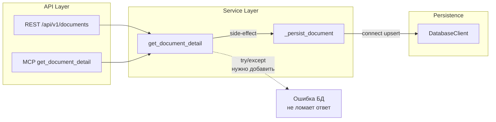

# Task 10: Обработка отказа БД — замена `if self._db is None: return` на явное поведение

## Задача

Убрать паттерн `if self._db is None: return` в методах `_persist_document`, определить поведение при недоступности БД:
- **На старте**: healthcheck — если БД настроена но недоступна, fail fast
- **При инжесте**: Circuit Breaker — retry с backoff, затем fail
- **При запросе агента** (`get_document_detail`): graceful degradation — не ломать ответ, записать в tracer, сообщить агенту о неполных данных

## Анализ текущего состояния

### Где сейчас `if self._db is None: return`

1. [`core/odl_service.py:136`](../core/odl_service.py:136) — `ODLService._persist_document()`
2. [`adapters/pravo/adapter/base.py:425`](../adapters/pravo/adapter/base.py:425) — `PravoAdapterBase._persist_document()`

### Проблема

- Silent skip: метод ничего не логирует, вызывающий код не знает, что персистентность была пропущена
- Противоречие с docstring: "If configured, persistence is mandatory — errors propagate to the caller"
- При misconfiguration (БД ожидалась, но не передана) — отсутствие диагностики
- В тестах persistence-path не проверяется, если `_db is None`

### Цепочка вызовов



### Как сейчас обрабатываются ошибки в API

- [`core/api/rest_server.py:163-169`](../core/api/rest_server.py:163-169): ловит `NotFoundError` → 404, `SourceUnavailableError` → 503. DB-ошибки не ловятся → 500 Internal Server Error.
- [`core/api/mcp_server.py:128-134`](../core/api/mcp_server.py:128-134): ловит `NotFoundError` и `SourceUnavailableError`. DB-ошибки не ловятся → исключение.

## Рекомендуемое решение

### Шаг 10.1: Startup healthcheck — проверка БД при старте

**Файл:** [`core/main.py`](../../core/main.py)

После создания `DatabaseClient` (l.135-140) добавить явную проверку connectivity ПЕРЕД созданием сервера:

```python
# В main(), после создания DatabaseClient:
if db is not None:
    try:
        await db.connect()
        logger.info("Database healthcheck passed")
    except Exception as e:
        logger.critical("Database unavailable at startup: %s", e)
        sys.exit(1)
```

Это гарантирует fail-fast: если БД настроена в конфиге, но недоступна, сервер не стартует.

**Вопрос:** `main()` — синхронная функция, `asyncio.run()` вызывается в конце. Нужно либо:
- Сделать `main()` асинхронной
- Или добавить healthcheck в `_run_server()` перед `rest_server.serve()`

**Рекомендация:** Добавить healthcheck в `_run_server()` — она уже async.

### Шаг 10.2: Новая ошибка `PersistenceUnavailableError`

**Файл:** [`core/errors/errors.py`](../../core/errors/errors.py)

```python
class PersistenceUnavailableError(ODLBaseError):
    """Система персистентности (БД) недоступна.

    Используется для graceful degradation — не фатальная ошибка API,
    а сигнал о том, что метаданные не были сохранены.
    """

    def __init__(self, message: str = "Persistence layer is unavailable") -> None:
        super().__init__(message, code="PERSISTENCE_UNAVAILABLE")
```

### Шаг 10.3: Изменить `ODLService._persist_document`

**Файл:** [`core/odl_service.py:121-163`](../core/odl_service.py:121-163)

Заменить silent return на явное логирование + tracer:

```python
async def _persist_document(
    self,
    doc: OfficialDocument,
    source_id: str,
    toc: list[TocNode] | None = None,
) -> None:
    """Persist document + sections to PostgreSQL.

    Если DatabaseClient не настроен — логирует предупреждение, пишет в tracer.
    Если настроен — персистентность обязательна, ошибки пробрасываются наверх.
    """
    if self._db is None:
        logger.warning(
            "Database not configured — skipping persistence for document %s (source=%s)",
            doc.id, source_id,
        )
        with self.tracer.trace("persistence.skipped") as span:
            span.set_input({"reason": "db_not_configured", "document_id": doc.id})
        return

    await self._db.connect()

    ref_repo = self._ref_repo_lazy
    doc_repo = self._doc_repo_lazy
    section_repo = self._section_repo_lazy

    assert ref_repo is not None
    assert doc_repo is not None
    assert section_repo is not None

    # 1. Get or create data source
    source_uuid = await ref_repo.get_or_create_data_source(
        source_id=source_id,
        name=doc.source.name,
        url=doc.url,
    )

    # 2. Upsert the document
    doc_uuid = await doc_repo.upsert_document(doc, source_uuid)

    # 3. Upsert sections (TOC)
    if toc:
        await section_repo.upsert_sections(doc_uuid, toc)
```

### Шаг 10.4: Изменить `PravoAdapterBase._persist_document`

**Файл:** [`adapters/pravo/adapter/base.py:412-446`](../adapters/pravo/adapter/base.py:412-446)

Аналогичная замена:

```python
async def _persist_document(self, doc: OfficialDocument) -> None:
    """Persist document to PostgreSQL if DB is configured."""
    if self._db is None:
        logger.warning(
            "Database not configured — skipping persistence for document %s",
            doc.id,
        )
        return

    await self._db.connect()

    ref_repo = self._ref_repo_lazy
    doc_repo = self._doc_repo_lazy
    assert ref_repo is not None
    assert doc_repo is not None

    # Get or create data source
    source_uuid = await ref_repo.get_or_create_data_source(
        source_id=self.source_id,
        name=doc.source.name,
        url=doc.url,
    )

    # Lazy-заполнение имён справочных записей перед upsert
    await self._ensure_reference_names(doc)

    # Upsert the document
    await doc_repo.upsert_document(doc, source_uuid)
```

### Шаг 10.5: Graceful degradation в `get_document_detail`

**Файл:** [`core/odl_service.py:209-264`](../core/odl_service.py:209-264)

Оборачиваем вызов `_persist_document` в try/except, чтобы ошибка БД не ломала ответ агента:

```python
async def get_document_detail(
    self,
    source_id: str,
) -> DocumentDetail:
    # ... (существующий код получения doc, toc, detail)

    # Persist to PostgreSQL — side-effect, не core logic
    # Ошибка БД не должна ломать ответ: логируем, пишем в tracer
    try:
        await self._persist_document(doc, source_id, toc)
    except Exception:
        logger.exception(
            "Failed to persist document %s (source=%s) — returning detail without persistence",
            doc.id, source_id,
        )
        with self.tracer.trace("persistence.failed") as span:
            span.set_input({
                "document_id": doc.id,
                "source_id": source_id,
                "error": str(sys.exc_info()[1]),
            })
            span.set_error(sys.exc_info()[1])

    return detail
```

**Важно:** Импортировать `sys` для `sys.exc_info()`.

### Шаг 10.6: Circuit Breaker для ingest-пути

**Файл:** [`adapters/pravo/adapter/base.py`](../../adapters/pravo/adapter/base.py)

Ingest-путь (`handler/ingest.py` → `_persist_document`) должен использовать CircuitBreaker:

```python
# В __init__ PravoAdapterBase:
from adapters.base.circuit_breaker import CircuitBreaker

self._persistence_cb = CircuitBreaker(
    name="db_persistence",
    failure_threshold=3,
    recovery_timeout=30.0,
)
```

В `_persist_document` (или в ingest handler) — проверка circuit breaker:

```python
async def _persist_document(self, doc: OfficialDocument) -> None:
    if not self._persistence_cb.can_request():
        logger.warning(
            "Persistence circuit breaker is OPEN — skipping persistence for %s",
            doc.id,
        )
        raise PersistenceUnavailableError("Persistence circuit breaker is OPEN")

    try:
        # ... existing persistence logic ...
        self._persistence_cb.record_success()
    except Exception:
        self._persistence_cb.record_failure()
        raise
```

Для `get_document_detail` CircuitBreaker НЕ используется — там graceful degradation.

### Шаг 10.7: Обновить `/health` endpoint

**Файл:** [`core/api/rest_server.py`](../../core/api/rest_server.py)

Добавить статус БД в healthcheck:

```python
@app.get("/health")
async def health() -> JSONResponse:
    """Проверка работоспособности сервиса."""
    redis_status = "connected" if (cache and cache.available) else "unavailable"
    db_status = "connected" if (db and db.available) else "unavailable"
    return JSONResponse(content={
        "status": "ok",
        "redis": redis_status,
        "database": db_status,
    })
```

**Важно:** Нужно передать `db` в `create_app()`.

### Шаг 10.8: Обновить unit-тесты

**Файлы:**
- [`tests/unit/test_odl_service.py`](../../tests/unit/test_odl_service.py) — тесты graceful degradation
- [`tests/unit/test_pravo_adapter_production.py`](../../tests/unit/test_pravo_adapter_production.py) — тесты circuit breaker
- [`tests/unit/test_db_client_helpers.py`](../../tests/unit/test_db_client_helpers.py) — возможно, тесты healthcheck

**Новые тесты:**

1. **ODLService без БД**: проверить, что `get_document_detail` работает без БД, логирует warning, но возвращает `DocumentDetail`
2. **ODLService с БД которая падает**: mock `_db.connect()` чтобы кидал исключение, проверить что `get_document_detail` возвращает `DocumentDetail` без ошибки
3. **Circuit Breaker**: проверить, что после N неудач `can_request()` возвращает False
4. **Healthcheck**: проверить формат ответа с `db_status`

### Шаг 10.9: Обновить `task9_fix_varchar36_plan.md`

Добавить строку в таблицу статуса:

| Задача | Описание | Статус |
|--------|----------|--------|
| 10 | Обработка отказа БД: убрать `if self._db is None: return`, определить поведение при недоступности БД | ✅ Выполнено |

### Шаг 10.X: Обновить docstring — убрать упоминания опциональности персистентности

**Файл:** [`core/odl_service.py`](../../core/odl_service.py)

| Строки | Было | Стало |
|--------|------|-------|
| 6-9 | `Поддерживает опциональную персистентность в PostgreSQL через DatabaseClient и репозитории. Если DatabaseClient не передан — работает без БД.` | `Поддерживает персистентность в PostgreSQL через DatabaseClient и репозитории. Если DatabaseClient передан — персистентность обязательна, ошибки БД пробрасываются наверх.` |
| 53-55 | `Опционально принимает DatabaseClient для персистентности в PostgreSQL. Если DatabaseClient не передан — работает без БД.` | `Принимает DatabaseClient для персистентности в PostgreSQL. Если передан — персистентность обязательна, ошибки БД пробрасываются наверх.` |
| 129-130 | `If DatabaseClient is not configured (self._db is None), does nothing. If configured, persistence is mandatory — errors propagate to the caller.` | `If DatabaseClient is not configured (self._db is None), logs a warning and returns. If configured, persistence is mandatory — errors propagate to the caller.` |
| 215-216 | `После получения документа от адаптера, опционально сохраняет его в PostgreSQL (если DatabaseClient передан в конструктор).` | `После получения документа от адаптера сохраняет его в PostgreSQL (если DatabaseClient передан в конструктор).` |

**Файл:** [`adapters/pravo/adapter/base.py`](../../adapters/pravo/adapter/base.py)

| Строки | Было | Стало |
|--------|------|-------|
| 415-416 | `If DatabaseClient is not configured (self._db is None), does nothing. If configured, persistence is mandatory — errors propagate to the caller.` | `If DatabaseClient is not configured (self._db is None), logs a warning and returns. If configured, persistence is mandatory — errors propagate to the caller.` |

## Схема изменений

```mermaid
flowchart TD
    subgraph "Startup"
        A[main.py] --> B{db configured?}
        B -->|Yes| C[db.connect healthcheck]
        C -->|OK| D[Start server]
        C -->|FAIL| E[logger.critical + sys.exit 1]
        B -->|No| D
    end

    subgraph "Agent Request get_document_detail"
        F[get_document_detail] --> G[get doc from adapter]
        G --> H[return DocumentDetail]
        H --> I{persist document}
        I -->|try/except| J[ODLService._persist_document]
        J --> K[if _db is None: log warning + return]
        J --> L[db.connect + upsert]
        L -->|OK| M[success]
        L -->|FAIL| N[log.exception + tracer.error\nНЕ ломать ответ]
        N --> O[return DocumentDetail as-is]
    end

    subgraph "Ingest Path"
        P[ingest handler] --> Q{CircuitBreaker\ncan_request?}
        Q -->|No| R[raise PersistenceUnavailableError]
        Q -->|Yes| S[_persist_document]
        S -->|OK| T[record_success]
        S -->|FAIL| U[record_failure + raise]
    end

    subgraph "Healthcheck"
        V[/health endpoint] --> W[redis_status]
        V --> X[db_status = connected/unavailable]
    end
```

## Связанные файлы

| Файл | Изменения |
|------|-----------|
| [`core/errors/errors.py`](../../core/errors/errors.py) | + `PersistenceUnavailableError` |
| [`core/odl_service.py`](../../core/odl_service.py) | Заменить silent return на log+warn + tracer; wrap `_persist_document` call в try/except |
| [`adapters/pravo/adapter/base.py`](../../adapters/pravo/adapter/base.py) | Заменить silent return на log+warn; добавить CircuitBreaker для ingest |
| [`core/api/rest_server.py`](../../core/api/rest_server.py) | + `db_status` в /health |
| [`core/main.py`](../../core/main.py) | + startup healthcheck БД |
| [`tests/unit/test_odl_service.py`](../../tests/unit/test_odl_service.py) | + тесты graceful degradation |
| [`tests/unit/test_pravo_adapter_production.py`](../../tests/unit/test_pravo_adapter_production.py) | + тесты circuit breaker |
| [`plans/task9_fix_varchar36_plan.md`](task9_fix_varchar36_plan.md) | Обновить статус |
