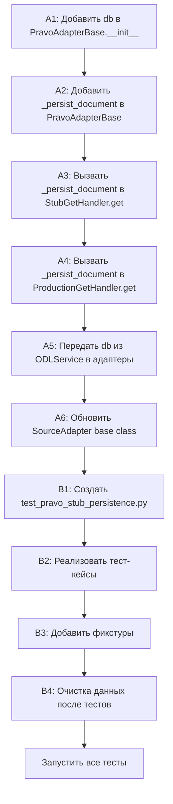

# Task 9: Подключение БД к адаптеру PravoAdapter + интеграционные тесты

## Анализ текущей архитектуры

### Как сейчас работает пайплайн:

1. **`PravoAdapter`** (через `StubGetHandler` / `ProductionGetHandler`):
   - HTTP → `PravoClient.get_document()` → `PravoParser.parse_document()` → `OfficialDocument`
   - Сохраняет результат только в **in-memory кэш** (`adapter._document_cache`)
   - БД не используется

2. **`ODLService`**:
   - `get_document_detail()` → вызывает `adapter.get()` → получает `OfficialDocument`
   - Затем вызывает `self._persist_document(doc, source_id, toc)` — **этот метод уже реализован!**
   - `_persist_document()` использует `DocumentRepository` + `ReferenceRepository` + `SectionRepository`
   - Но **вызывается только из REST/MCP API**, не из тестов напрямую

3. **Слой персистентности**:
   - `DatabaseClient` — обёртка asyncpg
   - `DocumentRepository` — CRUD для document + M:N junction tables
   - `ReferenceRepository` — get-or-create для справочников (document_type, organization, etc.)
   - Всё реализовано и протестировано (Tasks 1-8)

### Что нужно сделать:

**Часть A: Подключить БД к `PravoAdapter`** — добавить опциональный `DatabaseClient` в адаптер, чтобы `get()` и `ingest()` автоматически сохраняли документы в PostgreSQL.

**Часть B: Создать интеграционные тесты** — новый файл `tests/integration/test_pravo_stub_persistence.py`, который проверяет полный пайплайн: HTTP → парсинг → модель → PostgreSQL.

---

## Часть A: Подключение БД к PravoAdapter

### A1. Добавить `DatabaseClient` в `PravoAdapterBase.__init__()`

**Файл:** [`adapters/pravo/adapter/base.py`](adapters/pravo/adapter/base.py)

- Добавить параметр `db: DatabaseClient | None = None` в конструктор
- **`db` обязателен для продакшн-кода, но опционален для тестов** (существующие тесты создают адаптер без БД)
- Сохранить как `self._db`
- Добавить lazy-свойства `_ref_repo_lazy` и `_doc_repo_lazy` (аналогично `ODLService`)
- Импортировать `DatabaseClient` из `core.persistence`
- Импортировать `DocumentRepository`, `ReferenceRepository` из `core.persistence.repository`

### A2. Добавить метод `_persist_document()` в `PravoAdapterBase`

**Файл:** [`adapters/pravo/adapter/base.py`](adapters/pravo/adapter/base.py)

Аналогично [`ODLService._persist_document()`](core/odl_service.py:115):

```python
async def _persist_document(self, doc: OfficialDocument) -> None:
    """Persist document to PostgreSQL if DB is configured."""
    if self._db is None:
        return
    await self._db.connect()
    source_uuid = await self._ref_repo_lazy.get_or_create_data_source(
        source_id=self.source_id,
        name=doc.source.name,
        url=doc.url,
    )
    await self._doc_repo_lazy.upsert_document(doc, source_uuid)
```

**Важно:** Не дублировать логику — `ODLService` уже вызывает `_persist_document()`. Но адаптер тоже должен сохранять, чтобы:
1. Тесты могли проверить полный пайплайн через адаптер (без `ODLService`)
2. При прямом вызове `adapter.get()` данные тоже попадали в БД

### A3. Вызвать `_persist_document()` в `StubGetHandler.get()` и `ProductionGetHandler.get()`

**Файлы:**
- [`adapters/pravo/adapter/stub/get.py`](adapters/pravo/adapter/stub/get.py) — после строки 63 (после `adapter._document_cache[document_id] = ...`)
- [`adapters/pravo/adapter/production/get.py`](adapters/pravo/adapter/production/get.py) — аналогично

Добавить после кэширования:
```python
# Persist to PostgreSQL if DB is configured
await adapter._persist_document(doc)
```

### A4. Вызвать `_persist_document()` в `StubIngestHandler.ingest()` и `ProductionIngestHandler.ingest()`

**Файлы:**
- [`adapters/pravo/adapter/stub/ingest.py`](adapters/pravo/adapter/stub/ingest.py) — после `await adapter.get(document_id)` (строка 47)
- [`adapters/pravo/adapter/production/ingest.py`](adapters/pravo/adapter/production/ingest.py) — аналогично

**Важно:** `ingest()` уже вызывает `adapter.get()`, который будет сохранять в БД (из A3). Поэтому в `ingest()` дополнительно сохранять не нужно — достаточно того, что `get()` сохраняет.

### A5. Передать `db` из `ODLService` в адаптеры

**Файл:** [`core/odl_service.py`](core/odl_service.py)

Сейчас `ODLService` получает `db` и создаёт репозитории. Нужно также передать `db` в адаптеры, чтобы они могли сохранять документы напрямую.

**Вариант:** Добавить метод `set_db(db: DatabaseClient | None)` в `SourceAdapter` protocol, и вызывать его при инициализации `ODLService`.

Или проще: в `ODLService.__init__()` после создания адаптеров, если `db` передан, установить его каждому адаптеру через атрибут (если адаптер поддерживает).

**Рекомендация:** Добавить опциональный атрибут `_db` в `SourceAdapter` (базовый класс) и устанавливать его через `ODLService`.

### A6. Обновить `SourceAdapter` protocol / base class

**Файл:** [`adapters/base/source_adapter.py`](adapters/base/source_adapter.py)

Добавить опциональный атрибут `db: DatabaseClient | None = None` (или setter).

---

## Часть B: Интеграционные тесты полного пайплайна

### B1. Создать `tests/integration/test_pravo_stub_persistence.py`

Новый файл, который:
- Использует `PravoAdapter(mode="stub", db=DatabaseClient(...))`
- Использует фикстуры из [`tests/integration/conftest.py`](tests/integration/conftest.py) (или создаёт свои)
- Проверяет полный цикл: HTTP → парсинг → модель → PostgreSQL → чтение из БД

### B2. Тест-кейсы

1. **`test_get_persists_document_to_db`**
   - Вызвать `adapter.get(document_id)` для одного документа из `_STUB_PUBLISH_IDS_INITIAL`
   - Проверить, что документ появился в БД через `DocumentRepository.get_document_by_external_id()`
   - Проверить совпадение ключевых полей (title, document_number, publish_id, etc.)

2. **`test_ingest_persists_all_documents_to_db`**
   - Вызвать `adapter.ingest()`
   - Для каждого publish_id из `_STUB_PUBLISH_IDS_INITIAL` проверить наличие в БД
   - Проверить, что количество документов в БД соответствует ожидаемому

3. **`test_get_without_db_does_not_persist`**
   - Вызвать `adapter.get(document_id)` **без** `db`
   - Проверить, что документ **не** появился в БД
   - Убедиться, что адаптер работает корректно и без БД

4. **`test_persisted_document_fields_match`**
   - Получить документ через `adapter.get()`
   - Прочитать его из БД
   - Сравнить все значимые поля: title, url, summary, document_number, publish_id, legal_status, publish_date, valid_from, meta

### B3. Фикстуры

Использовать существующие фикстуры из [`tests/integration/conftest.py`](tests/integration/conftest.py):
- `db` — `DatabaseClient` подключенный к `odl-metadata-db`
- `source_uuid` — UUID источника данных

Добавить новые фикстуры:
- `adapter_with_db(db)` — `PravoAdapter(mode="stub", db=db)`
- `adapter_without_db()` — `PravoAdapter(mode="stub")`

### B4. Очистка данных

После каждого теста удалять тестовые документы из БД (через `DELETE FROM document WHERE external_id LIKE 'pravo-%'`).

---

## План выполнения (порядок действий)



---

## Файлы для изменений

| Файл | Изменения |
|------|-----------|
| [`adapters/pravo/adapter/base.py`](adapters/pravo/adapter/base.py) | Добавить `db` параметр, lazy репозитории, `_persist_document()` |
| [`adapters/pravo/adapter/stub/get.py`](adapters/pravo/adapter/stub/get.py) | Вызвать `adapter._persist_document(doc)` после кэширования |
| [`adapters/pravo/adapter/production/get.py`](adapters/pravo/adapter/production/get.py) | Вызвать `adapter._persist_document(doc)` после кэширования |
| [`adapters/base/source_adapter.py`](adapters/base/source_adapter.py) | Добавить опциональный `db` атрибут |
| [`core/odl_service.py`](core/odl_service.py) | Передать `db` в адаптеры при инициализации |
| [`tests/integration/test_pravo_stub_persistence.py`](tests/integration/test_pravo_stub_persistence.py) | **Новый файл** — тесты полного пайплайна |
| [`tests/integration/conftest.py`](tests/integration/conftest.py) | Добавить фикстуры `adapter_with_db`, `adapter_without_db` |
