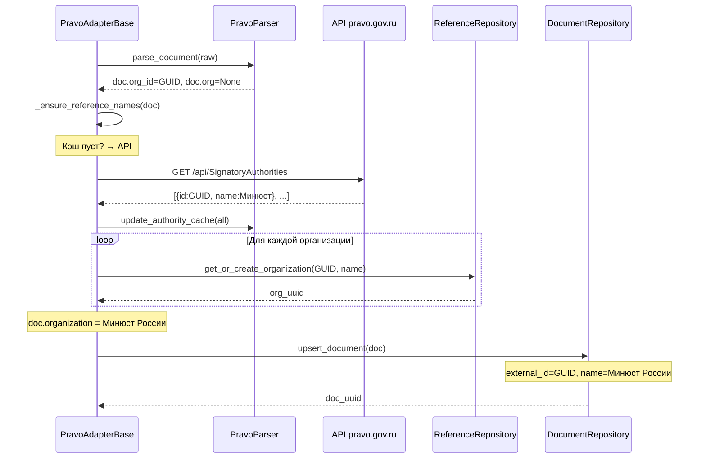
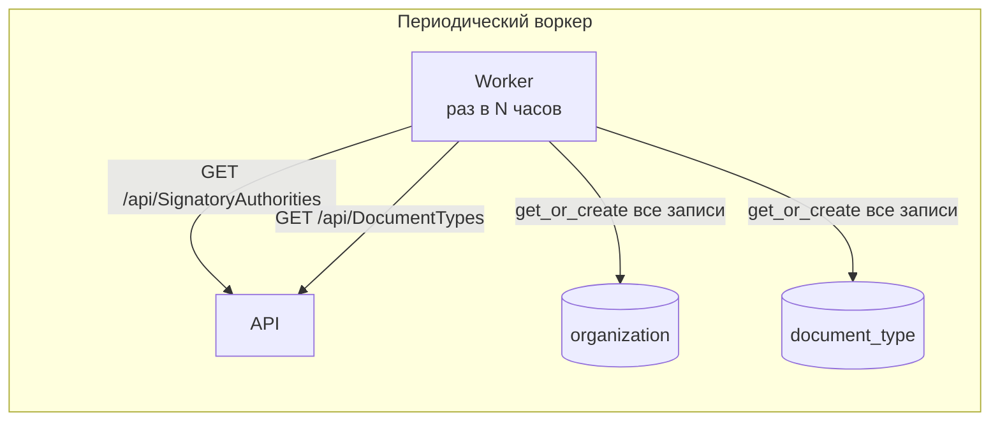
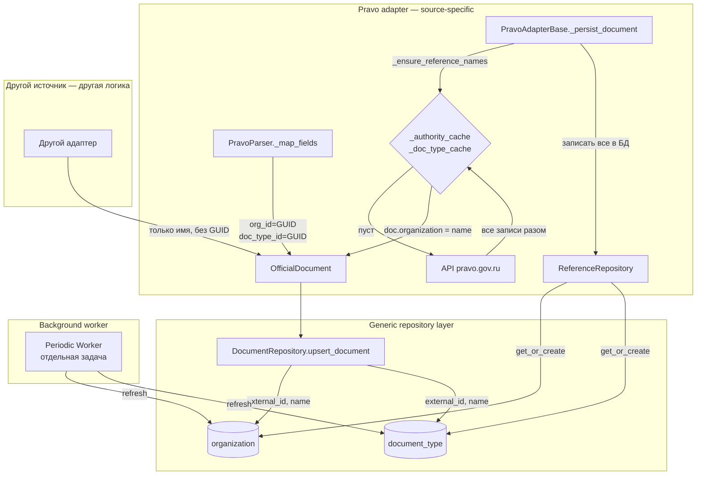
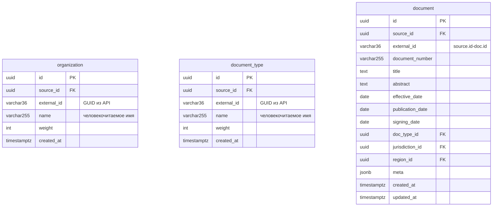

# Task 9: Нормализация справочных таблиц и их эффективное заполнение

## Задача

Нормализовать схему справочных таблиц (`organization`, `document_type`):
- `external_id` — естественный ключ GUID из API источника
- `name` — человекочитаемое имя (атрибут, не идентификатор)
- Организация — скаляр (документ имеет один принявший орган)

Обеспечить эффективное заполнение справочных таблиц при обработке документов:
- In-memory кэш имён с lazy-загрузкой из API (первый документ инициирует загрузку всего справочника)
- Фоновый воркер для периодической синхронизации всех записей с БД

## Решение

### Шаг 9.1: Изменить `OfficialDocument` (`core/models/models.py`) — **ВЫПОЛНЕНО**

```python
# Было:
organization: list[str] = Field(default_factory=list, ...)
# Стало:
organization: str | None = Field(default=None, description="Орган, принявший документ. Пример: 'Минюст России'")
organization_id: str | None = Field(default=None, description="GUID органа из API источника")
document_type_id: str | None = Field(default=None, description="GUID вида документа из API источника")
```

### Шаг 9.2: Изменить `PravoParser._map_fields` (`adapters/pravo/pravo_parser.py`) — **ВЫПОЛНЕНО**

Парсер возвращает только GUID-поля, текстовые имена не извлекаются.
Имена будут заполнены адаптером на Шаге 9.4 через lazy-кэш.

```python
# Было:
doc_type = self._doc_type_cache.get(str(doc_type_id))
# ...
org_name = self._authority_cache.get(str(authority_id))
organization = [org_name] if org_name else [f"authority:{authority_id}"]

# Стало (только GUID):
doc_type_id: str | None = None          # GUID вида документа
doc_type_id_raw = raw.get("documentTypeId")
if doc_type_id_raw:
    doc_type_id = str(doc_type_id_raw)

organization_id: str | None = None      # GUID органа
authority_id = raw.get("signatoryAuthorityId")
if authority_id:
    organization_id = str(authority_id)

# В return dict:
"organization_id": organization_id,
"document_type_id": doc_type_id,
```

### Шаг 9.3: Изменить `DocumentRepository.upsert_document` (`core/persistence/repository/document_repo.py`) — **ВЫПОЛНЕНО**

- `organization` теперь скалярное `str | None` — M:N `_upsert_document_organizations` удалён
- Для `organization`: `external_id=doc.organization_id`, `name=doc.organization`
- Для `document_type`: `external_id=doc.document_type_id`, `name=doc.document_type`
- `_row_to_document`: `organization=orgs[0] if orgs else None` (скаляр)

> **Важно:** Имена (`doc.organization`, `doc.document_type`) будут установлены адаптером **до** вызова `upsert_document` (см. Шаг 9.4).

### Шаг 9.4: Добавить lazy-заполнение справочных кэшей в `PravoAdapterBase` (`adapters/pravo/adapter/base.py`)

> ⚠️ **Source-specific handler.** Логика ниже специфична для pravo (есть API для загрузки справочников по GUID).
> Другие источники (RSS, stub и т.д.) реализуют свою процедуру — например, создают записи в `organization`
> только по текстовому названию, без GUID.
>
> `DocumentRepository.upsert_document` остаётся **generic** — он работает с любыми полями,
> которые передал адаптер. Если `doc.organization` не установлен — в БД запишется `name=""`.

#### Где живёт логика

`_ensure_reference_names` — метод `PravoAdapterBase`, не общий слой.
Вызывается в `_persist_document` **перед** `upsert_document`:

```python
# adapters/pravo/adapter/base.py — PravoAdapterBase
async def _persist_document(self, doc: OfficialDocument) -> str:
    # 1. Lazy-заполнение имён (pravo-specific)
    await self._ensure_reference_names(doc)

    # 2. Upsert — generic, работает с любыми полями
    return await self._repo.upsert_document(doc, source_uuid)
```

```python
async def _ensure_reference_names(self, doc: OfficialDocument) -> None:
    """Lazy-заполнение имён из кэша парсера.

    Pravo-specific: если кэш пуст — однократно загружает ВСЕ справочные
    данные из API в in-memory кэш парсера. Затем устанавливает
    doc.organization / doc.document_type из кэша.

    Запись в БД делает только `upsert_document` — для одной организации
    текущего документа. Bulk-запись всех справочных записей — в воркере (Шаг 9.5).
    """
    parser = self._parser

    # --- Организация ---
    if doc.organization_id and not doc.organization:
        if not parser._authority_cache:
            authorities = await self._pravo_client.get_signatory_authorities(
                block=self._block, category=self._category,
            )
            parser.update_authority_cache(authorities)
            # ⚡ Только in-memory кэш, БД не трогаем
        doc.organization = parser._authority_cache.get(doc.organization_id)

    # --- Тип документа ---
    if doc.document_type_id and not doc.document_type:
        if not parser._doc_type_cache:
            doc_types = await self._pravo_client.get_document_types(
                block=self._block, category=self._category,
                authority_id=doc.organization_id or "",
            )
            parser.update_doc_type_cache(doc_types)
        doc.document_type = parser._doc_type_cache.get(doc.document_type_id)
```

#### Поток вызовов



#### Для других источников (пример)

```python
# Другой адаптер, например RSS-адаптер
async def _persist_document(self, doc: OfficialDocument) -> str:
    # Нет API для справочников — создаём запись только по имени
    if doc.organization and not doc.organization_id:
        await self._ref_repo.get_or_create_organization(
            source_id=source_uuid,
            external_id=doc.organization,  # имя как external_id (fallback)
            name=doc.organization,
        )
    return await self._repo.upsert_document(doc, source_uuid)
```

#### Важные детали

1. **API вызывается один раз за сессию** — при первом документе, которому нужен lookup
2. **Все справочные записи загружаются в in-memory кэш** — API возвращает только весь список, пишем в БД только одну запись текущего документа. Bulk-запись — в воркере
3. **Кэш парсера** — in-memory storage для быстрого lookup. Bulk-запись в БД — в воркере
4. **Если GUID не найден в ответе API** — `doc.organization` остаётся `None`, upsert пройдёт без organisation_id
5. **Метод `_ensure_caches_populated`** больше не нужен при старте — можно удалить или оставить для явного вызова

### Шаг 9.5: Фоновый воркер для периодического обновления справочников (отдельная задача)

> **Не входит в текущий спринт.** Оформляется как отдельная задача.



Воркер использует существующие `ReferenceRepository.get_or_create_organization/document_type`.
При `ON CONFLICT ... SET name = EXCLUDED.name` имена обновляются.

### Шаг 9.6: Обновить unit-тесты

- `tests/unit/test_models.py` — обновить тесты создания `OfficialDocument` с новыми полями
- `tests/unit/test_pravo_adapter_production.py` — обновить тесты парсера (теперь без текстовых полей)
- `tests/unit/test_pravo_adapter_production.py` — добавить тесты `_ensure_reference_names` с моком API

### Шаг 9.7: Обновить интеграционные тесты

- `tests/integration/test_pravo_stub_persistence.py` — обновить под новую модель
- Для stub-режима `_ensure_reference_names` не должен вызывать реальный API

### Шаг 9.8: Запустить все тесты

```bash
uv run pytest tests/unit/test_models.py -v
uv run pytest tests/unit/test_pravo_adapter_production.py -v
uv run pytest tests/integration/test_pravo_stub_persistence.py -v
uv run pytest tests/unit/ -v
```

## Архитектура (после изменений)



## Схема БД (без изменений)



## Статус выполнения

| Шаг | Описание | Статус |
|-----|----------|--------|
| 9.1 | OfficialDocument: добавить organization_id, document_type_id | ✅ Выполнено |
| 9.2 | PravoParser._map_fields: только GUID, без текста | ✅ Выполнено |
| 9.3 | DocumentRepository: убрать M:N, external_id=GUID | ✅ Выполнено |
| 9.4 | PravoAdapterBase: lazy-заполнение кэша в _persist_document | ✅ Выполнено |
| 9.5 | Фоновый воркер (отдельная задача) | 📋 Отложено |
| 9.6 | Unit-тесты (обновление тестов под новую модель) | ✅ Выполнено |
| 9.7 | Интеграционные тесты | ⏳ Ожидает |
| 9.8 | Прогон всех тестов — 460 passed | ✅ Выполнено |

## Связанные задачи

| Задача | Описание | Статус |
|--------|----------|--------|
| 10 | Обработка отказа БД: убрать `if self._db is None: return`, определить поведение при недоступности БД (raise / retry / queue) | ✅ Выполнено |
