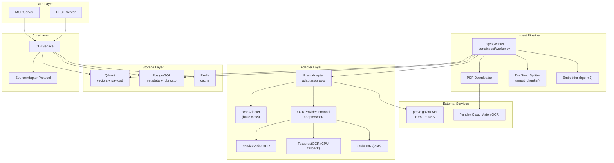

# План Phase 6: Рабочая вертикаль end-to-end (PravoAdapter + Ingest Pipeline)

## Обзор

**Цель:** Реализовать работающую вертикаль end-to-end: от загрузки документов с pravo.gov.ru до ответа AI-агенту с provenance. Фокус — глубина одной вертикали (Минтруд), а не ширина.

**Срок:** ~3.5 дня
**Принцип:** лучше одна вертикаль, доведённая до чистого состояния, чем три наполовину.

---

## Текущее состояние проекта (что уже есть)

### Готово ✅
- **Инфраструктура:** Docker (Qdrant, Redis, LangFuse, PostgreSQL), CI/CD, ruff + mypy + pytest
- **Спецификация:** `SPEC.md`, C4-диаграммы, ADR
- **Каноническая модель:** 12 Pydantic-моделей (`OfficialDocument`, `SearchResult`, `SearchResponse`, `DocumentDetail`, `ConfidenceSignals`, `Citation`, `TopicNode`, `TocNode`, `Source`, `SearchContext`, `LegalStatus`, `SourceAvailability`)
- **SourceAdapter Protocol:** 7 методов (`search`, `get`, `normalize`, `ingest`, `list_topics`, `get_toc`, `get_content`)
- **StubAdapter:** 2 документа, темы, TOC — демонстрация шва адаптера
- **Dual API:** MCP (FastMCP) + REST (FastAPI) поверх единого `ODLService`
- **Наблюдаемость:** LangFuseTracer + FileFallbackTracer, структурированные логи
- **Типизированные ошибки:** `NotFoundError`, `SourceUnavailableError`, `InvalidInputError`, `InternalError`
- **Тесты:** unit-тесты на модели, сервис, API, адаптер, конфиг, ошибки, логгер, tracer

### Заглушки (stub) 🔄
- `core/cache/__init__.py` — TODO: Redis-кэш
- `core/ingest/__init__.py` — TODO: ingest worker
- `core/index/__init__.py` — TODO: Qdrant + SQLite
- `core/router/__init__.py` — TODO: роутинг по контексту

---

## Архитектура Phase 6



---

## Детальный план по дням

### День 1: OCRProvider + RSSAdapter + PravoAdapter (скелет)

**Оценка:** ~35% (Архитектура и переносимость) + ~20% (Вертикаль)

#### 1.1. OCRProvider Protocol и реализации

**Файлы:**
- `adapters/ocr/__init__.py` — экспорты
- `adapters/ocr/ocr_provider.py` — `OCRProvider` Protocol
- `adapters/ocr/yandex_vision.py` — `YandexVisionOCR`
- `adapters/ocr/tesseract_ocr.py` — `TesseractOCR`
- `adapters/ocr/stub_ocr.py` — `StubOCR` (для тестов)

**`OCRProvider` Protocol:**
```python
class OCRProvider(Protocol):
    async def extract_text(self, pdf_bytes: bytes, document_id: str) -> str:
        """Extract text from PDF bytes.

        Args:
            pdf_bytes: Raw PDF content.
            document_id: Document identifier for logging/tracing.

        Returns:
            Extracted text.

        Raises:
            OCRUnavailableError: OCR service unavailable.
            OCRQualityError: Extracted text quality below threshold.
        """
        ...
```

**YandexVisionOCR:**
- HTTP-клиент к `https://ai.api.cloud.yandex.net/ocr/v1/recognizeText`
- Использует ключи из config: `OCR_YA_KEY_SECRET`, `OCR_YA_FOLDER_ID`
- Обработка ошибок: таймауты, retry (3 попытки), fallback
- Логирование через Tracer

**TesseractOCR:**
- Использует `pytesseract` (CPU)
- Fallback, если Yandex недоступен
- Настраивается через config: `OCR_TESSERACT_LANG=rus`

**StubOCR:**
- Возвращает предопределённый текст для тестовых document_id
- Не требует внешних сервисов

**Конфигурация (`.env.example`):**
```
OCR_PROVIDER=yandex_vision|tesseract|stub
OCR_YA_KEY_SECRET=<your-ya-key-secret>
OCR_YA_FOLDER_ID=<your-ya-folder-id>
OCR_TESSERACT_LANG=rus
```

**Новые ошибки:**
- `OCRUnavailableError` — сервис OCR недоступен
- `OCRQualityError` — качество распознавания ниже порога

#### 1.2. RSSAdapter (базовый класс)

**Файлы:**
- `adapters/base/rss_adapter.py` — `RSSAdapter` base class

**RSSAdapter:**
- Общий функционал для источников, поддерживающих RSS
- Парсинг RSS/Atom ленты
- Метод `fetch_new_entries()` — получение новых записей
- Метод `parse_entry()` — парсинг одной записи в сырые данные
- PravoAdapter наследует от RSSAdapter

**Обоснование (для ADR):** Часть функционала RSS можно реализовать специфическими средствами API pravo.gov.ru (периодический опрос `/api/Documents` с `PeriodType=weekly`). Но RSSAdapter — более общее решение, применимое к любым источникам с RSS-лентой. Это соответствует принципу переносимости.

#### 1.3. PravoAdapter (скелет)

**Файлы:**
- `adapters/pravo/__init__.py` — экспорты
- `adapters/pravo/pravo_adapter.py` — `PravoAdapter` (фасад)
- `adapters/pravo/pravo_client.py` — HTTP-клиент к API pravo.gov.ru
- `adapters/pravo/pravo_parser.py` — парсер ответов API в каноническую модель

**PravoClient:** HTTP-клиент (httpx) к `http://publication.pravo.gov.ru` с методами для всех API-эндпоинтов (PublicBlocks, Categories, SignatoryAuthorities, DocumentTypes, Documents, Document, PDF download). Retry (3 попытки), таймауты (30s), rate limiting.

**PravoParser:** Парсинг JSON-ответов API в `OfficialDocument`. Маппинг полей API → каноническая модель (см. таблицу ниже).

**PravoAdapter:** Реализует `SourceAdapter` Protocol. `source_id` = `"pravo"`. Подробная архитектура (Strategy Pattern с handlers/, production/, stub/) описана в [`plans/pravo_adapter_decomposition.md`](plans/pravo_adapter_decomposition.md).

**Stub/Production режим:** `PravoAdapter.__init__(mode="stub" | "production")`. Режим задаётся через `PRAVO_MODE` env var (по умолчанию `production`). В stub режиме — 3 фиксированных документа Минтруда, в production — реальный API.

#### 1.4. Каноническая модель: доработка OfficialDocument

**Файл:** `core/models/models.py`

**Принцип:** Каноническая модель содержит только общие для всех источников поля. Source-специфичные атрибуты (которые не маппятся в каноническую модель) собираются в поле `meta: dict[str, Any]`.

**Изменения:**
```python
class OfficialDocument(BaseModel):
    # Существующие поля...

    # Новые общие поля
    document_number: str | None = None  # Номер документа (НПА)
    document_type: str | None = None    # Вид документа (Приказ, Постановление...)
    eo_number: str | None = None        # Номер электронного опубликования
    publish_date: datetime | None = None # Дата публикации (из publishDateShort API)

    # Source-специфичные атрибуты (не маппятся в канонические поля)
    meta: dict[str, Any] = Field(
        default_factory=dict,
        description="Source-специфичные атрибуты документа, "
        "не маппящиеся в канонические поля. "
        "Пример для pravo.gov.ru: pdf_url, pdf_pages, jd_reg_number, jd_reg_date. "
        "Позволяет расширять модель без изменения схемы.",
    )
```

**Маппинг полей API pravo.gov.ru → каноническая модель (PravoParser):**

| Поле API | Поле модели | Примечание |
|---|---|---|
| `id` (GUID) | `id` | Префикс `pravo-` + GUID |
| `eoNumber` | `eo_number` | Номер электронного опубликования |
| `publishDateShort` | `publish_date` | Дата публикации (НЕ ingest_date) |
| `complexName` | `summary` | Составное название |
| `title` | `title` | Заголовок |
| `name` | — | Дублирует часть complexName, не маппим |
| `number` | `document_number` | Номер документа (НПА) |
| `documentDate` | `valid_from` | Дата подписания = начало юр.силы |
| `documentType.name` | `document_type` | Вид документа (Приказ, Постановление...) |
| `signatoryAuthorityId` | `organization` | Lookup имени органа через `/api/SignatoryAuthorities`. Добавляется в `list[str]` |
| `pagesCount` | `meta["pdf_pages"]` | Source-специфично |
| `pdfFileLength` | `meta["pdf_file_length"]` | Source-специфично |
| `jdRegNumber` | `meta["jd_reg_number"]` | Source-специфично |
| `jdRegDate` | `meta["jd_reg_date"]` | Source-специфично |
| `zipFileLength` | `meta["zip_file_length"]` | Source-специфично |
| `hasSvg` | `meta["has_svg"]` | Source-специфично |

**Критерии готовности Дня 1:**
- [ ] `OCRProvider` Protocol определён, mypy проходит
- [ ] `YandexVisionOCR` реализован (с retry, таймаутами)
- [ ] `TesseractOCR` реализован (CPU fallback)
- [ ] `StubOCR` реализован (для тестов)
- [ ] `RSSAdapter` base class реализован
- [ ] `PravoClient` реализован (все методы API)
- [ ] `PravoParser` реализован (маппинг полей)
- [ ] `PravoAdapter` реализован (stub + production режимы)
- [ ] `OfficialDocument` дополнен полями из API pravo.gov.ru
- [ ] `make test && make lint && make type-check` проходят

---

### День 2: Ingest Pipeline (полный пайплайн)

**Оценка:** ~20% (Вертикаль) + ~10% (Надёжность и SLO)

#### 2.1. IngestWorker

**Файлы:**
- `core/ingest/__init__.py` — обновить (убрать заглушку)
- `core/ingest/worker.py` — `IngestWorker`
- `core/ingest/chunker.py` — интеграция с DocStructSplitter
- `core/ingest/embedder.py` — `Embedder` (bge-m3 через sentence-transformers)

**IngestWorker:**
```python
class IngestWorker:
    """Background worker for document ingestion pipeline."""

    async def initial_ingest(self, adapter: SourceAdapter) -> int:
        """Initial bulk load — downloads, OCRs, chunks, embeds, stores."""
        ...

    async def ingest_new(self, adapter: SourceAdapter) -> int:
        """Incremental ingest — checks for new documents since last run."""
        ...

    async def ingest_document(self, doc: OfficialDocument, pdf_bytes: bytes) -> None:
        """Single document pipeline: OCR → chunk → embed → store."""
        ...
```

**Pipeline (полный):**
```
RSS/API pravo.gov.ru (или фиксированный список в stub)
    ↓
Скачивание PDF (PravoClient.download_pdf)
    ↓
OCRProvider.extract_text(pdf) → текст
    ↓
Нормализация в OfficialDocument (PravoParser)
    ↓
Чанкинг (DocStructSplitter)
    ↓
Эмбеддинг (bge-m3 под sentence-transformers)
    ↓
Запись: Qdrant (вектор + payload) + PostgreSQL (метаданные + рубрикатор)
```

#### 2.2. DocStructSplitter (chunker)

**Интеграция с внешним пакетом:** `smart_chunker` (https://github.com/igorvolk1961/smart_chunker)

**Файл:** `core/ingest/chunker.py`

```python
class DocStructSplitter:
    """Splitter for structured documents with numbered sections.

    Uses smart_chunker library for Russian official documents.
    """

    def split_text(self, text: str, document_id: str) -> list[Chunk]:
        """Split document text into chunks by structure.

        Args:
            text: Full document text (from OCR).
            document_id: Document identifier.

        Returns:
            List of Chunk objects with section metadata.
        """
        ...
```

**Chunk модель:**
```python
class Chunk(BaseModel):
    id: str
    document_id: str
    text: str
    section: list[str]  # Путь к разделу
    chunk_index: int
    embedding: list[float] | None = None
```

#### 2.3. Embedder (bge-m3)

**Файл:** `core/ingest/embedder.py`

```python
class Embedder:
    """Text embedder using sentence-transformers with bge-m3 model."""

    def __init__(self, model_name: str = "BAAI/bge-m3"):
        self._model = SentenceTransformer(model_name)

    async def embed(self, texts: list[str]) -> list[list[float]]:
        """Embed a batch of texts."""
        ...

    async def embed_query(self, query: str) -> list[float]:
        """Embed a single query (for search)."""
        ...
```

**Обоснование bge-m3:** Высокая точность на русском языке, большой контекст (8192 токена). Минус — медленная, но для тестового задания обработка больших объёмов не требуется.

#### 2.4. Storage Layer

**Файлы:**
- `core/index/__init__.py` — обновить (убрать заглушку)
- `core/index/qdrant_store.py` — `QdrantStore`
- `core/index/metadata_store.py` — `MetadataStore` (PostgreSQL)

**QdrantStore:**
```python
class QdrantStore:
    """Vector storage in Qdrant."""

    async def upsert_chunks(self, chunks: list[Chunk]) -> None:
        """Insert or update chunks with embeddings."""
        ...

    async def search(self, query_embedding: list[float],
                     filters: dict | None = None,
                     limit: int = 10) -> list[SearchResult]:
        """Semantic search with payload filtering."""
        ...
```

**MetadataStore (PostgreSQL):**
```python
class MetadataStore:
    """Metadata and hierarchical rubricator in PostgreSQL."""

    async def upsert_document(self, doc: OfficialDocument) -> None:
        """Insert or update document metadata."""
        ...

    async def get_document(self, document_id: str) -> OfficialDocument | None:
        """Get document metadata by ID."""
        ...

    async def list_topics(self, parent_id: str | None = None) -> list[TopicNode]:
        """Browse hierarchical rubricator."""
        ...
```

**Схема PostgreSQL:**
```sql
CREATE TABLE official_document (
    id VARCHAR PRIMARY KEY,
    title VARCHAR NOT NULL,
    source_id VARCHAR NOT NULL,
    url VARCHAR NOT NULL,
    summary TEXT,
    jurisdiction VARCHAR,
    region VARCHAR,
    document_number VARCHAR,
    document_type VARCHAR,
    eo_number VARCHAR,
    publish_date TIMESTAMP,
    ingest_date TIMESTAMP NOT NULL DEFAULT NOW(),
    valid_from TIMESTAMP,
    valid_to TIMESTAMP,
    legal_status VARCHAR NOT NULL DEFAULT 'unknown',
    meta JSONB NOT NULL DEFAULT '{}'  -- source-специфичные атрибуты
);

CREATE TABLE document_topic (
    document_id VARCHAR REFERENCES official_document(id),
    topic VARCHAR NOT NULL,
    PRIMARY KEY (document_id, topic)
);

CREATE TABLE document_organization (
    document_id VARCHAR REFERENCES official_document(id),
    organization VARCHAR NOT NULL,
    PRIMARY KEY (document_id, organization)
);

CREATE TABLE topic (
    id VARCHAR PRIMARY KEY,
    name VARCHAR NOT NULL,
    parent_id VARCHAR REFERENCES topic(id),
    description TEXT
);
```

#### 2.5. REST-endpoints для управления

**Файл:** `core/api/rest_server.py` (дополнить)

**Новые эндпоинты:**
```
POST /api/v1/ingest/run          — запустить initial_ingest
POST /api/v1/ingest/update       — запустить ingest_new
GET  /api/v1/ingest/status       — статус ингеста (последний запуск, кол-во документов)
GET  /api/v1/adapters            — список активных адаптеров
GET  /api/v1/storage/status      — состояние векторной базы (кол-во документов, чанков)
```

#### 2.6. Идемпотентность ингеста

**Механизм:**
- Каждый документ имеет уникальный `eo_number` (номер электронного опубликования)
- Перед записью проверяется: существует ли документ с таким `eo_number` в PostgreSQL
- Если существует — пропускаем (не дублируем)
- Если нужно обновить — используем `valid_to` для старой версии и создаём новую

**Критерии готовности Дня 2:**
- [ ] `IngestWorker` реализован (initial_ingest + ingest_new + ingest_document)
- [ ] `DocStructSplitter` интегрирован
- [ ] `Embedder` (bge-m3) реализован
- [ ] `QdrantStore` реализован (upsert + search)
- [ ] `MetadataStore` (PostgreSQL) реализован
- [ ] REST-endpoints для управления ингестом
- [ ] Идемпотентность: повторный ingest не дублирует
- [ ] `make test && make lint && make type-check` проходят

---

### День 3: Graceful degradation + Кэш + Observability

**Оценка:** ~25% (Инженерная культура) + ~10% (Надёжность и SLO)

#### 3.1. Redis-кэш

**Файлы:**
- `core/cache/__init__.py` — обновить
- `core/cache/redis_cache.py` — `RedisCache`

```python
class RedisCache:
    """TTL-based cache for search results and document cards."""

    async def get_search_results(self, query_hash: str) -> SearchResponse | None: ...
    async def set_search_results(self, query_hash: str, response: SearchResponse, ttl: int = 300): ...
    async def get_document_detail(self, source_id: str) -> DocumentDetail | None: ...
    async def set_document_detail(self, source_id: str, detail: DocumentDetail, ttl: int = 3600): ...
    async def invalidate(self, document_id: str): ...
```

**Интеграция с ODLService:**
- `ODLService` проверяет кэш перед вызовом адаптера
- При успешном ответе адаптера — записывает в кэш
- При недоступности адаптера — возвращает из кэша (best-effort)
- При ингесте — инвалидирует соответствующие ключи

#### 3.2. Graceful degradation (полный)

**Сценарии:**
1. **PDF недоступен** → логируем, пропускаем документ, продолжаем пайплайн
2. **OCR вернул пустой текст** → логируем, помечаем документ как `ocr_failed`, сохраняем метаданные без текста
3. **Yandex OCR вернул ошибку** → fallback на TesseractOCR, если и он не смог — логируем, пропускаем
4. **Qdrant недоступен** → кэшируем результаты в Redis, возвращаем из кэша при запросе
5. **PostgreSQL недоступен** → работаем только с Qdrant (без иерархического рубрикатора)
6. **Адаптер недоступен** → graceful degradation уже есть (try/except в ODLService)

#### 3.3. Observability пайплайна

**Детальное логирование через Tracer:**
- Каждый шаг пайплайна — отдельный span:
  - `ingest.download_pdf` — время скачивания, размер
  - `ingest.ocr` — время OCR, количество символов
  - `ingest.chunk` — количество чанков
  - `ingest.embed` — время эмбеддинга
  - `ingest.qdrant_upsert` — количество записанных векторов
  - `ingest.postgres_upsert` — количество записанных метаданных
- При ошибке — span с `set_error()` + подробное логирование

#### 3.4. Тесты

**Критические тесты для этой фазы:**

1. **Тесты OCR:**
   - `test_yandex_vision_ocr.py` — mock HTTP-ответов Yandex
   - `test_tesseract_ocr.py` — тест с реальным PDF (если Tesseract установлен)
   - `test_stub_ocr.py` — тест заглушки
   - `test_ocr_fallback.py` — Yandex недоступен → fallback на Tesseract

2. **Тесты PravoAdapter:**
   - `test_pravo_client.py` — mock HTTP-ответов API
   - `test_pravo_parser.py` — парсинг JSON → OfficialDocument
   - `test_pravo_adapter.py` — интеграция client + parser
   - `test_pravo_adapter_stub.py` — stub режим

3. **Тесты Ingest Pipeline:**
   - `test_ingest_worker.py` — mock всех зависимостей
   - `test_chunker.py` — разбиение текста на чанки
   - `test_embedder.py` — тест эмбеддинга (с реальной моделью или mock)
   - `test_idempotency.py` — повторный ingest не дублирует

4. **Тесты кэша:**
   - `test_redis_cache.py` — mock Redis
   - `test_cache_integration.py` — ODLService + кэш

5. **Контрактные тесты:**
   - `test_response_provenance.py` — ответ содержит все поля provenance
   - `test_confidence_signals.py` — сигналы уверенности корректны

**Критерии готовности Дня 3:**
- [ ] Redis-кэш реализован и интегрирован с ODLService
- [ ] Graceful degradation для всех сценариев
- [ ] Observability пайплайна (детальные span'ы)
- [ ] Тесты OCR (mock Yandex, fallback)
- [ ] Тесты PravoAdapter (mock API)
- [ ] Тесты Ingest Pipeline
- [ ] Тесты кэша
- [ ] Контрактные тесты на ответ с provenance
- [ ] `make test && make lint && make type-check` проходят

---

### День 4: Полировка + Демонстрация + Документация

**Оценка:** ~35% (Архитектура и переносимость) + ~10% (Достоверность и ограничения)

#### 4.1. Документация

**Файлы для обновления:**
- `README.md` — обновить:
  - Инструкция по запуску с PravoAdapter
  - Примеры запросов с реальными документами
  - Описание stub/production режимов
  - Инструкция по настройке OCR (Yandex/Tesseract)
- `SPEC.md` — обновить:
  - Раздел «Следующий шаг» — что не успели
  - Добавить описание OCR-провайдеров
  - Добавить описание пайплайна ингеста
- `plans/adr.md` — добавить ADR:
  - Выбор OCR-провайдера (Yandex Vision)
  - Выбор DocStructSplitter
  - Выбор bge-m3
  - RSSAdapter vs специфическое API
- `examples/SKILL.md` — обновить:
  - Пример запроса к PravoAdapter
  - Пример ответа с provenance

#### 4.2. Демонстрационный сценарий

**Сценарий для проверяющего:**

1. **Запуск в stub режиме:**
   ```bash
   ADAPTERS=adapters.pravo:PravoAdapter INGEST_MODE=stub make up
   ```

2. **Initial ingest (загружает 3 документа Минтруда):**
   ```bash
   curl -X POST http://localhost:8000/api/v1/ingest/run
   ```

3. **Поиск документа:**
   ```bash
   curl -X POST http://localhost:8000/api/v1/search \
     -H "Content-Type: application/json" \
     -d '{"query": "пособие по безработице"}'
   ```

4. **Получение карточки документа:**
   ```bash
   curl http://localhost:8000/api/v1/documents/pravo-0001202012230060
   ```

5. **Graceful degradation (отключить Yandex → fallback на кэш/индекс):**
   - Остановить Yandex OCR (или установить `OCR_PROVIDER=tesseract`)
   - Повторить поиск — ответ должен прийти из кэша/индекса

6. **Проверка шва адаптера:**
   - Переключить `ADAPTERS=adapters.stub:StubAdapter`
   - Убедиться, что API работает с другим источником без изменений кода

#### 4.3. Финальная чистка

- Проверить `.secrets.baseline` — нет ли утекших ключей
- Проверить `.gitignore` — не попали ли бинарные файлы
- Проверить `Dockerfile` — оптимизация слоёв
- Финальный прогон `make test && make lint && make type-check`
- Финальный коммит с осмысленным сообщением

#### 4.4. Что резать, если не успеваем

**Приоритеты (от высшего к низшему):**
1. **Обязательно:** PravoAdapter (stub mode) + IngestWorker (stub) — работающая вертикаль
2. **Обязательно:** Тесты на PravoAdapter и IngestWorker
3. **Желательно:** Graceful degradation + кэш
4. **Желательно:** Документация и ADR
5. **Если время:** Production mode PravoAdapter (реальный API)
6. **Если время:** TesseractOCR fallback

**Что можно описать в SPEC.md как «Следующий шаг»:**
- Полноценный production-режим PravoAdapter (реальный мониторинг RSS/API)
- TesseractOCR как production-fallback
- Rate limiting и circuit breaker для адаптеров
- Миграции схем PostgreSQL (Alembic)
- Prometheus-метрики

**Критерии готовности Дня 4:**
- [ ] README обновлён
- [ ] SPEC.md обновлён (раздел «Следующий шаг»)
- [ ] ADR дополнены (OCR, DocStructSplitter, bge-m3, RSSAdapter)
- [ ] SKILL.md обновлён
- [ ] Демонстрационный сценарий работает
- [ ] Финальный `make test && make lint && make type-check` зелёный
- [ ] Репозиторий чист (нет секретов, бинарных файлов)

---

## Структура новых файлов

```
adapters/
├── base/
│   └── rss_adapter.py              # NEW: RSSAdapter base class
├── ocr/                            # NEW: OCR providers
│   ├── __init__.py
│   ├── ocr_provider.py             # OCRProvider Protocol
│   ├── yandex_vision.py            # YandexVisionOCR
│   ├── tesseract_ocr.py            # TesseractOCR
│   └── stub_ocr.py                 # StubOCR (tests)
└── pravo/
    ├── __init__.py
    ├── pravo_adapter.py            # NEW: PravoAdapter
    ├── pravo_client.py             # NEW: HTTP client for pravo.gov.ru
    └── pravo_parser.py             # NEW: API response parser

core/
├── cache/
│   └── redis_cache.py              # NEW: RedisCache implementation
├── index/
│   ├── qdrant_store.py             # NEW: QdrantStore
│   └── metadata_store.py           # NEW: MetadataStore (PostgreSQL)
├── ingest/
│   ├── worker.py                   # NEW: IngestWorker
│   ├── chunker.py                  # NEW: DocStructSplitter integration
│   └── embedder.py                 # NEW: Embedder (bge-m3)
└── errors/
    └── errors.py                   # MODIFY: add OCRUnavailableError, OCRQualityError

tests/
├── unit/
│   ├── test_yandex_vision_ocr.py   # NEW
│   ├── test_tesseract_ocr.py       # NEW
│   ├── test_stub_ocr.py            # NEW
│   ├── test_pravo_client.py        # NEW
│   ├── test_pravo_parser.py        # NEW
│   ├── test_pravo_adapter.py       # NEW
│   ├── test_ingest_worker.py       # NEW
│   ├── test_chunker.py             # NEW
│   ├── test_embedder.py            # NEW
│   ├── test_redis_cache.py         # NEW
│   └── test_cache_integration.py   # NEW
└── contracts/
    └── test_response_provenance.py # NEW
```

---

## Маппинг на критерии оценки

| Критерий | Вес | Что закрываем |
|---|---|---|
| Архитектура и переносимость | ~35% | OCRProvider Protocol (сменяемый), RSSAdapter (общее решение), PravoAdapter (шов), stub/production режимы, ADR, SPEC.md |
| Работающая вертикаль end-to-end | ~20% | PravoAdapter + IngestWorker + Qdrant + PostgreSQL — полный пайплайн от загрузки до ответа |
| Инженерная культура | ~25% | Тесты (mock Yandex, PravoAdapter, Ingest, кэш), graceful degradation, observability пайплайна |
| Надёжность и SLO | ~10% | Redis-кэш, graceful degradation (6 сценариев), идемпотентность ингеста |
| Достоверность и ограничения | ~10% | Provenance в ответе, честный отказ при отсутствии документа, юридический статус |

---

## Риски и митигации

| Риск | Митигация |
|---|---|
| Yandex Cloud Vision недоступен или требует платную подписку | StubOCR для демонстрации, TesseractOCR как fallback |
| PDF на pravo.gov.ru — скан-копии без текстового слоя | OCR через Yandex Vision — основное решение |
| bge-m3 медленная на CPU | Для тестового достаточно (мало документов). В SPEC.md указать альтернативы |
| DocStructSplitter может не покрыть все структуры документов | stub-режим использует предопределённые тексты; в production — fallback на наивный splitter |
| Не хватает времени на все фазы | Чёткие приоритеты (День 4, раздел 4.4): что резать в первую очередь |
| Yandex Cloud Vision — внешний сервис, может изменить API | Абстракция OCRProvider позволяет сменить провайдера без изменения кода адаптера |
| PostgreSQL dependency увеличивает сложность docker-compose | Для stub-режима можно использовать SQLite как fallback |
