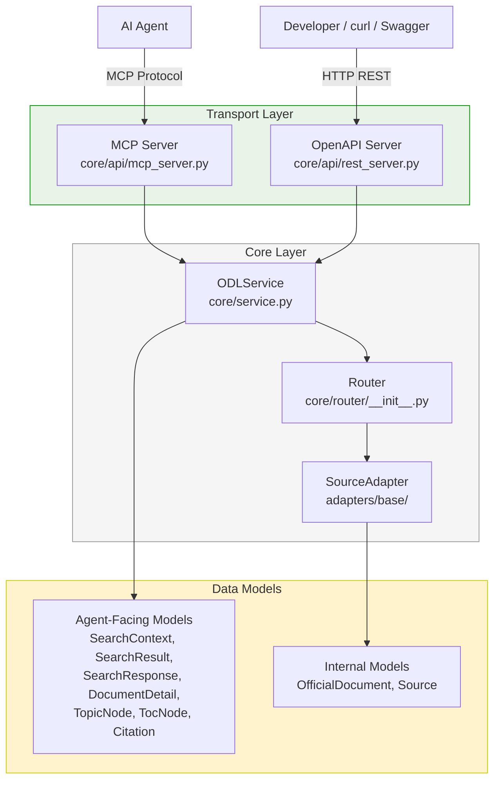
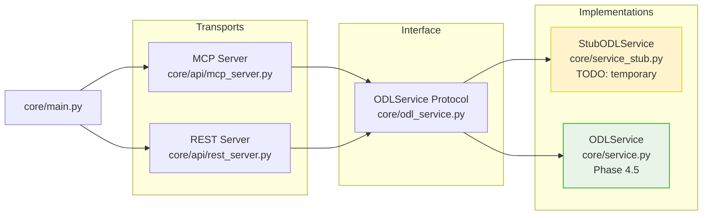

# План разработки: Official Data Layer for AI Agents

## 1. Обзор

**Цель:** переносимый слой официальных данных для AI-агентов — сервис, к которому агент обращается вместо веб-поиска, когда вопрос касается государственной и социальной тематики. Слой опирается на официальные источники, отдаёт ответ с provenance, а если официального основания нет — честно сообщает.

**Ключевой принцип:** разделение механизма (внутри слоя) и политики (на стороне агента через Agent Skill).

**Состав задания:**
- **Широта** — архитектура (C4: Context + Container), спецификация
- **Глубина** — рабочая вертикаль end-to-end: один источник + stub-адаптер для демонстрации шва

## 2. Что уже сделано

- [x] **Фаза 0**: Инфраструктура — Docker, CI, линтеры, типы, pre-commit
- [x] **Фаза 1**: Спецификация — SPEC.md, ADRs, C4-диаграммы
- [x] **Фаза 2**: Скелет ядра — 12 Pydantic-моделей, SourceAdapter Protocol, типизированные ошибки, Tracer
- [x] **Фаза 3**: Stub-адаптер — демо-источник с 2 документами, тесты

## 3. Стек технологий

| Компонент | Выбор                            | Обоснование                                                                                        |
|---|----------------------------------|----------------------------------------------------------------------------------------------------|
| Язык | Python 3.10+                     | Требование задания                                                                                 |
| Интерфейс | MCP + OpenAPI (Dual API)         | MCP — для AI-агентов, OpenAPI — для разработчиков и интеграций                                     |
| Векторный поиск | Qdrant                           | Опыт работы, Высокопроизводительная БД, payload filtering, sparse vectors для гибридного поиска    |
| Метаданные и иерархия | PostgreSQL                       | Иерархический рубрикатор (темы, регионы, ведомства), рекурсивные CTE, ссылочная целостность через FK |
| Кэш | Redis                            | TTL-кэш ответов и карточек                                                                         |
| Observability | LangFuse                         | Трейсинг LLM-вызовов, метрики, отладка                                                             |
| Валидация | Pydantic v2                      | Строгие схемы входа/выхода, типизированные ошибки                                                  |
| Эмбеддинги | sentence-transformers (локально) | Без внешних зависимостей, сменяемая модель                                                         |
| Линтер/формат | ruff                             | Быстрый, покрывает lint + format                                                                   |
| Типы | mypy (strict)                    | Требование задания                                                                                 |
| Тесты | pytest + pytest-asyncio          | Покрытие ключевых путей                                                                            |
| Секреты | detect-secrets (pre-commit)      | Защита от утечек                                                                                   |
| CI | GitHub Actions                   | lint + types + tests на каждый PR                                                                  |
| Упаковка | Docker + docker-compose          | Воспроизводимое окружение для проверяющего                                                         |

## 4. Docker-инфраструктура

**Сервисы:**
- `qdrant` — векторный поиск (порты 6333/6334)
- `redis` — кэш (порт 6379)
- `langfuse` + `langfuse-db` (postgres) — observability (порт 3000)
- `app` — основное приложение, MCP-сервер + REST API (порт 8000)

**PostgreSQL** — отдельный сервис `metadata-db` для метаданных и иерархического рубрикатора. LangFuse использует свой PostgreSQL (`langfuse-db`).

**Команды:**
```bash
make up          # Поднять всё
make down        # Остановить
make test        # Прогнать тесты
make lint        # Линтеры
make type-check  # Типы
make logs        # Логи
make rebuild     # Пересобрать приложение
```

## 5. Структура репозитория

```
gov-data-layer/
├── README.md                    # Как запустить, примеры, архитектура
├── SPEC.md                      # Спецификация: цель, границы, решения, компромиссы
├── plans/                       # Планы, ADRs, диаграммы
│   ├── plan.md                  # Этот файл
│   ├── SPEC.md                  # Копия спецификации
│   ├── adr.md                   # Architecture Decision Records
│   ├── context.md               # C4 Context diagram
│   ├── container.md             # C4 Container diagram
│   ├── data-structures-design.md
│   └── adr-searchcontext-design.md
├── task/
│   └── postanovka_gov_data_layer.md  # Исходное ТЗ
├── examples/
│   └── SKILL.md                 # Пример Agent Skill (инструкция для агента)
├── core/                        # Ядро слоя (механизм)
│   ├── __init__.py
│   ├── main.py                  # Точка входа
│   ├── odl_service.py           # ★ Protocol для ODLService (Phase 4)
│   ├── service_stub.py          # ★ Заглушка ODLService (Phase 4, временно)
│   ├── service.py               # ★ ODLService — единый core-класс (Phase 4)
│   ├── api/                     # Транспортный слой
│   │   ├── __init__.py          # Экспорты
│   │   ├── mcp_server.py        # MCP-сервер (тонкий адаптер поверх ODLService)
│   │   └── rest_server.py       # OpenAPI-сервер (FastAPI, тонкий адаптер)
│   ├── router/                  # Роутинг, сборка ответа, уверенность
│   ├── ingest/                  # Фоновая загрузка по TTL
│   ├── models/                  # Каноническая модель (Pydantic)
│   ├── index/                   # Работа с Qdrant + SQLite
│   ├── cache/                   # Работа с Redis
│   ├── errors/                  # Типизированные ошибки
│   └── observability/           # Логи, метрики, request_id
├── adapters/                    # Шов адаптера (физически отделены)
│   ├── __init__.py
│   ├── base/                    # Интерфейс SourceAdapter (Protocol)
│   ├── pravo/                   # PravoAdapter (publication.pravo.gov.ru)
│   └── stub/                    # StubAdapter (демо-источник)
├── tests/
│   ├── __init__.py
│   ├── unit/
│   ├── integration/
│   └── contracts/               # Тесты на контракт ответа
├── data/                        # Данные (SQLite, эмбеддинги)
├── docker-compose.yml
├── Dockerfile
├── .dockerignore
├── .env.example
├── .gitignore
├── .pre-commit-config.yaml
├── .secrets.baseline
├── pyproject.toml
├── Makefile
└── uv.lock
```

## 6. Архитектура: Dual API (MCP + OpenAPI)

### Ключевое решение

Вместо реализации только MCP-сервера, слой предоставляет **два интерфейса**:

- **MCP-сервер** — для AI-агентов (самоописательные инструменты, tool search)
- **OpenAPI (REST) сервер** — для традиционных HTTP-клиентов, интеграций, тестирования

Оба сервера обращаются к **одному и тому же core-классу** `ODLService`, который содержит всю бизнес-логику слоя.

### Диаграмма архитектуры



### Принцип: Transport-agnostic core

`ODLService` — единственный класс, который реализует бизнес-логику:

```python
class ODLService:
    async def search_documents(self, query: str, context: SearchContext | None = None) -> SearchResponse: ...
    async def get_document_detail(self, source_id: str) -> DocumentDetail: ...
    async def list_topics(self, parent_id: str, query: str = "") -> list[TopicNode]: ...
    async def get_toc(self, document_id: str, parent_section_id: str, query: str = "") -> list[TocNode]: ...
```

MCP-сервер и OpenAPI-сервер — это тонкие адаптеры, которые:
1. Принимают запрос в своём протоколе
2. Преобразуют в вызов `ODLService`
3. Преобразуют ответ обратно в формат протокола

### ADR: Dual API (MCP + OpenAPI)

**Решение:** Предоставлять два транспорта — MCP и OpenAPI — поверх единого `ODLService`.

**Обоснование:**
- MCP — нативный протокол для AI-агентов (самоописательные инструменты)
- OpenAPI — универсальный протокол для разработчиков, тестирования, интеграций
- Единый core-класс гарантирует одинаковое поведение независимо от транспорта
- FastAPI даёт автоматическую OpenAPI-документацию (Swagger UI)

**Компромиссы:**
- Два сервера = два процесса/порта для обслуживания
- Небольшое дублирование в адаптерах (парсинг запроса/ответа)
- MCP SDK может ограничивать гибкость (зависит от реализации)

## 7. План разработки по фазам

Инженерная культура (линтеры, типы, тесты, логи) встроена в каждую фазу.

### Фаза 0: Инфраструктура и инженерная культура (0.5 дня)

**Что делаем:**
- Структура monorepo (см. выше)
- `pyproject.toml` с зависимостями
- `ruff` + `mypy` (strict) настроены и проходят на пустом коде
- `pytest` настроен, инфраструктура готова
- `.pre-commit-config.yaml`: detect-secrets + ruff + mypy
- `.env.example` (без реальных ключей)
- GitHub Actions: lint + types + tests
- `docker-compose.yml` со всеми сервисами
- `Dockerfile` для упаковки приложения
- `Makefile` с командами `up`, `down`, `test`, `lint`, `logs`

**Критерий готовности:**
- `docker compose up -d` поднимает все сервисы
- `docker compose ps` показывает все контейнеры `healthy`
- `make lint && make type-check && make test` проходят
- Приложение доступно на `http://localhost:8000/health`

### Фаза 1: Спецификация (0.5 дня)

**Что делаем:**
- `SPEC.md`: цель, границы, ключевые решения, компромиссы
- Раздел **«Разделение механизм/политика»**: что делает слой, что отдаёт наружу, что остаётся за агентом
- **Контракт ответа** с разложенными сигналами уверенности (не один скаляр):
  - `retrieval_relevance` — similarity score
  - `data_freshness` — дата инжеста
  - `source_availability` — available / degraded / unavailable
- **SLO-ориентиры** по путям:
  - Быстрый ретривальный (из индекса/кэша): p95 < 500ms
  - Путь с LLM (если есть): p95 < 2s
  - Фоновый холодный (ингест): вне запроса, по TTL
- **Токен-бюджет** ответа — разумный предел с пагинацией
- **Свежесть** — TTL по типу данных, дата актуальности в каждом ответе
- Обоснование выбора стека (Qdrant + SQLite, MCP + OpenAPI, LangFuse)
- Раздел **«Следующий шаг»** — что не успели

**Критерий готовности:** спецификация читается как документ для production-системы.

### Фаза 2: Скелет ядра и каноническая модель (1 день)

**Что делаем:**
- Каноническая модель (Pydantic):
  - `OfficialDocument` — сущность с метаданными
  - `Source` — источник
  - `Citation` — ссылка с span
  - `ConfidenceSignals` — разложенные сигналы уверенности
  - `TopicNode` — узел иерархического рубрикатора
  - `TocNode` — узел оглавления документа
- Две оси времени: `ingest_date` + `legal_status` (valid_from/valid_to)
- Интерфейс `SourceAdapter` (Protocol): `search()`, `get()`, `normalize()`, `ingest()`
- Типизированные ошибки: `NotFoundError`, `SourceUnavailableError`, `InvalidInputError`, `InternalError`
- Сквозной `request_id` в контексте (structlog)
- Тесты на контракт модели и интерфейса адаптера
- `mypy` проходит на всех типах

**Критерий готовности:** модель описана, интерфейс зафиксирован, тесты на контракт проходят, типы зелёные.

### Фаза 3: Stub-адаптер — демонстрация шва ✅ (выполнено)

**Что делали:**
- `StubAdapter` — тривиальная реализация `SourceAdapter`
- Тест: роутер работает с двумя адаптерами, ядро не знает про конкретные источники
- Демонстрация: добавление источника не трогает ядро
- Линтеры и типы проходят

**Критерий готовности:** можно «добавить источник» за 30 минут, не меняя core. Тесты зелёные.

### Фаза 4: Dual API — MCP + OpenAPI (2 дня) 🔄

**Стратегия:** Быстрая вертикаль через заглушку сервиса. Сначала Protocol, потом заглушка, потом два сервера, потом настоящий сервис. Protocol гарантирует, что серверы не нужно переделывать при замене заглушки.



#### Шаг 4.0: Protocol для ODLService (`core/odl_service.py`)
- Protocol с 4 методами: `search_documents`, `get_document_detail`, `list_topics`, `get_toc`
- Импортирует модели из `core/models/models.py`
- `mypy` проходит

#### Шаг 4.1: Заглушка ODLService (`core/service_stub.py`)
- Минимальная имплементация Protocol через StubAdapter
- Все методы помечены `# TODO: Phase 4.5 — replace with real ODLService`
- Возвращает хардкодные ответы

#### Шаг 4.1.5: Добавить зависимости в `pyproject.toml`
- `fastapi>=0.109.0`, `uvicorn>=0.27.0` — основные
- `httpx>=0.25.0` — dev (для тестов)

#### Шаг 4.2: REST-сервер (`core/api/rest_server.py`)
- FastAPI-приложение с 4 эндпоинтами:
  - `POST /api/v1/search` — `search_documents`
  - `GET /api/v1/documents/{source_id}` — `get_document_detail`
  - `GET /api/v1/topics` — `list_topics`
  - `GET /api/v1/documents/{document_id}/toc` — `get_toc`
- Swagger UI автоматически на `/docs`
- Тонкий адаптер — только парсинг входа/выхода

#### Шаг 4.3: MCP-сервер (`core/api/mcp_server.py`)
- Принимает `ODLServiceProtocol` в конструкторе
- 4 инструмента: `search_documents`, `get_document_detail`, `list_topics`, `get_toc`
- Тонкий адаптер — только парсинг входа/выхода
- Использование `mcp` SDK

#### Шаг 4.4: Точка входа (`core/main.py`)
- Создаёт StubAdapter → StubODLService → MCPServer + RESTServer
- Запуск MCP + REST параллельно (asyncio.gather)
- Graceful shutdown

#### Шаг 4.5: Настоящий ODLService (`core/service.py`)
- Имплементирует `ODLServiceProtocol`
- Содержит Router (выбор адаптера, агрегация, graceful degradation)
- Интеграция с Tracer
- Преобразование `OfficialDocument` → `DocumentDetail`

#### Шаг 4.6: Обновить docker-compose и зависимости
- Порт 8000 для REST API (уже есть)
- Добавить healthcheck для REST
- Обновить Dockerfile (зависимости)
- Добавить зависимости в `pyproject.toml`: `fastapi>=0.109.0`, `uvicorn>=0.27.0`, `httpx>=0.25.0` (dev)

#### Шаг 4.7: Тесты
- `tests/unit/test_odl_service.py` — тест соответствия Protocol (mypy + pytest)
- `tests/unit/test_service.py` — unit-тесты ODLService
- `tests/integration/test_api.py` — интеграционные тесты (MCP + REST через StubAdapter, потом через ODLService)

#### Шаг 4.8: Обновить документацию
- `SPEC.md` — добавить раздел про Dual API
- `examples/SKILL.md` — обновить под актуальные модели
- `README.md` — примеры запросов к REST API

**Критерии готовности фазы 4:**
- [ ] `ODLServiceProtocol` определён, `mypy` проходит
- [ ] `StubODLService` работает и возвращает данные
- [ ] MCP-сервер отвечает на инструменты `search_documents` и `get_document_detail`
- [ ] REST API отвечает на `POST /api/v1/search` и `GET /api/v1/documents/{id}`
- [ ] Оба сервера используют один и тот же `ODLServiceProtocol` (проверка через тест)
- [ ] `GET /health` возвращает 200
- [ ] OpenAPI/Swagger UI доступен на `/docs`
- [ ] Tracer логирует вызовы обоих серверов
- [ ] Настоящий `ODLService` реализован и проходит те же тесты
- [ ] `service_stub.py` удалён
- [ ] `make test` зелёный
- [ ] `make lint && make type-check` проходят

### Фаза 5: Кэш, наблюдаемость, graceful degradation (1 день)

**Что делаем:**
- Redis: кэш ответов с TTL
- Graceful degradation: источник недоступен → best-effort из кэша/индекса с честным сигналом, запрос агента не падает
- Тесты на graceful degradation, кэш, метрики
- Линтеры и типы проходят

**Критерий готовности:** при отключении pravo.gov.ru слой продолжает работать с деградацией, метрики видны. Тесты зелёные.

### Фаза 6: Пример Agent Skill и финальная полировка (0.5 дня)

**Что делаем:**
- `examples/agent_skill.md` — пример Agent Skill:
  - Когда звать слой
  - Что передавать (регион, рубрика, окно актуальности)
  - Как читать разложенные сигналы уверенности
  - Когда отказаться от ответа
- Интеграционные тесты: сквозной сценарий (запрос → ответ с цитатой)
- README: как запустить, примеры, архитектура
- Финальная чистка репозитория
- Все тесты, линтеры, типы — зелёные

**Критерий готовности:** `make test` зелёный, README читается, репозиторий чистый, проверяющий может запустить одной командой `docker compose up`.

### Фаза 7: Первый адаптер — pravo.gov.ru (1.5 дня)

**Что делаем:**
- HTTP-клиент для pravo.gov.ru (retry, таймауты, rate limiting)
- Парсер документов (HTML/XML → каноническая модель)
- Ингест: загрузка → нормализация → запись в индекс
- Обработка TTL (периодическое обновление)
- Тесты: mock HTTP-ответов, проверка нормализации, обработка ошибок
- Линтеры и типы проходят

**Критерий готовности:** ingest загружает N документов с pravo.gov.ru и пишет в индекс. Тесты зелёные.

## 8. Детальный дизайн ключевых компонентов

### 8.1 ODLService (`core/service.py`)

```python
class ODLService:
    """Единый core-класс, реализующий всю бизнес-логику ODL.

    MCP-сервер и OpenAPI-сервер — тонкие адаптеры поверх этого класса.
    """

    def __init__(self, adapters: list[SourceAdapter]) -> None:
        self._router = Router(adapters)
        self._tracer = get_tracer()

    async def search_documents(
        self,
        query: str,
        context: SearchContext | None = None,
    ) -> SearchResponse:
        """Поиск документов по запросу с фильтрацией."""
        with self._tracer.trace("search_documents", query=query[:100]) as span:
            span.set_input({"query": query, "context": context.model_dump() if context else None})
            try:
                results = await self._router.route_search(query, context)
                response = SearchResponse(
                    results=results,
                    total_count=len(results),
                    offset=context.offset if context else 0,
                )
                span.set_output({"total_count": response.total_count})
                return response
            except Exception as e:
                span.set_error(e)
                raise

    async def get_document_detail(self, source_id: str) -> DocumentDetail:
        """Получить полную карточку документа."""
        with self._tracer.trace("get_document_detail", source_id=source_id) as span:
            span.set_input({"source_id": source_id})
            try:
                doc = await self._router.route_get(source_id)
                detail = self._build_document_detail(doc)
                span.set_output({"document_id": detail.id})
                return detail
            except Exception as e:
                span.set_error(e)
                raise

    async def list_topics(
        self,
        parent_id: str,
        query: str = "",
    ) -> list[TopicNode]:
        """Просмотр иерархического рубрикатора."""
        # TODO: Phase 4 — реализовать через PostgreSQL
        return []

    async def get_toc(
        self,
        document_id: str,
        parent_section_id: str,
        query: str = "",
    ) -> list[TocNode]:
        """Навигация по оглавлению документа."""
        # TODO: Phase 4 — реализовать через PostgreSQL
        return []

    def _build_document_detail(self, doc: OfficialDocument) -> DocumentDetail:
        """Преобразовать OfficialDocument в DocumentDetail (agent-facing)."""
        return DocumentDetail(
            id=doc.id,
            title=doc.title,
            url=doc.url,
            source_name=doc.source.name,
            jurisdiction=doc.jurisdiction,
            region=doc.region,
            topic=doc.topic,
            organization=doc.organization,
            ingest_date=doc.ingest_date,
            valid_from=doc.valid_from,
            valid_to=doc.valid_to,
            legal_status=doc.legal_status,
            content=doc.summary or "",
            citations=[],
            toc=[],
        )
```

### 8.2 MCP-сервер (`core/api/mcp_server.py`)

```python
"""MCP-сервер — тонкий адаптер поверх ODLService."""

from mcp.server import Server
from mcp.server.stdio import stdio_server
from mcp.types import Tool, TextContent

from core.service import ODLService
from core.models import SearchContext

class MCPServer:
    """MCP-сервер, делегирующий все вызовы ODLService."""

    def __init__(self, service: ODLService) -> None:
        self._service = service
        self._server = Server("odl")

    async def run(self) -> None:
        # Регистрация инструментов
        self._server.list_tools()(self._handle_list_tools)
        self._server.call_tool()(self._handle_call_tool)
        async with stdio_server() as (read, write):
            await self._server.run(read, write)

    async def _handle_list_tools(self) -> list[Tool]:
        return [
            Tool(
                name="search_documents",
                description="Поиск официальных документов",
                inputSchema=SearchContext.model_json_schema(),
            ),
            # ... остальные инструменты
        ]

    async def _handle_call_tool(self, name: str, arguments: dict) -> list[TextContent]:
        if name == "search_documents":
            context = SearchContext(**arguments.get("context", {}))
            result = await self._service.search_documents(
                query=arguments["query"],
                context=context,
            )
            return [TextContent(type="text", text=result.model_dump_json())]
        # ... остальные инструменты
```

### 8.3 OpenAPI-сервер (`core/api/rest_server.py`)

```python
"""OpenAPI (REST) сервер — тонкий адаптер поверх ODLService."""

from fastapi import FastAPI, HTTPException
from core.service import ODLService
from core.models import SearchContext, SearchResponse, DocumentDetail
from core.errors import NotFoundError, InvalidInputError, SourceUnavailableError

class RESTServer:
    """OpenAPI-сервер, делегирующий все вызовы ODLService."""

    def __init__(self, service: ODLService) -> None:
        self._service = service
        self.app = FastAPI(title="ODL API", version="0.1.0")
        self._register_routes()

    def _register_routes(self) -> None:
        @self.app.get("/health")
        async def health():
            return {"status": "ok"}

        @self.app.post("/api/v1/search", response_model=SearchResponse)
        async def search_documents(query: str, context: SearchContext | None = None):
            try:
                return await self._service.search_documents(query, context)
            except InvalidInputError as e:
                raise HTTPException(status_code=400, detail=str(e))
            except SourceUnavailableError as e:
                raise HTTPException(status_code=503, detail=str(e))

        @self.app.get("/api/v1/documents/{source_id}", response_model=DocumentDetail)
        async def get_document_detail(source_id: str):
            try:
                return await self._service.get_document_detail(source_id)
            except NotFoundError as e:
                raise HTTPException(status_code=404, detail=str(e))

        # ... list_topics, get_toc
```

### 8.4 Router (`core/router/__init__.py`)

```python
class Router:
    """Роутер — выбирает адаптер по контексту и агрегирует результаты."""

    def __init__(self, adapters: list[SourceAdapter]) -> None:
        self._adapters = {a.source_id: a for a in adapters}

    async def route_search(
        self,
        query: str,
        context: SearchContext | None = None,
    ) -> list[SearchResult]:
        """Поиск по всем адаптерам (в v1 — только stub)."""
        results: list[SearchResult] = []
        for adapter in self._adapters.values():
            try:
                adapter_results = await adapter.search(query, context)
                results.extend(adapter_results)
            except SourceUnavailableError:
                logger.warning("Source unavailable", extra={"source": adapter.source_id})
                continue
        return results

    async def route_get(self, document_id: str) -> OfficialDocument:
        """Получить документ по ID (пробуем адаптеры по очереди)."""
        for adapter in self._adapters.values():
            try:
                return await adapter.get(document_id)
            except NotFoundError:
                continue
        raise NotFoundError(f"Document '{document_id}' not found in any adapter")
```

### 8.5 Точка входа (`core/main.py`)

```python
async def main():
    configure()
    logger = get_logger("odl.main")

    # Создаём сервис с адаптерами
    adapters: list[SourceAdapter] = [StubAdapter()]
    service = ODLService(adapters)

    # Запускаем оба сервера
    mcp_server = MCPServer(service)
    rest_server = RESTServer(service)

    # Запуск в отдельных задачах
    await asyncio.gather(
        mcp_server.run(),
        uvicorn.run(rest_server.app, host="0.0.0.0", port=8000),
    )
```

## 9. Оценка времени

| Фаза | Время |
|---|---|
| 0. Инфраструктура | 0.5 дня |
| 1. Спецификация | 0.5 дня |
| 2. Скелет ядра | 1 день |
| 3. Адаптер pravo.gov.ru | 1.5 дня |
| 4. Индекс | 1 день |
| 5. Dual API (MCP + OpenAPI) | 2 дня |
| 6. Stub-адаптер | 0.5 дня |
| 7. Кэш + наблюдаемость | 1 день |
| 8. Agent Skill + полировка | 0.5 дня |
| **Итого** | **~8.5 дней** |

## 10. Распределение оценки (из задания)

| Критерий | Вес | Как закрываем |
|---|---|---|
| Архитектура и переносимость | ~35% | C4-диаграммы, SPEC.md, MCP + OpenAPI, шов адаптера, разделение механизм/политика, Agent Skill |
| Работающая вертикаль end-to-end | ~20% | pravo.gov.ru + stub-адаптер, сквозной сценарий |
| Инженерная культура | ~25% | CI, тесты, секреты, наблюдаемость, типизированные ошибки, деградация |
| Надёжность и SLO | ~10% | Холодный/горячий старт, кэш, graceful degradation, SLO в спецификации |
| Достоверность и ограничения | ~10% | Цитирование, две оси времени, честный отказ |

## 11. Риски и компромиссы

| Риск | Митигация |
|---|---|
| Документы на платформе pravo.gov.ru формируют итоговый документ инкрементно | Mock HTTP-ответов в тестах, graceful degradation, возможность заменить источник |
| Иерархический рубрикатор не влезает в payload filtering Qdrant | SQLite для иерархии, гибридный поиск |
| Не хватает времени на все фазы | Сокращать ширину реализации, сохранять глубину одной вертикали; что не успели — описать в SPEC.md как «Следующий шаг» |
| LangFuse может быть overkill для тестового | Опциональный сервис, можно отключить через docker-compose profile |
| Эмбеддинги sentence-transformers медленнее OpenAI | Для тестового достаточно, модель сменяемая |
| Два сервера = два процесса/порта для обслуживания | Оба в одном контейнере, asyncio.gather |

## 12. Принципы, которые соблюдаем на всех фазах

1. **Инженерная культура встроена** — линтеры, типы, тесты в каждой фазе
2. **Разделение механизм/политика** — слой не зашивает порог доверия, отдаёт разложенные сигналы
3. **Provenance по умолчанию** — источник, дата, юр.статус в каждом ответе
4. **Честные границы** — типизированные ошибки, «не нашёл» вместо пустоты
5. **Токен-осознанность** — компактные ответы, пагинация, выбор полей
6. **Модель-агностичность** — слой не привязан к конкретной LLM, бюджет токенов небольшой
7. **Transport-agnostic core** — вся бизнес-логика в ODLService, транспорты — тонкие адаптеры
8. **Чистый репозиторий** — без бинарных артефактов, осмысленная история коммитов
