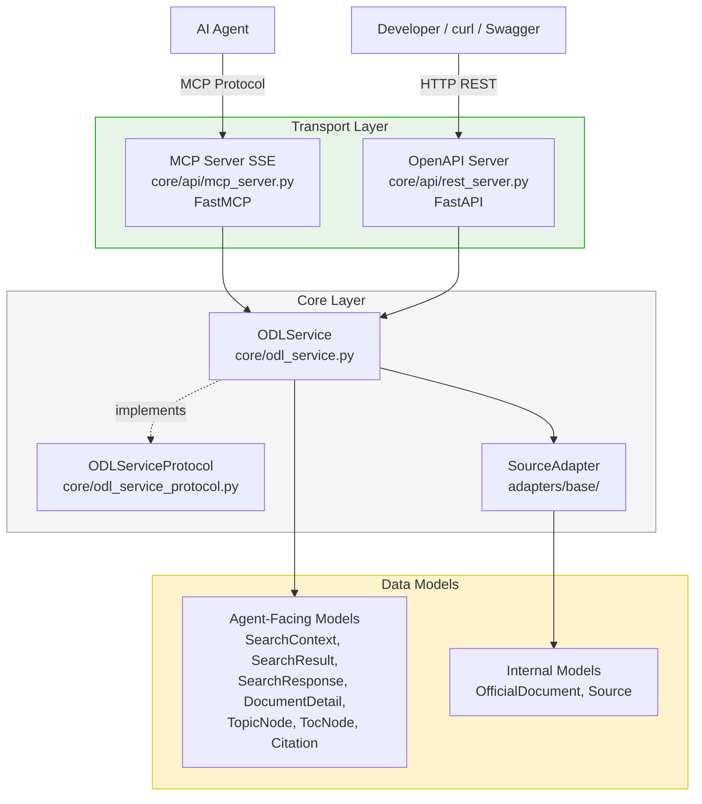

# План разработки: Official Data Layer for AI Agents

## 1. Обзор

**Цель:** переносимый слой официальных данных для AI-агентов — сервис, к которому агент обращается вместо веб-поиска, когда вопрос касается государственной и социальной тематики. Слой опирается на официальные источники, отдаёт ответ с provenance, а если официального основания нет — честно сообщает.

**Ключевой принцип:** разделение механизма (внутри слоя) и политики (на стороне агента через Agent Skill).

**Состав задания:**
- **Широта** — архитектура (C4: Context + Container), спецификация
- **Глубина** — рабочая вертикаль end-to-end: один источник + stub-адаптер для демонстрации шва

## 2. Что уже сделано

### Фаза 0: Инфраструктура ✅
- [x] Структура monorepo
- [x] `pyproject.toml` с зависимостями
- [x] `ruff` + `mypy` (strict) настроены
- [x] `pytest` настроен, asyncio_mode = strict
- [x] `.pre-commit-config.yaml`: detect-secrets + ruff + mypy
- [x] `.env.example` (без реальных ключей)
- [x] GitHub Actions: lint + types + tests
- [x] `docker-compose.yml` со всеми сервисами (qdrant, redis, langfuse, app)
- [x] `Dockerfile` для упаковки приложения
- [x] `Makefile` с командами `up`, `down`, `test`, `lint`, `logs`
- [x] `setup.bat` / `stop-server.bat` для Windows

### Фаза 1: Спецификация ✅
- [x] `SPEC.md` — цель, границы, ключевые решения, компромиссы
- [x] Раздел «Разделение механизм/политика»
- [x] Контракт ответа с разложенными сигналами уверенности
- [x] SLO-ориентиры по путям
- [x] Токен-бюджет ответа
- [x] Свежесть (TTL по типу данных)
- [x] Обоснование выбора стека
- [x] Раздел «Следующий шаг»
- [x] C4-диаграммы (Context + Container) в `plans/`

### Фаза 2: Скелет ядра и каноническая модель ✅
- [x] Каноническая модель (Pydantic v2):
  - `OfficialDocument` — сущность с метаданными
  - `Source` — источник
  - `Citation` — ссылка с span
  - `ConfidenceSignals` — разложенные сигналы уверенности
  - `TopicNode` — узел иерархического рубрикатора
  - `TocNode` — узел оглавления документа
  - `SearchContext` — контекст запроса
  - `SearchResult` — результат поиска
  - `SearchResponse` — ответ на поиск
  - `DocumentDetail` — полная карточка документа
- [x] Две оси времени: `ingest_date` + `legal_status` (valid_from/valid_to)
- [x] Интерфейс `SourceAdapter` (Protocol): `search()`, `get()`, `normalize()`, `ingest()`, `list_topics()`, `get_toc()`, `get_content()`
- [x] Типизированные ошибки: `NotFoundError`, `SourceUnavailableError`, `InvalidInputError`, `InternalError`
- [x] Сквозной `request_id` в контексте (Tracer)
- [x] Тесты на контракт модели и интерфейса адаптера
- [x] `mypy` проходит на всех типах

### Фаза 3: Stub-адаптер ✅
- [x] `StubAdapter` — реализация `SourceAdapter` с 2 документами, темами, TOC
- [x] Тесты: `test_stub_adapter.py`
- [x] Демонстрация: добавление источника не трогает ядро
- [x] Линтеры и типы проходят

### Фаза 4: Dual API — MCP + OpenAPI ✅ (реализовано)
- [x] `ODLServiceProtocol` — Protocol с 4 методами
- [x] `ODLService` — реальная реализация (не заглушка):
  - Агрегация результатов по всем адаптерам
  - Graceful degradation при отказе адаптера
  - Tracer на каждый вызов
  - Ленивая инициализация Tracer
- [x] REST-сервер (`core/api/rest_server.py`):
  - FastAPI с 4 эндпоинтами + `/health`
  - Swagger UI на `/docs`, ReDoc на `/redoc`
  - Tracing middleware для всех HTTP-запросов
  - Обработка типизированных ошибок → HTTP status codes
- [x] MCP-сервер (`core/api/mcp_server.py`):
  - FastMCP с 4 инструментами
  - Структурированные ошибки
  - SSE-транспорт, смонтирован на `/mcp`
- [x] Точка входа (`core/main.py`):
  - Загрузка `.env`, конфигурация адаптеров из `ADAPTERS` env var
  - MCP смонтирован как SSE-приложение на том же uvicorn-порту
  - Graceful shutdown (SIGINT/SIGTERM)
- [x] Конфигурация (`core/api/config.py`):
  - `ServerConfig.from_env()` — динамическая загрузка адаптеров
  - `instantiate_adapter()` — импорт по строке "module:ClassName"
- [x] Тесты:
  - `test_odl_service.py` — unit-тесты ODLService
  - `test_rest_server.py` — тесты REST API (httpx)
  - `test_mcp_server.py` — тесты MCP инструментов
  - `test_config.py` — тесты конфигурации

**Примечание:** В отличие от первоначального плана, `service_stub.py` не создавался — `ODLService` был реализован сразу как полноценный сервис. Файл `core/service.py` также отсутствует — класс живёт в `core/odl_service.py`.

### Фаза 5: Кэш, наблюдаемость, graceful degradation ✅
- [x] `Tracer` — абстрактный базовый класс с `trace()` и `span()`
- [x] `LangFuseTracer` — отправка трейсов в LangFuse
- [x] `FileFallbackTracer` — запись JSON-логов в файл (fallback)
- [x] `Logger` — структурированные логи (stderr)
- [x] `configure()` — фабрика Tracer
- [x] `CacheClient` — Redis-кэш с lazy connection, TTL, graceful fallback
- [x] `CircuitBreaker` — адаптерный circuit breaker (перемещён в `adapters/base/`)
- [x] Graceful degradation — stale cache fallback, retry с exponential backoff, source availability tracking
- [x] Тесты: `test_cache_client.py`, `test_circuit_breaker.py`, `test_pravo_adapter_cache.py`

### Фаза 6: Адаптер pravo.gov.ru ✅
- [x] `PravoClient` — HTTP-клиент к API publication.pravo.gov.ru (retry, таймауты, rate limiting)
- [x] `PravoParser` — парсер JSON-ответов API в каноническую модель
- [x] `PravoAdapter` — полная реализация SourceAdapter Protocol (stub + production режимы)
- [x] Stub/production режимы через `PRAVO_MODE` env var (по умолчанию production)
- [x] Strategy Pattern: handlers/ (ABC), production/, stub/ — stub изолирован для безболезненного удаления
- [x] Resilience: circuit breaker, stale cache fallback, retry, graceful degradation
- [x] OCR интеграция: YandexVisionOCR + TesseractOCR fallback
- [x] Тесты: `test_pravo_adapter_production.py`, `test_pravo_adapter_cache.py`, `test_pravo_production.py` (integration)

### Фаза 7: Agent Skill и финальная полировка 🔄 (частично)
- [x] `examples/SKILL.md` — существует, описывает Agent Skill
- [ ] Интеграционные тесты (сквозной сценарий) — частично (есть `test_pravo_production.py`)
- [ ] README — может требовать обновления под актуальную структуру

## 3. Стек технологий

| Компонент | Выбор                            | Обоснование                                                                                        |
|---|----------------------------------|----------------------------------------------------------------------------------------------------|
| Язык | Python 3.10+                     | Требование задания                                                                                 |
| Интерфейс | MCP + OpenAPI (Dual API)         | MCP — для AI-агентов, OpenAPI — для разработчиков и интеграций                                     |
| Векторный поиск | Qdrant                           | Высокопроизводительная БД, payload filtering, sparse vectors для гибридного поиска    |
| Метаданные и иерархия | PostgreSQL                       | Иерархический рубрикатор (темы, регионы, ведомства), рекурсивные CTE, ссылочная целостность через FK |
| Кэш | Redis                            | TTL-кэш ответов и карточек                                                                         |
| Observability | LangFuse                         | Трейсинг LLM-вызовов, метрики, отладка                                                             |
| Валидация | Pydantic v2                      | Строгие схемы входа/выхода, типизированные ошибки                                                  |
| Эмбеддинги | sentence-transformers (локально) | Без внешних зависимостей, сменяемая модель                                                         |
| Линтер/формат | ruff                             | Быстрый, покрывает lint + format                                                                   |
| Типы | mypy (strict)                    | Требование задания                                                                                 |
| Тесты | pytest + pytest-asyncio          | Покрытие ключевых путей                                                                            |
| Секреты | detect-secrets (pre-commit)      | Защита от утечек                                                                                   |
| CI | GitHub Actions                   | lint + types + tests на каждый PR                                                                  |
| Упаковка | Docker + docker-compose          | Воспроизводимое окружение для проверяющего                                                         |

## 4. Docker-инфраструктура

**Сервисы:**
- `qdrant` — векторный поиск (порты 6333/6334)
- `redis` — кэш (порт 6379)
- `langfuse` + `langfuse-db` (postgres) — observability (порт 3000)
- `app` — основное приложение, MCP-сервер + REST API (порт 8000)

**PostgreSQL** — отдельный сервис `metadata-db` для метаданных и иерархического рубрикатора. LangFuse использует свой PostgreSQL (`langfuse-db`).

**Команды:**
```bash
make up          # Поднять всё
make down        # Остановить
make test        # Прогнать тесты
make lint        # Линтеры
make type-check  # Типы
make logs        # Логи
make rebuild     # Пересобрать приложение
```

## 5. Структура репозитория (актуальная)

```
gov-data-layer/
├── README.md                    # Как запустить, примеры, архитектура
├── SPEC.md                      # Спецификация: цель, границы, решения, компромиссы
├── plans/                       # Планы, ADRs, диаграммы
│   ├── plan.md                  # Этот файл
│   ├── SPEC.md                  # Копия спецификации
│   ├── adr.md                   # Architecture Decision Records
│   ├── context.md               # C4 Context diagram
│   ├── container.md             # C4 Container diagram
│   ├── data-structures-design.md
│   └── adr-searchcontext-design.md
├── task/
│   └── postanovka_gov_data_layer.md  # Исходное ТЗ
├── examples/
│   └── SKILL.md                 # Пример Agent Skill (инструкция для агента)
├── core/                        # Ядро слоя (механизм)
│   ├── __init__.py              # Экспорты: ODLService, ODLServiceProtocol
│   ├── main.py                  # Точка входа (uvicorn + MCP SSE mount)
│   ├── odl_service.py           # ODLService — единый core-класс (реализация)
│   ├── odl_service_protocol.py  # ODLServiceProtocol — контракт для сервиса
│   ├── api/                     # Транспортный слой
│   │   ├── __init__.py          # Экспорты
│   │   ├── config.py            # ServerConfig, instantiate_adapter
│   │   ├── mcp_server.py        # MCP-сервер (FastMCP, SSE transport)
│   │   └── rest_server.py       # OpenAPI-сервер (FastAPI, create_app)
│   ├── router/                  # Заглушка для Phase 5
│   ├── ingest/                  # Заглушка для Phase 3
│   ├── models/                  # Каноническая модель (Pydantic v2)
│   │   ├── __init__.py
│   │   └── models.py            # 12 Pydantic-моделей
│   ├── index/                   # Заглушка для Phase 4
│   ├── cache/                   # Заглушка для Phase 4
│   ├── errors/                  # Типизированные ошибки
│   │   ├── __init__.py
│   │   └── errors.py            # ODLBaseError + 4 подкласса
│   └── observability/           # Логи, трейсинг, конфигурация
│       ├── __init__.py          # Экспорты
│       ├── config.py            # ObservabilityConfig
│       ├── configure.py         # configure() — фабрика Tracer
│       ├── logger.py            # logging (stderr, LOG_LEVEL)
│       └── tracer.py            # Tracer ABC, LangFuseTracer, FileFallbackTracer
├── adapters/                    # Шов адаптера (физически отделены)
│   ├── __init__.py
│   ├── base/                    # Интерфейс SourceAdapter (Protocol)
│   │   ├── __init__.py
│   │   └── source_adapter.py    # SourceAdapter Protocol
│   ├── pravo/                   # Заглушка для Phase 7
│   └── stub/                    # StubAdapter (демо-источник)
│       ├── __init__.py
│       └── stub_adapter.py      # 2 документа, темы, TOC
├── tests/
│   ├── __init__.py
│   ├── unit/
│   │   ├── test_config.py       # Тесты конфигурации
│   │   ├── test_errors.py       # Тесты ошибок
│   │   ├── test_logger.py       # Тесты логгера
│   │   ├── test_mcp_server.py   # Тесты MCP-сервера
│   │   ├── test_models.py       # Тесты моделей
│   │   ├── test_odl_service.py  # Тесты ODLService
│   │   ├── test_rest_server.py  # Тесты REST API
│   │   ├── test_stub_adapter.py # Тесты StubAdapter
│   │   └── test_tracer.py       # Тесты Tracer
│   ├── integration/             # Заглушка
│   └── contracts/               # Тесты на контракт ответа
│       └── test_source_adapter_protocol.py
├── data/                        # Данные (traces.log, эмбеддинги)
├── docker-compose.yml
├── Dockerfile
├── .dockerignore
├── .env.example
├── .gitignore
├── .pre-commit-config.yaml
├── .secrets.baseline
├── pyproject.toml
├── Makefile
├── setup.bat                    # Windows setup script
├── stop-server.bat              # Windows stop script
├── test-cov.bat                 # Windows test with coverage
└── uv.lock
```

## 6. Архитектура: Dual API (MCP + OpenAPI)

### Ключевое решение

Вместо реализации только MCP-сервера, слой предоставляет **два интерфейса**:

- **MCP-сервер** — для AI-агентов (самоописательные инструменты, SSE transport)
- **OpenAPI (REST) сервер** — для традиционных HTTP-клиентов, интеграций, тестирования

Оба сервера обращаются к **одному и тому же core-классу** `ODLService`, который содержит всю бизнес-логику слоя.

### Диаграмма архитектуры



### Принцип: Transport-agnostic core

`ODLService` — единственный класс, который реализует бизнес-логику:

```python
class ODLService(ODLServiceProtocol):
    async def search_documents(self, query: str, context: SearchContext | None = None) -> SearchResponse: ...
    async def get_document_detail(self, source_id: str) -> DocumentDetail: ...
    async def list_topics(self, parent_id: str | None = None, query: str = "") -> list[TopicNode]: ...
    async def get_toc(self, document_id: str, parent_section_id: str | None = None, query: str = "") -> list[TocNode]: ...
```

MCP-сервер и OpenAPI-сервер — это тонкие адаптеры, которые:
1. Принимают запрос в своём протоколе
2. Преобразуют в вызов `ODLService`
3. Преобразуют ответ обратно в формат протокола

### Особенности реализации

- **MCP-сервер** использует `FastMCP` (из `mcp` SDK) и монтируется как SSE-приложение на путь `/mcp` того же uvicorn-сервера
- **REST-сервер** использует `FastAPI` с автоматической OpenAPI-документацией (`/docs`, `/redoc`)
- **Tracing middleware** оборачивает каждый HTTP-запрос в span
- **Graceful shutdown** обрабатывает SIGINT/SIGTERM
- **Адаптеры загружаются динамически** из переменной окружения `ADAPTERS`

### ADR: Dual API (MCP + OpenAPI)

**Решение:** Предоставлять два транспорта — MCP и OpenAPI — поверх единого `ODLService`.

**Обоснование:**
- MCP — нативный протокол для AI-агентов (самоописательные инструменты)
- OpenAPI — универсальный протокол для разработчиков, тестирования, интеграций
- Единый core-класс гарантирует одинаковое поведение независимо от транспорта
- FastAPI даёт автоматическую OpenAPI-документацию (Swagger UI)

**Компромиссы:**
- Два сервера в одном процессе через mount (MCP SSE на /mcp)
- Небольшое дублирование в адаптерах (парсинг запроса/ответа)

## 7. План разработки по фазам

Инженерная культура (линтеры, типы, тесты, логи) встроена в каждую фазу.

### Фаза 0: Инфраструктура и инженерная культура ✅

**Что сделано:**
- Структура monorepo
- `pyproject.toml` с зависимостями
- `ruff` + `mypy` (strict) настроены и проходят
- `pytest` настроен, инфраструктура готова
- `.pre-commit-config.yaml`: detect-secrets + ruff + mypy
- `.env.example` (без реальных ключей)
- GitHub Actions: lint + types + tests
- `docker-compose.yml` со всеми сервисами
- `Dockerfile` для упаковки приложения
- `Makefile` с командами `up`, `down`, `test`, `lint`, `logs`

### Фаза 1: Спецификация ✅

**Что сделано:**
- `SPEC.md`: цель, границы, ключевые решения, компромиссы
- Раздел «Разделение механизм/политика»
- Контракт ответа с разложенными сигналами уверенности
- SLO-ориентиры по путям
- Токен-бюджет ответа
- Свежесть — TTL по типу данных
- Обоснование выбора стека
- Раздел «Следующий шаг»

### Фаза 2: Скелет ядра и каноническая модель ✅

**Что сделано:**
- Каноническая модель (Pydantic v2): 12 моделей
- Две оси времени: `ingest_date` + `legal_status`
- Интерфейс `SourceAdapter` (Protocol) с 7 методами
- Типизированные ошибки: 4 класса
- Сквозной `request_id` в контексте (Tracer)
- Тесты на контракт модели и интерфейса адаптера
- `mypy` проходит на всех типах

### Фаза 3: Stub-адаптер ✅

**Что сделано:**
- `StubAdapter` — реализация `SourceAdapter` с 2 документами
- Тесты: `test_stub_adapter.py`
- Демонстрация: добавление источника не трогает ядро
- Линтеры и типы проходят

### Фаза 4: Dual API — MCP + OpenAPI ✅

**Что сделано:**
- `ODLServiceProtocol` — контракт с 4 методами
- `ODLService` — реальная реализация с агрегацией адаптеров и graceful degradation
- REST-сервер (FastAPI) — 4 эндпоинта + health + tracing middleware
- MCP-сервер (FastMCP) — 4 инструмента + SSE transport
- Точка входа (`main.py`) — единый uvicorn-процесс, MCP на `/mcp`
- Конфигурация (`config.py`) — динамическая загрузка адаптеров из `ADAPTERS`
- Тесты: `test_odl_service.py`, `test_rest_server.py`, `test_mcp_server.py`, `test_config.py`

**Критерии готовности:**
- [x] `ODLServiceProtocol` определён, `mypy` проходит
- [x] `ODLService` работает и возвращает данные
- [x] MCP-сервер отвечает на инструменты `search_documents` и `get_document_detail`
- [x] REST API отвечает на `POST /api/v1/search` и `GET /api/v1/documents/{id}`
- [x] Оба сервера используют один и тот же `ODLServiceProtocol`
- [x] `GET /health` возвращает 200
- [x] OpenAPI/Swagger UI доступен на `/docs`
- [x] Tracer логирует вызовы обоих серверов
- [x] `make test` зелёный
- [x] `make lint && make type-check` проходят

### Фаза 5: Кэш, наблюдаемость, graceful degradation 🔄 (частично)

**Что сделано:**
- [x] Tracer (LangFuse + FileFallback)
- [x] Logger (stderr, LOG_LEVEL)
- [x] Graceful degradation на уровне адаптера (try/except в ODLService)

**Что осталось:**
- [ ] Redis: кэш ответов с TTL
- [ ] Graceful degradation: источник недоступен → best-effort из кэша/индекса
- [ ] Тесты на graceful degradation, кэш, метрики

### Фаза 6: Первый адаптер — pravo.gov.ru ❌

**Что осталось:**
- [ ] HTTP-клиент для pravo.gov.ru (retry, таймауты, rate limiting)
- [ ] Парсер документов (HTML/XML → каноническая модель)
- [ ] Ингест: загрузка → нормализация → запись в индекс
- [ ] Обработка TTL (периодическое обновление)
- [ ] Тесты: mock HTTP-ответов, проверка нормализации, обработка ошибок

### Фаза 7: Пример Agent Skill и финальная полировка ❌

**Что осталось:**
- [ ] `examples/SKILL.md` — обновить под актуальные модели
- [ ] Интеграционные тесты: сквозной сценарий
- [ ] README: обновить примеры запросов
- [ ] Финальная чистка репозитория

## 8. Детальный дизайн ключевых компонентов


## 8. Оценка состояния проекта

| Фаза | Статус | Примечание |
|---|---|---|
| 0. Инфраструктура | ✅ Завершено | Docker, CI, lint, types |
| 1. Спецификация | ✅ Завершено | SPEC.md, C4, ADRs |
| 2. Скелет ядра | ✅ Завершено | 12 моделей, Protocol, ошибки |
| 3. Stub-адаптер | ✅ Завершено | 2 документа, темы, TOC |
| 4. Dual API | ✅ Завершено | MCP + REST, единый процесс |
| 5. Кэш + наблюдаемость | ✅ Завершено | Redis cache client, circuit breaker, stale cache fallback |
| 6. Адаптер pravo.gov.ru | ✅ Завершено | PravoClient, PravoParser, PravoAdapter (stub + production) |
| 7. Agent Skill + полировка | 🔄 Частично | SKILL.md существует, интеграционные тесты частично |

## 9. Распределение оценки (из задания)

| Критерий | Вес | Как закрываем |
|---|---|---|
| Архитектура и переносимость | ~35% | C4-диаграммы, SPEC.md, MCP + OpenAPI, шов адаптера, разделение механизм/политика, Agent Skill |
| Работающая вертикаль end-to-end | ~20% | Stub-адаптер + Dual API, сквозной сценарий |
| Инженерная культура | ~25% | CI, тесты, секреты, наблюдаемость, типизированные ошибки, деградация |
| Надёжность и SLO | ~10% | Холодный/горячий старт, кэш, graceful degradation, SLO в спецификации |
| Достоверность и ограничения | ~10% | Цитирование, две оси времени, честный отказ |

## 10. Риски и компромиссы

| Риск | Митигация |
|---|---|
| Документы на платформе pravo.gov.ru формируют итоговый документ инкрементно | Mock HTTP-ответов в тестах, graceful degradation, возможность заменить источник |
| Иерархический рубрикатор не влезает в payload filtering Qdrant | SQLite для иерархии, гибридный поиск |
| Не хватает времени на все фазы | Сокращать ширину реализации, сохранять глубину одной вертикали; что не успели — описать в SPEC.md как «Следующий шаг» |
| LangFuse может быть overkill для тестового | Опциональный сервис, можно отключить через docker-compose profile |
| Эмбеддинги sentence-transformers медленнее OpenAI | Для тестового достаточно, модель сменяемая |
| Два сервера = два процесса/порта для обслуживания | Оба в одном контейнере, MCP смонтирован как SSE на /mcp |

## 11. Принципы, которые соблюдаем на всех фазах

1. **Инженерная культура встроена** — линтеры, типы, тесты в каждой фазе
2. **Разделение механизм/политика** — слой не зашивает порог доверия, отдаёт разложенные сигналы
3. **Provenance по умолчанию** — источник, дата, юр.статус в каждом ответе
4. **Честные границы** — типизированные ошибки, «не нашёл» вместо пустоты
5. **Токен-осознанность** — компактные ответы, пагинация, выбор полей
6. **Модель-агностичность** — слой не привязан к конкретной LLM, бюджет токенов небольшой
7. **Transport-agnostic core** — вся бизнес-логика в ODLService, транспорты — тонкие адаптеры
8. **Чистый репозиторий** — без бинарных артефактов, осмысленная история коммитов
