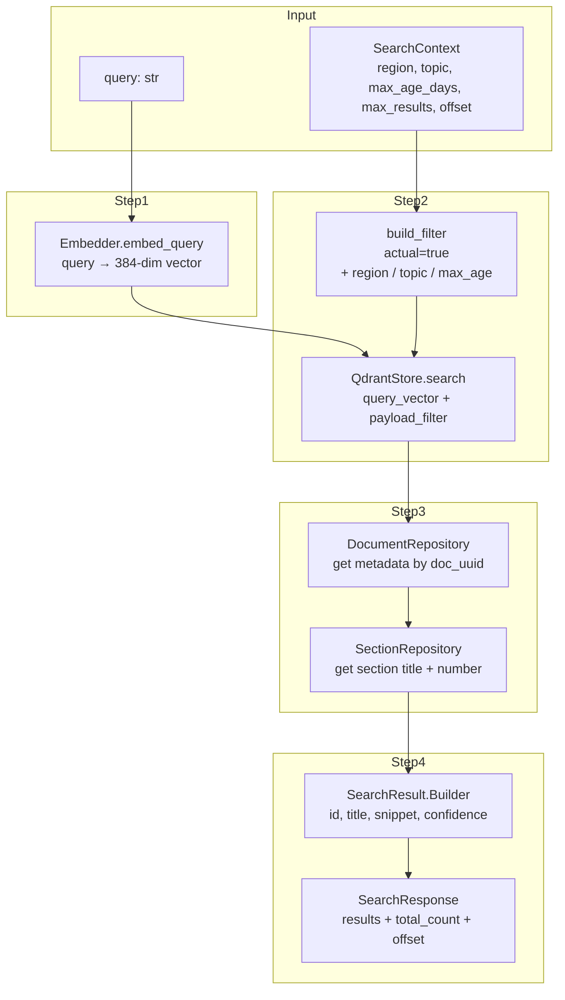
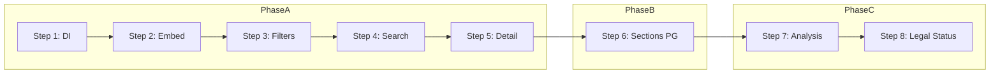

# План реализации End-to-End Query Pipeline (TD-13)

**Дата:** 2026-07-15
**Контекст:** На основе п.14 [`plans/NEXT_STEPS.md`](plans/NEXT_STEPS.md) — сборка пайплайна обработки запроса агента

---

## Текущее состояние

| Компонент | Статус |
|-----------|--------|
| `ODLService.search_documents()` | Опрашивает все адаптеры через `adapter.search()` — не использует Qdrant |
| `ODLService.get_document_detail()` | Получает документ от адаптера, персистит в PostgreSQL |
| `QdrantStore` | Работает с реальным Qdrant. Payload-фильтров нет |
| `Embedder` | Работает, выдаёт 384-dim векторы |
| `DocStructSplitter` | Разбивает текст на чанки и TOC |
| PostgreSQL репозитории | DocumentRepository, ReferenceRepository, SectionRepository — работают |
| MCP/REST эндпоинты | Вызывают ODLService, но `search_documents()` не делает векторный поиск |

---

## Архитектура пайплайна

---

## Пошаговый план

### Phase A: Minimal Query (Steps 1-5)

#### Шаг 1: QdrantStore + Embedder в ODLService ✅
**Файлы:** [`core/odl_service.py`](core/odl_service.py), [`core/main.py`](core/main.py), [`config.yaml`](config.yaml)

1. ✅ Параметры `qdrant: QdrantStore | None` и `embedder: Embedder | None` в конструкторе `ODLService`
2. ✅ В `main.py` создаются `QdrantStore` и `Embedder` из конфига, передаются в `ODLService`
3. ✅ AppConfig уже содержит `qdrant_host`, `qdrant_port`
4. ✅ `DocumentChunk.data_freshness: datetime | None` — дата вступления в силу раздела
5. ✅ `ConfidenceSignals.data_freshness: datetime | None` — опционально

#### Шаг 2: Embedder в search_documents ✅
**Файлы:** [`core/odl_service.py`](core/odl_service.py)

1. ✅ `query_vector = embedder.embed_query(query)` в `search_documents()`
2. ✅ Graceful degradation: Embedder через lazy init (`_embedder_lazy`)

#### Шаг 3: Payload-фильтры Qdrant ✅
**Файлы:** [`core/index/qdrant_store.py`](core/index/qdrant_store.py)

1. ✅ `QdrantStore.build_filter()` — базовый метод (возвращает None, будет расширен в Phase B)
2. ✅ `data_freshness` сохраняется в payload при upsert и читается при search

#### Шаг 4: search_documents через Qdrant ✅
**Файлы:** [`core/odl_service.py`](core/odl_service.py)

1. ✅ Поиск только через Qdrant (без fallback на адаптеры)
2. ✅ Chunk → `DocumentRepository.get_document_by_id()` → url, source_name из БД
3. ✅ `ConfidenceSignals(retrieval_relevance=score, data_freshness=chunk.data_freshness)`
4. ✅ NO datetime.now() — даты не фабрикуются
5. ✅ NO logger — только tracer spans
6. ✅ Есть тесты: `TestSearchDocumentsWithoutQdrant` + `TestSearchDocumentsWithQdrant`

#### Шаг 5: get_document_detail через Qdrant ✅
**Файлы:** [`core/odl_service.py`](core/odl_service.py), [`core/models/models.py`](core/models/models.py), [`core/ingest/chunker.py`](core/ingest/chunker.py), [`core/index/qdrant_store.py`](core/index/qdrant_store.py)

1. ✅ После получения `doc` от адаптера:
   - Вызов `qdrant.get_chunks_by_document_id(doc.id)` — scroll-based получение всех чанков документа
   - Группировка чанков по `section_path` → одна `Citation` на раздел
   - `_merge_overlapping_chunks()` — детектит overlap ≥50 символов между последовательными чанками, обрезает дубликаты
2. ✅ Fallback: если Qdrant недоступен — текущее поведение (Citation из summary)
3. ✅ Добавлено поле `section_chunk_index` в `DocumentChunk` — порядковый номер чанка в пределах его раздела
4. ✅ Вычисление `section_chunk_index` в `DocStructSplitter`
5. ✅ NO logger — только tracer spans

**Критерий:** `GET /api/v1/documents/{id}` с цитатами из чанков, сгруппированными по разделам.

---

### Phase B: Persistence связей (Steps 6)

#### Шаг 6: Sections в PostgreSQL (TD-8)
**Файлы:** [`core/odl_service.py`](core/odl_service.py), [`adapters/base/ingest_pipeline.py`](adapters/base/ingest_pipeline.py)

1. В `_persist_document()` — после `doc_repo.upsert_document()` вызвать `section_repo.upsert_sections(doc_uuid, toc)`
2. Получить mapping `external_id → UUID` для section_uuids
3. Передать section_uuids в `process_document_text()` для `DocumentChunk.section_uuids`

**Критерий:** После инжеста разделы в PostgreSQL + связаны с чанками в Qdrant.

---

### Phase C: Обогащение ответа (Steps 7-8)

#### Шаг 7: Семантический анализ разделов MVP (TD-9)
**Файлы:** `core/analyzer/section_analyzer.py` (новый)

1. `SectionAnalyzer.analyze(text) → list[SectionFact]`
2. Паттерны: `признать утратившим силу` → `REVOKE`, `внести изменения` → `MODIFY`, `ввести в действие` → `ENACT`
3. Сохранять факты в `change_tracking` и `document_relation`

**Критерий:** Для тестового документа определяются типы разделов.

#### Шаг 8: Определение актуальности MVP (TD-11)
**Файлы:** `core/persistence/repository/document_repo.py`

1. `get_legal_status(doc_uuid) → LegalStatus`: SQL по `document_relation`
2. Если `relation_type IN ('REVOKE','MODIFY')` и `valid_from <= now()` → `REVOKED`/`MODIFIED`
3. Иначе если `valid_from` в прошлом → `ACTIVE`

**Критерий:** `get_legal_status()` возвращает корректный статус.

---

## Порядок выполнения

---

## Критерии готовности

| Шаг | Проверка |
|-----|----------|
| 1 | `ODLService(qdrant=qs, embedder=emb)` — работает |
| 2 | `search_documents("query")` эмбеддит запрос |
| 3 | `qdrant.search(vec, context)` фильтрует |
| 4 | REST поиск возвращает результаты из Qdrant |
| 5 | ✅ Деталь документа содержит цитаты из чанков |
| 6 | Sections в PostgreSQL после инжеста |
| 7 | `SectionAnalyzer` находит REVOKE/MODIFY/ENACT |
| 8 | `get_legal_status` возвращает ACTIVE/REVOKED |
