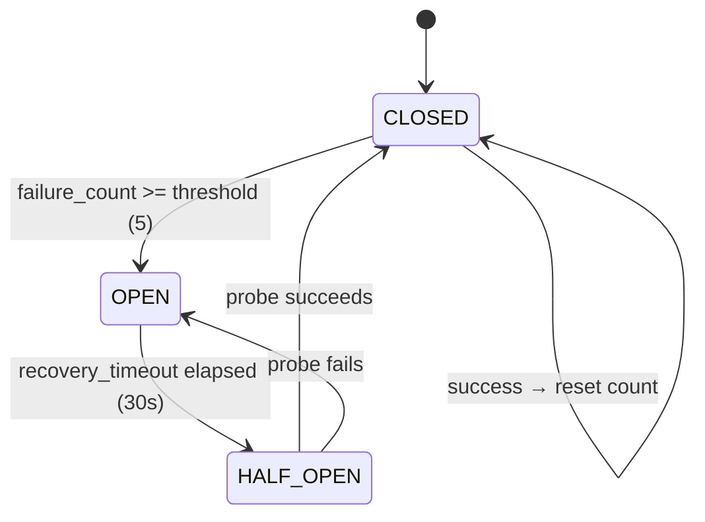
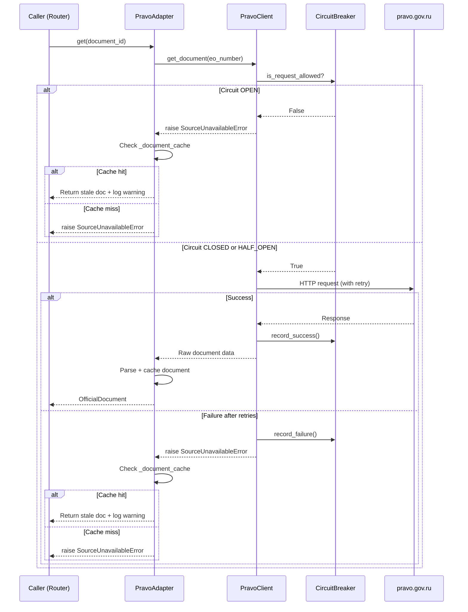
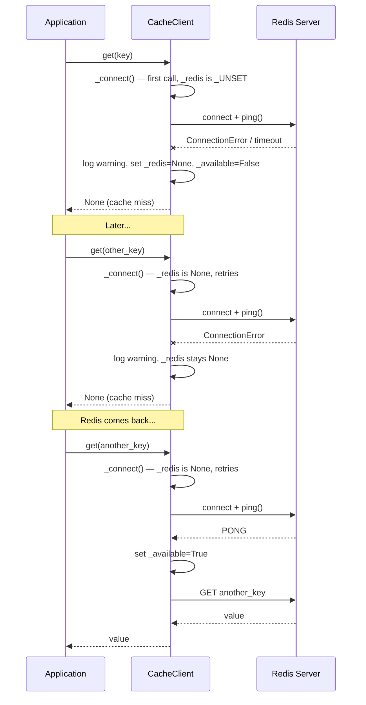
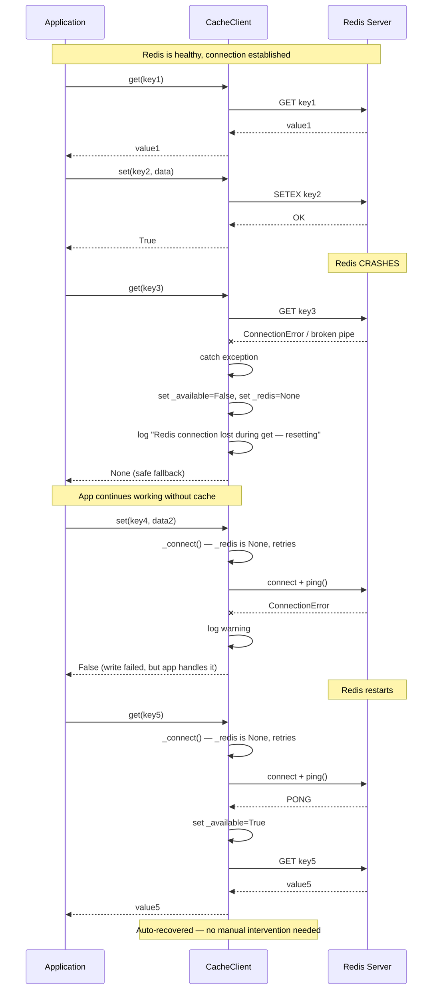

# Resilience Architecture: Graceful Handling of pravo.gov.ru Unavailability

## Current State

The existing [`PravoClient._request()`](adapters/pravo/pravo_client.py:101) already has:
1. **Retry with exponential backoff** (3 attempts: 1s, 2s, 4s)
2. **Non-retryable status detection** (400, 401, 403, 404, 405)
3. **`SourceUnavailableError`** propagation to callers

The [`PravoAdapter.get()`](adapters/pravo/pravo_adapter.py:255) catches `SourceUnavailableError` and re-raises. The [`PravoAdapter.list_topics()`](adapters/pravo/pravo_adapter.py:330) catches it and returns `[]`.

The model [`SourceAvailability`](core/models/models.py:26) already defines three states: `AVAILABLE`, `DEGRADED`, `UNAVAILABLE` — but they are not yet used for runtime circuit-breaking.

## Problem

When pravo.gov.ru is down:
- Every request retries 3 times with backoff (wasting ~7s per request)
- No fast-fail mechanism — cascading failures possible
- No stale data fallback — users get errors even for previously fetched documents
- No visibility into current source health

## Proposed Architecture

### Layer 1 — Circuit Breaker (in `PravoClient`)

A state machine that tracks consecutive failures and short-circuits requests when the source is likely down.



**Implementation:** New class `_CircuitBreaker` in [`pravo_client.py`](adapters/pravo/pravo_client.py:1)

```python
class _CircuitBreaker:
    """Simple circuit breaker for external API calls."""

    def __init__(self, failure_threshold: int = 5, recovery_timeout: float = 30.0):
        self._failure_threshold = failure_threshold
        self._recovery_timeout = recovery_timeout
        self._failure_count = 0
        self._last_failure_time: datetime | None = None
        self._state = "CLOSED"

    @property
    def state(self) -> str:
        if self._state == "OPEN":
            elapsed = (datetime.now() - self._last_failure_time).total_seconds()
            if elapsed >= self._recovery_timeout:
                self._state = "HALF_OPEN"
        return self._state

    def record_success(self) -> None:
        self._failure_count = 0
        self._state = "CLOSED"

    def record_failure(self) -> None:
        self._failure_count += 1
        self._last_failure_time = datetime.now()
        if self._failure_count >= self._failure_threshold:
            self._state = "OPEN"

    def is_request_allowed(self) -> bool:
        return self.state != "OPEN"
```

**Integration points:**
- [`PravoClient.__init__()`](adapters/pravo/pravo_client.py:58): add `self._circuit_breaker = _CircuitBreaker()`
- [`PravoClient._request()`](adapters/pravo/pravo_client.py:101): check `is_request_allowed()` at entry; call `record_success()`/`record_failure()` after attempt
- Circuit breaker state exposed via `@property circuit_state` for monitoring

### Layer 2 — Stale Cache Fallback (in `PravoAdapter`)

When the API is down but we have previously fetched data, serve it with a `stale=True` indicator.

**Implementation in [`PravoAdapter`](adapters/pravo/pravo_adapter.py:142):**

```python
# In __init__():
self._document_cache: dict[str, tuple[OfficialDocument, datetime]] = {}

# In get() — after successful fetch:
self._document_cache[doc.id] = (doc, datetime.now(timezone.utc))

# In get() — before raising SourceUnavailableError:
cached = self._document_cache.get(document_id)
if cached:
    doc, cached_at = cached
    logger.warning("Serving stale cached document from %s", cached_at.isoformat())
    return doc  # Caller sees stale data instead of error
```

**Cache eviction:** Simple TTL-based (e.g., 24h) or LRU with max size (e.g., 1000 entries).

### Layer 3 — Health Check Endpoint (in `PravoClient`)

A lightweight probe that pings a cheap endpoint to detect recovery before the next user request.

```python
async def check_health(self) -> bool:
    """Quick health check — does the API respond?"""
    try:
        await self._request("GET", _PUBLIC_BLOCKS_PATH, params={"take": "1"})
        return True
    except SourceUnavailableError:
        return False
```

Could be called on a background schedule (e.g., every 30s when circuit is OPEN) to proactively detect recovery.

### Layer 4 — Informative Error Responses (in `PravoAdapter`)

When the source is unavailable, include circuit state and retry hints in the error message.

```python
# In PravoAdapter.get():
except SourceUnavailableError:
    circuit_state = self._pravo_client.circuit_state
    raise SourceUnavailableError(
        f"pravo.gov.ru is temporarily unavailable. "
        f"Circuit state: {circuit_state}. "
        f"Retry after circuit recovers."
    )
```

## Data Flow Diagram



---

# Part 2: Graceful Handling of Redis Unavailability

## Current State

Redis is defined as a **stub** — [`core/cache/__init__.py`](core/cache/__init__.py:1) contains only a TODO comment for Phase 4. The dependency `redis>=5.0.0` is already declared in [`pyproject.toml`](pyproject.toml:16), but no Redis client code exists yet.

The configuration is wired:
- [`AppConfig`](core/api/app_config.py:106-107) reads `redis_host` and `redis_port` from `config.yaml` or `.env`
- [`docker-compose.yml`](docker-compose.yml:24-36) defines a `redis:7-alpine` service with healthcheck
- The [`app` service](docker-compose.yml:119-120) has `depends_on: redis: condition: service_healthy` — **this means the app container won't start if Redis is down**

The planned use of Redis (from the TODO): TTL-based caching of search results and document cards, with cache invalidation on ingest.

## Problem

When Redis is unavailable:
1. **In Docker Compose:** The app container won't even start — `depends_on: condition: service_healthy` blocks startup
2. **Outside Docker (dev/test):** Any code that tries to connect to Redis will hang or crash
3. **No graceful degradation:** If Redis goes down mid-operation, the cache layer becomes a single point of failure
4. **No fallback:** No in-memory cache or no-op cache to keep the app running

## Proposed Architecture

### Principle: Redis is Optional, Not Required

The app must function **without Redis**. If Redis is unavailable, the cache degrades to a no-op (cache miss on every request) or an in-memory fallback. The app should log a warning and continue.

### Layer 1 — Remove Hard Docker Dependency

**Problem:** [`docker-compose.yml`](docker-compose.yml:119-120) has `depends_on: redis: condition: service_healthy` for the `app` service.

**Solution:** Change `depends_on` to `condition: service_started` (or remove the condition entirely) so the app starts even if Redis is down. The app handles Redis unavailability gracefully at the code level.

```yaml
# Before:
depends_on:
  redis:
    condition: service_healthy

# After:
depends_on:
  redis:
    condition: service_started
```

### Layer 2 — Lazy Redis Connection with Graceful Degradation

**Key design decisions:**
1. **Lazy connection** — no connection attempt until first cache operation
2. **On failure: reset to `_UNSET`** — so the next call retries connection (auto-recovery)
3. **On mid-operation crash: catch exception, reset to `_UNSET`** — next call retries
4. **All operations return safe defaults** — `None` for `get()`, `False` for `set()`/`delete()`

**Implementation in [`core/cache/__init__.py`](core/cache/__init__.py:1):**

```python
"""Cache — Redis-backed with in-memory fallback when Redis is unavailable."""

from __future__ import annotations

import os
from datetime import timedelta
from typing import Any

import redis.asyncio as aioredis

from core.observability import get_logger

logger = get_logger(__name__)

# Sentinel value to distinguish "not checked yet" from "connection failed"
_UNSET = object()


class CacheClient:
    """Redis cache client with graceful degradation.

    If Redis is unavailable at construction time or goes down mid-operation,
    falls back to a no-op cache that logs a warning and returns None for all
    lookups. Automatically retries connection on the next operation.
    """

    def __init__(
        self,
        host: str = "localhost",
        port: int = 6379,
        default_ttl: timedelta = timedelta(hours=1),
    ) -> None:
        self._host = host
        self._port = port
        self._default_ttl = default_ttl
        self._redis: aioredis.Redis | None = _UNSET  # type: ignore[assignment]
        self._available = False

    @property
    def available(self) -> bool:
        """Whether Redis is currently available."""
        return self._available

    async def _connect(self) -> aioredis.Redis | None:
        """Lazy connection — retries on every call if previously failed.

        Uses _UNSET sentinel to distinguish three states:
        - _UNSET: never tried yet → try to connect
        - None: previous attempt failed → retry
        - Redis instance: connected and healthy → reuse
        """
        if isinstance(self._redis, aioredis.Redis):
            return self._redis

        # Either _UNSET (first call) or None (previous failure) — try to connect
        try:
            self._redis = aioredis.Redis(
                host=self._host,
                port=self._port,
                socket_connect_timeout=2.0,
                socket_timeout=2.0,
                decode_responses=True,
            )
            await self._redis.ping()
            self._available = True
            logger.info("Redis connected at %s:%s", self._host, self._port)
            return self._redis
        except (aioredis.ConnectionError, aioredis.TimeoutError, OSError) as exc:
            logger.warning(
                "Redis unavailable at %s:%s — falling back to no-op cache: %s",
                self._host,
                self._port,
                exc,
            )
            self._redis = None
            self._available = False
            return None

    async def get(self, key: str) -> Any | None:
        """Get a value from cache. Returns None on cache miss or Redis error."""
        client = await self._connect()
        if client is None:
            return None
        try:
            return await client.get(key)
        except (aioredis.ConnectionError, aioredis.TimeoutError, OSError):
            self._available = False
            self._redis = None  # Reset so _connect() retries next time
            logger.exception("Redis connection lost during get — resetting")
            return None

    async def set(
        self, key: str, value: str, ttl: timedelta | None = None
    ) -> bool:
        """Set a value in cache with optional TTL. Returns False on error."""
        client = await self._connect()
        if client is None:
            return False
        try:
            ttl_seconds = int((ttl or self._default_ttl).total_seconds())
            return await client.setex(key, ttl_seconds, value)
        except (aioredis.ConnectionError, aioredis.TimeoutError, OSError):
            self._available = False
            self._redis = None  # Reset so _connect() retries next time
            logger.exception("Redis connection lost during set — resetting")
            return False

    async def delete(self, key: str) -> bool:
        """Delete a key from cache. Returns False on error."""
        client = await self._connect()
        if client is None:
            return False
        try:
            return bool(await client.delete(key))
        except (aioredis.ConnectionError, aioredis.TimeoutError, OSError):
            self._available = False
            self._redis = None  # Reset so _connect() retries next time
            logger.exception("Redis connection lost during delete — resetting")
            return False

    async def close(self) -> None:
        """Close the Redis connection gracefully."""
        if isinstance(self._redis, aioredis.Redis):
            await self._redis.aclose()
        self._redis = None
        self._available = False
```

### Layer 3 — Integration into App Startup

**In [`core/main.py`](core/main.py:60):**

```python
# During startup, after config is loaded:
from core.cache import CacheClient

redis_host = get_config().redis_host
redis_port = get_config().redis_port
cache = CacheClient(host=redis_host, port=redis_port)
# Cache is lazy — no connection attempt until first use
```

The `CacheClient` is then passed to `ODLService` or directly to adapters that need caching.

### Layer 4 — Health Check Integration

The `/health` endpoint should report Redis availability:

```python
# In health check response:
{
    "status": "healthy",
    "redis": "connected" | "unavailable",
    "adapters": [...]
}
```

### Layer 5 — Connection Recovery

If Redis goes down mid-operation, the `CacheClient` sets `_available = False` and returns `None` for all operations. On the next successful `ping()` (triggered by `_connect()`), it recovers automatically. No explicit reconnection logic is needed — `redis-py` handles reconnection internally, and `_connect()` re-evaluates on each call when `self._redis` is `None`.

## Data Flow Diagrams

### Scenario A: Redis Unavailable at Startup



### Scenario B: Redis Crashes Mid-Operation



## Files to Modify

| File | Changes |
|------|---------|
| [`adapters/pravo/pravo_client.py`](adapters/pravo/pravo_client.py) | Add `_CircuitBreaker` class, integrate into `_request()`, expose `circuit_state` property, add `check_health()` method |
| [`adapters/pravo/pravo_adapter.py`](adapters/pravo/pravo_adapter.py) | Add `_document_cache` dict, cache after successful `get()`, fallback to cache before raising `SourceUnavailableError`, enhance error messages with circuit state |
| [`core/cache/__init__.py`](core/cache/__init__.py) | Replace stub with `CacheClient` class — lazy Redis connection, graceful degradation to no-op, automatic recovery |
| [`core/main.py`](core/main.py) | Instantiate `CacheClient` during startup, pass to service/adapters |
| [`docker-compose.yml`](docker-compose.yml:119-120) | Change `redis` dependency from `condition: service_healthy` to `condition: service_started` |
| [`core/errors/errors.py`](core/errors/errors.py) | Optionally add `SourceDegradedError` (extends `SourceUnavailableError`) to distinguish "completely down" from "serving stale" |

## Files NOT to Modify

| File | Reason |
|------|--------|
| [`adapters/pravo/pravo_parser.py`](adapters/pravo/pravo_parser.py) | Parser is stateless, no resilience concerns |
| [`adapters/base/source_adapter.py`](adapters/base/source_adapter.py) | Protocol definition — resilience is implementation detail |
| [`core/models/models.py`](core/models/models.py) | `SourceAvailability` enum already has `DEGRADED` — no changes needed |
| [`core/api/app_config.py`](core/api/app_config.py) | Config reading is already correct — no changes needed |
| [`.env.example`](.env.example) | No Redis secrets needed — Redis has no auth in current setup |

---

# Part 3: Stub Removal and Full Implementation of All Scenarios

## Current Stubs in This Phase

The following stubs exist in files created or modified in this phase:

| File | Stub | Location |
|------|------|----------|
| [`core/cache/__init__.py`](core/cache/__init__.py) | Entire file is a stub — `"""Cache — stub for Phase 4."""` | Line 1 |
| [`adapters/pravo/pravo_adapter.py`](adapters/pravo/pravo_adapter.py) | `mode="stub"` default — adapter starts in stub mode with fake documents | Line 151 |
| [`adapters/pravo/pravo_adapter.py`](adapters/pravo/pravo_adapter.py) | `feed_url=""` — RSS feed URL is a placeholder | Line 169 |
| [`adapters/pravo/pravo_adapter.py`](adapters/pravo/pravo_adapter.py) | `ingest()` returns 0 in production mode — `# TODO: Реализовать production ingest в День 2` | Line 326 |
| [`adapters/pravo/pravo_adapter.py`](adapters/pravo/pravo_adapter.py) | `get_content()` returns stub text — `(Stub content — будет заменён после интеграции OCR)` | Line 407 |
| [`adapters/pravo/pravo_parser.py`](adapters/pravo/pravo_parser.py) | Authority/doc_type caches never populated — `# TODO: Вызывать update_authority_cache() и update_doc_type_cache()` | Line 43 |
| [`adapters/pravo/pravo_adapter.py`](adapters/pravo/pravo_adapter.py) | `_stub_documents` and `_stub_topics` — fake data for stub mode | Lines 180-214 |

## Scenarios to Implement

### Scenario 1: Pravo.gov.ru is Available — Full Production Flow

**Goal:** When `mode="production"` and pravo.gov.ru responds, the adapter fetches real data, parses it, caches it, and returns proper models.

**What needs to happen:**
1. `PravoAdapter.__init__()` with `mode="production"` creates real `PravoClient` and `PravoParser`
2. `search()` calls `PravoClient.search_documents()` → `PravoParser.parse_search_results()`
3. `get()` calls `PravoClient.get_document()` → `PravoParser.parse_document_detail()` → cache result in `_document_cache`
4. `list_topics()` calls `PravoClient.get_public_blocks()` → `PravoParser.parse_topics()`
5. `get_toc()` calls `PravoClient.get_document_toc()` → `PravoParser.parse_toc()`
6. Circuit breaker records success → stays CLOSED

### Scenario 2: Pravo.gov.ru is Down — Circuit Breaker + Stale Cache

**Goal:** When pravo.gov.ru is unavailable, the system fast-fails via circuit breaker and falls back to stale cached data.

**What needs to happen:**
1. `PravoClient._request()` fails with `SourceUnavailableError`
2. Circuit breaker records failure → after threshold → state becomes OPEN
3. Next request to `PravoClient._request()` checks `is_request_allowed()` → False → immediate `SourceUnavailableError` (no network call)
4. `PravoAdapter.get()` catches `SourceUnavailableError` → checks `_document_cache`
5. If cache hit → return stale document with warning log
6. If cache miss → raise `SourceUnavailableError` with circuit state info

### Scenario 3: Pravo.gov.ru Recovers — Circuit Breaker Auto-Recovery

**Goal:** After recovery timeout, the circuit breaker transitions to HALF_OPEN, allows a probe request, and if successful, returns to CLOSED.

**What needs to happen:**
1. After `recovery_timeout` (30s), circuit breaker state transitions from OPEN → HALF_OPEN
2. Next request is allowed through
3. If request succeeds → `record_success()` → state becomes CLOSED
4. If request fails → `record_failure()` → state becomes OPEN again

### Scenario 4: Redis is Unavailable at Startup

**Goal:** App starts without Redis, cache degrades to no-op, app continues working.

**What needs to happen:**
1. `CacheClient.__init__()` — no connection attempt
2. First `get()`/`set()` call → `_connect()` tries to connect → fails → logs warning → returns `None`/`False`
3. All subsequent calls retry connection (because `_redis` is `None`, not a cached `Redis` instance)
4. Health check endpoint reports `redis: "unavailable"`

### Scenario 5: Redis Crashes Mid-Operation

**Goal:** App continues working after Redis goes down during runtime.

**What needs to happen:**
1. `CacheClient.get()`/`set()`/`delete()` catches `ConnectionError`/`TimeoutError`/`OSError`
2. Sets `self._redis = None` (resets connection state)
3. Sets `self._available = False`
4. Logs: `"Redis connection lost during get — resetting"`
5. Returns safe default (`None`/`False`)
6. Next call triggers `_connect()` again → retries connection

### Scenario 6: Redis Recovers After Being Down

**Goal:** Cache automatically recovers when Redis comes back, without restarting the app.

**What needs to happen:**
1. `CacheClient._connect()` is called on next cache operation
2. `self._redis` is `None` (from previous failure) → attempts new connection
3. Connection succeeds → `ping()` returns PONG
4. Sets `self._available = True`
5. Logs: `"Redis connected at host:port"`
6. Returns healthy Redis client → operation proceeds normally

### Scenario 7: Authority/DocType Caches Populated

**Goal:** `PravoParser` caches are populated before production use, so `document_type` and `authority` fields are not `None`.

**What needs to happen:**
1. `PravoAdapter` calls `PravoParser.update_authority_cache()` and `PravoParser.update_doc_type_cache()` during initialization or on first search
2. These methods fetch lookup data from pravo.gov.ru API endpoints
3. `PravoParser` uses cached data when parsing search results and document details

### Scenario 8: Production Ingest Works

**Goal:** `PravoAdapter.ingest()` actually fetches and indexes documents in production mode.

**What needs to happen:**
1. `ingest()` calls `PravoClient.search_documents()` with appropriate query/date range
2. For each result, calls `PravoClient.get_document()` to fetch full details
3. Returns count of ingested documents
4. (Future: also stores to Qdrant/SQLite — out of scope for this phase)

### Scenario 9: Production Content Extraction Works

**Goal:** `PravoAdapter.get_content()` returns real document text in production mode.

**What needs to happen:**
1. `get_content()` calls `PravoClient.get_document_pdf()` to download PDF
2. Passes PDF bytes to OCR provider (Yandex Vision or Tesseract)
3. Returns extracted text
4. (Note: OCR integration is already implemented in `adapters/ocr/` — just needs to be wired in)

## Files to Modify

| File | Changes |
|------|---------|
| [`core/cache/__init__.py`](core/cache/__init__.py) | Replace stub with full `CacheClient` implementation |
| [`adapters/pravo/pravo_adapter.py`](adapters/pravo/pravo_adapter.py) | Remove stub mode default, wire authority/doc type caches, implement production `ingest()` and `get_content()`, add `_document_cache` |
| [`adapters/pravo/pravo_client.py`](adapters/pravo/pravo_client.py) | Add `_CircuitBreaker`, integrate into `_request()`, add `check_health()` |
| [`adapters/pravo/pravo_parser.py`](adapters/pravo/pravo_parser.py) | Add `update_authority_cache()` and `update_doc_type_cache()` methods |
| [`core/main.py`](core/main.py) | Instantiate `CacheClient`, pass to service/adapters |
| [`docker-compose.yml`](docker-compose.yml:119-120) | Relax Redis dependency condition |
| [`tests/unit/test_cache.py`](tests/unit/test_cache.py) | New file — unit tests for `CacheClient` |
| [`tests/unit/test_pravo_resilience.py`](tests/unit/test_pravo_resilience.py) | New file — unit tests for circuit breaker and stale cache |

## Files NOT to Modify

| File | Reason |
|------|--------|
| [`adapters/base/source_adapter.py`](adapters/base/source_adapter.py) | Protocol definition — implementation details are in adapter |
| [`core/models/models.py`](core/models/models.py) | `SourceAvailability` enum already has `DEGRADED` — no changes needed |
| [`core/errors/errors.py`](core/errors/errors.py) | `SourceUnavailableError` already exists — no new error types needed |
| [`adapters/stub/stub_adapter.py`](adapters/stub/stub_adapter.py) | Stub adapter is intentionally kept for testing — not removed |

## Todo List

### Part A: Pravo.gov.ru Resilience

1. Add `_CircuitBreaker` class to [`pravo_client.py`](adapters/pravo/pravo_client.py)
2. Integrate circuit breaker into [`PravoClient._request()`](adapters/pravo/pravo_client.py:101) — check before request, record after
3. Expose `circuit_state` property on [`PravoClient`](adapters/pravo/pravo_client.py:50)
4. Add `check_health()` method to [`PravoClient`](adapters/pravo/pravo_client.py:50)
5. Add document cache (`_document_cache`) to [`PravoAdapter.__init__()`](adapters/pravo/pravo_adapter.py:149)
6. Cache documents after successful [`PravoAdapter.get()`](adapters/pravo/pravo_adapter.py:255)
7. Fall back to stale cache in [`PravoAdapter.get()`](adapters/pravo/pravo_adapter.py:255) before raising `SourceUnavailableError`
8. Enhance error messages with circuit state information
9. Write unit tests for `_CircuitBreaker` — OPEN/CLOSED/HALF_OPEN transitions, threshold, recovery timeout
10. Write unit tests for stale cache fallback in `PravoAdapter` — cache hit returns stale doc, cache miss raises error

### Part B: Redis Resilience

11. Change [`docker-compose.yml`](docker-compose.yml:119-120) — `redis` dependency from `condition: service_healthy` to `condition: service_started`
12. Implement [`CacheClient`](core/cache/__init__.py) class with lazy connection, graceful degradation, and automatic recovery
13. Integrate `CacheClient` into [`core/main.py`](core/main.py) startup — instantiate after config load
14. Add Redis availability to health check endpoint
15. Write unit tests for `CacheClient`:
    - Connection failure at startup returns None/False
    - Connection loss mid-operation resets `_redis` to None
    - Auto-recovery on next call after connection loss
    - Successful get/set/delete with healthy Redis
    - `close()` cleans up connection

### Part C: Stub Removal and Production Mode

16. Remove `mode="stub"` default from [`PravoAdapter.__init__()`](adapters/pravo/pravo_adapter.py:151) — require explicit mode or default to `"production"`
17. Implement `PravoParser.update_authority_cache()` and `PravoParser.update_doc_type_cache()` — fetch lookup data from pravo.gov.ru API
18. Call cache update methods in [`PravoAdapter`](adapters/pravo/pravo_adapter.py) during initialization or on first search
19. Implement production [`PravoAdapter.ingest()`](adapters/pravo/pravo_adapter.py:317) — fetch documents via search + get, return count
20. Implement production [`PravoAdapter.get_content()`](adapters/pravo/pravo_adapter.py:390) — download PDF, pass to OCR provider, return text
21. Write unit tests for production mode scenarios — search, get, list_topics, get_toc with real API calls mocked
22. Write integration tests for full production flow — search → get → get_content → ingest
23. Run `ruff check` and `py_compile` validation on all modified files
