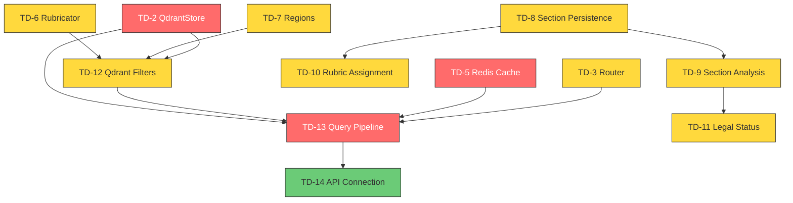

# План устранения технического долга

**Дата:** 2026-07-15
**Контекст:** На основе анализа в [`plans/interim_report.md`](plans/interim_report.md)

---

## Приоритеты

| Приоритет | Категория | Описание |
|-----------|-----------|----------|
| **P0** | Критический | Блокирует end-to-end вертикаль. Без этого слой не работает. |
| **P1** | Функциональный | Нужен для полноты вертикали. Можно демонстрировать без этого. |
| **P2** | Инженерный | Улучшает качество. Не влияет на функциональность. |
| **P3** | Архитектурный риск | Важно для production, но не для прототипа. |

---

## P0 — Критический долг (блокирует вертикаль)

### TD-2: Реализовать hybrid_search в QdrantStore
**Суть:** `upsert_chunks()` и `search()` работают. Нет гибридного dense+sparse поиска.
**Решение:**
1. Реализовать `hybrid_search()` — гибридный (dense + sparse) поиск с payload-фильтрами
**Оценка сложности:** Средняя
**Зависимости:** Нет
**Статус:** ⚠️ `qdrant-client` установлен, `upsert_chunks()`, `search()`, `build_filter()`, `deactivate_sections()` — ✅. Интеграционный тест `test_search_after_upsert` проходит. Остаётся `hybrid_search()`.

### TD-13: Собрать end-to-end query pipeline
**Суть:** Раздел CURRENT_STATE.md п.14. Query → фильтры → гибридный поиск → реранкинг → сборка ответа.
**Решение:**
1. Реализовать `ODLService.search_documents()` с реальным поиском по Qdrant (TD-2)
2. Реализовать ранжирование результатов (similarity score → retrieval_relevance)
3. Реализовать сборку `DocumentDetail` из чанков Qdrant + метаданных PostgreSQL
4. Соединить MCP/REST эндпоинты с ODLService (убрать заглушки)
**Оценка сложности:** Высокая
**Зависимости:** TD-2, TD-8, TD-12
**Статус:** ⚠️ `ODLService.search_documents()` работает, MCP/REST endpoints подключены. Не хватает: ранжирование (retrieval_relevance), гибридный поиск, сборка DocumentDetail из Qdrant + PostgreSQL.

### TD-5: Подключить Redis-кэш к ODLService
**Суть:** [`core/cache/`](core/cache/) — заглушка. Кэширование не используется.
**Решение:**
1. Реализовать `CacheClient.get()` / `CacheClient.set()` с TTL
2. Внедрить кэш в `ODLService.get_document_detail()` и `search_documents()`
3. Добавить инвалидацию кэша при инжесте
**Оценка сложности:** Средняя
**Зависимости:** Нет

---

## P1 — Функциональный долг

### TD-9: Семантический анализ разделов (regexp)
**Суть:** Определение типа раздела: отмена, изменение, ввод в действие, региональная принадлежность.
**Решение:**
1. Разработать набор regexp-паттернов для русских НПА
2. Реализовать `SectionAnalyzer.analyze(text) → SectionFact[]`
3. Сохранять факты в PostgreSQL (change_tracking, document_relation)
4. Рассчитать `extraction_confidence` для regexp-результатов
**Оценка сложности:** Высокая (требует глубокого понимания структуры НПА)
**Зависимости:** TD-8
**Статус:** ⚠️ Stub-анализатор создан, инфраструктура персистентности save_analysis_facts, resolve_target_document_id готова. Regexp-паттерны не реализованы.

### TD-6: Заполнить таблицу рубрик
**Суть:** Таблица `rubric` пуста. Нужен государственный классификатор.
**Решение:**
1. Найти источник данных: "Государственный классификатор информации о социальных услугах населению"
2. Загрузить данные через скрипт seed'инга
3. Создать векторную коллекцию рубрик в Qdrant
**Оценка сложности:** Средняя
**Зависимости:** Нет

### TD-7: Заполнить таблицу регионов
**Суть:** Таблица `region` пуста. Нужен классификатор регионов РФ (ОКАТО/ОКТМО).
**Решение:**
1. Загрузить данные из ОКАТО или ОКТМО
2. Добавить триграммный поиск по названиям
**Оценка сложности:** Низкая
**Зависимости:** Нет

### TD-3: Реализовать роутинг запроса к источнику
**Суть:** [`core/router/`](core/router/) — пустышка.
**Решение:**
1. Реализовать `Router.select_adapter(query, context) → SourceAdapter`
2. На основе реестра охвата и контекста запроса
**Оценка сложности:** Средняя
**Зависимости:** TD-13

---

## P2 — Инженерный долг

### TD-10: Определение рубрик документа
**Суть:** LLM или векторная близость для назначения рубрик разделу документа.
**Решение:**
1. Вариант A: Векторная близость — сравнить эмбеддинг раздела с эмбеддингами рубрик
2. Вариант B: LLM-классификация (lightweight, сменяемая модель)
3. Выбрать и реализовать один подход
**Оценка сложности:** Средняя
**Зависимости:** TD-6, TD-8

### TD-14: Связать MCP/REST endpoints с ODLService
**Суть:** В эндпоинтах могут быть заглушки.
**Решение:**
1. Проверить каждый эндпоинт MCP и REST — делегирует ли он ODLService
2. Заменить заглушки на реальные вызовы
**Оценка сложности:** Низкая
**Зависимости:** TD-13

### TD-15: Сохранять jurisdiction и region в БД
**Суть:** Поля есть в модели, но не пишутся.
**Решение:**
1. Дополнить `DocumentRepository.upsert_document()` — писать jurisdiction_id, region_id
2. Через lookup-таблицы (как в ADR 5)
**Оценка сложности:** Низкая
**Зависимости:** TD-8

---

## P3 — Архитектурный риск

### TD-16: C4-диаграммы в draw.io
**Суть:** Mermaid-диаграммы нужно экспортировать в draw.io для читаемого вида.
**Оценка сложности:** Низкая

### TD-17: Code Review
**Суть:** 106 файлов, ~20K строк. Комплексный review не проводился.
**Оценка сложности:** Высокая

### TD-18: Доработать SKILL.md
**Суть:** Черновик Agent Skill. Нужна полировка.
**Оценка сложности:** Низкая

### TD-19: SLO-замеры
**Суть:** Латентность, токен-бюджет, свежесть не измерены.
**Решение:**
1. Написать нагрузочный тест для горячего пути (кэш)
2. Написать нагрузочный тест для холодного пути (Qdrant)
3. Измерить токен-бюджет ответа (SearchResult ~ размер)
**Оценка сложности:** Средняя

### TD-20: Нагрузочное тестирование
**Суть:** Graceful degradation не проверен под нагрузкой.
**Оценка сложности:** Высокая

### TD-21: Документация по развёртыванию
**Суть:** Нет пошагового guide по запуску.
**Оценка сложности:** Низкая

### TD-22: Мониторинг
**Суть:** Нет метрик для Prometheus.
**Решение:** Добавить Prometheus-экспортёр через `prometheus_fastapi_instrumentator`.

---

## Диаграмма зависимостей устранения долга

